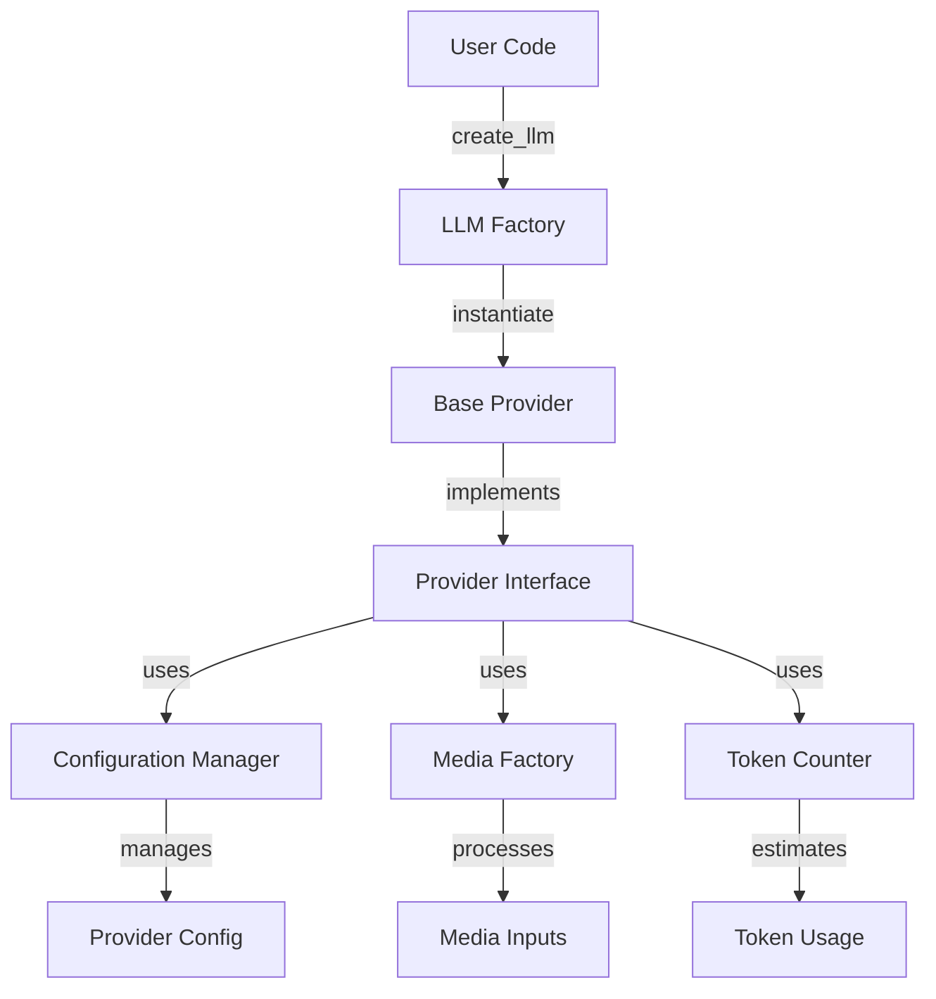
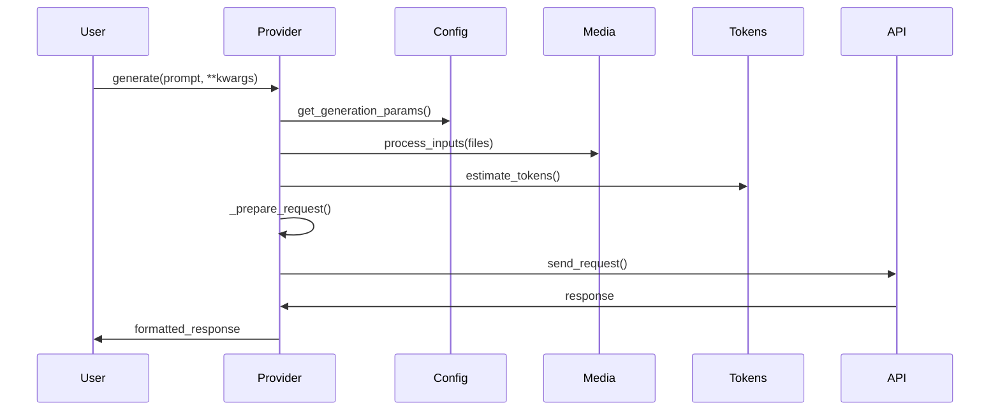
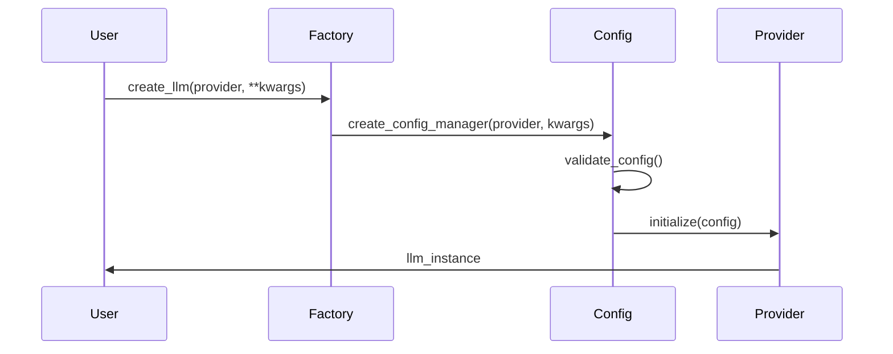

# AbstractLLM Architecture Overview

## Core Architecture

AbstractLLM follows a modular, provider-based architecture that emphasizes extensibility, maintainability, and ease of use. The system is designed to provide a unified interface for interacting with various LLM providers while maintaining provider-specific optimizations.



## Component Overview

### 1. Provider System

The provider system is the core of AbstractLLM, implementing a clean abstraction layer for different LLM services:

```python
class BaseProvider:
    def __init__(self, config_manager: ConfigurationManager):
        self.config_manager = config_manager
        self.initialize()

    @abstractmethod
    def generate(self, prompt: str, **kwargs) -> str:
        """Generate text from prompt"""
        pass

    @abstractmethod
    def generate_async(self, prompt: str, **kwargs) -> Awaitable[str]:
        """Generate text asynchronously"""
        pass
```

Key Features:
- Unified interface for all providers
- Consistent error handling
- Standardized configuration management
- Automatic token counting
- Media input processing
- Streaming support
- Async/sync implementations

### 2. Configuration Management

The configuration system provides a centralized way to manage provider settings:

```python
class ConfigurationManager:
    def __init__(self, provider: str, **kwargs):
        self.provider = provider
        self.config = self._create_config(**kwargs)
        self._validate_config()

    def get_param(self, key: str, default: Any = None) -> Any:
        """Get configuration parameter"""
        return self.config.get(key, default)

    def update_config(self, **kwargs) -> None:
        """Update configuration parameters"""
        self.config.update(kwargs)
        self._validate_config()
```

Features:
- Parameter validation
- Environment variable integration
- Provider-specific defaults
- Runtime configuration updates
- Type safety
- Caching settings

### 3. Media Factory

The media handling system processes various input types:

```python
class MediaFactory:
    @classmethod
    def process_files(cls, files: List[str], **kwargs) -> List[MediaInput]:
        """Process multiple files"""
        return [cls.process_file(f, **kwargs) for f in files]

    @classmethod
    def process_file(cls, file_path: str, **kwargs) -> MediaInput:
        """Process single file"""
        media_type = cls._detect_media_type(file_path)
        return cls._create_processor(media_type).process(file_path, **kwargs)
```

Capabilities:
- Automatic format detection
- Provider-specific formatting
- Image processing and optimization
- Text file handling
- Future audio/video support
- Caching mechanisms

### 4. Token Counter

The token counting system provides accurate token estimates:

```python
class TokenCounter:
    def __init__(self, provider: str, model: str):
        self.provider = provider
        self.model = model
        self._initialize_tokenizer()

    def count_tokens(self, text: str) -> int:
        """Count tokens in text"""
        return self._tokenizer.count_tokens(text)

    def estimate_tokens(self, **kwargs) -> int:
        """Estimate tokens for generation"""
        return self._estimate_completion_tokens(**kwargs)
```

Features:
- Provider-specific tokenizers
- Accurate token estimation
- Completion token prediction
- Cache optimization
- Model-specific counting

## Data Flow

### 1. Generation Flow



### 2. Configuration Flow



## Provider Implementation

### Base Structure

Each provider implements the following interface:

```python
class ProviderInterface(Protocol):
    def generate(self, prompt: str, **kwargs) -> str:
        """Generate completion"""
        pass

    def generate_async(self, prompt: str, **kwargs) -> Awaitable[str]:
        """Generate completion asynchronously"""
        pass

    def count_tokens(self, text: str) -> int:
        """Count tokens in text"""
        pass

    def get_capabilities(self) -> Dict[str, bool]:
        """Get provider capabilities"""
        pass
```

### Provider-Specific Features

1. **OpenAI**
   - GPT-4V support
   - Function calling
   - Streaming responses
   - System messages

2. **Anthropic**
   - Claude 3 support
   - Multi-turn conversations
   - Image analysis
   - Tool use

3. **HuggingFace**
   - Local model support
   - Custom model loading
   - Vision models
   - Quantization

4. **Ollama**
   - Local deployment
   - Model management
   - Custom models
   - GPU acceleration

## Extension Points

The system provides several extension points for customization:

1. **Custom Providers**
   ```python
   class CustomProvider(BaseProvider):
       def generate(self, prompt: str, **kwargs) -> str:
           # Custom implementation
           pass
   ```

2. **Media Processors**
   ```python
   class CustomMediaProcessor(MediaProcessor):
       def process(self, input_data: Any) -> MediaInput:
           # Custom processing
           pass
   ```

3. **Token Counters**
   ```python
   class CustomTokenCounter(TokenCounter):
       def count_tokens(self, text: str) -> int:
           # Custom counting logic
           pass
   ```

## Best Practices

1. **Provider Implementation**
   - Implement both sync and async methods
   - Handle rate limiting gracefully
   - Provide meaningful error messages
   - Support streaming when possible

2. **Configuration Management**
   - Use environment variables for secrets
   - Validate all inputs
   - Provide sensible defaults
   - Document all parameters

3. **Media Handling**
   - Process files efficiently
   - Implement proper cleanup
   - Handle large files carefully
   - Support common formats

4. **Error Handling**
   - Use custom exceptions
   - Provide context in errors
   - Implement retries
   - Log meaningful information

## Future Enhancements

1. **Provider Enhancements**
   - Additional provider support
   - Enhanced streaming capabilities
   - Better error recovery
   - Advanced caching

2. **Media Support**
   - Audio processing
   - Video handling
   - Document parsing
   - Format conversion

3. **Performance**
   - Parallel processing
   - Better caching
   - Memory optimization
   - Response streaming

4. **Developer Experience**
   - Enhanced debugging
   - Better documentation
   - More examples
   - Testing utilities 