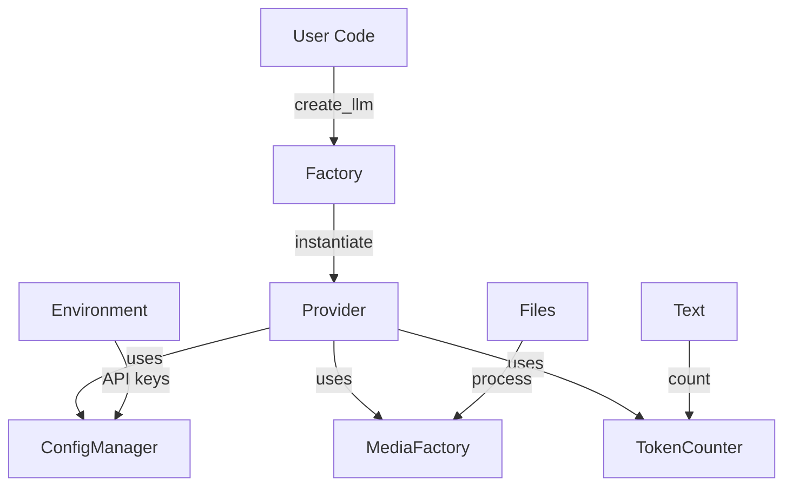

# AbstractLLM Implementation Guide

## Core Architecture

AbstractLLM follows a modular, provider-based architecture with several key components:



## Provider Implementation

### Base Provider Class

All providers must implement the `AbstractLLMInterface`:

```python
from abstractllm.interface import AbstractLLMInterface, ModelParameter, ModelCapability
from abstractllm.utils.config import ConfigurationManager
from abstractllm.media.factory import MediaFactory
from abstractllm.exceptions import UnsupportedFeatureError

class CustomProvider(AbstractLLMInterface):
    def __init__(self, config: Optional[Dict[Union[str, ModelParameter], Any]] = None):
        super().__init__(config)
        
        # Set provider-specific defaults
        default_config = {
            ModelParameter.MODEL: "default-model",
            ModelParameter.TEMPERATURE: 0.7,
            ModelParameter.MAX_TOKENS: 2048,
        }
        self.config_manager.merge_with_defaults(default_config)
        
        # Initialize provider-specific components
        self._model = None
        self._tokenizer = None
        self._initialize_components()
    
    def generate(self, 
                prompt: str, 
                system_prompt: Optional[str] = None,
                files: Optional[List[Union[str, Path]]] = None,
                stream: bool = False,
                **kwargs) -> Union[str, Generator[str, None, None]]:
        """Generate a response."""
        # Process configuration
        params = self.config_manager.get_generation_params(kwargs)
        
        # Process files if any
        if files:
            processed_files = []
            for file_path in files:
                media_input = MediaFactory.from_source(file_path)
                processed_files.append(media_input)
        
        # Generate response
        # ... provider-specific implementation
        
    async def generate_async(self, 
                          prompt: str,
                          system_prompt: Optional[str] = None,
                          files: Optional[List[Union[str, Path]]] = None,
                          stream: bool = False,
                          **kwargs) -> Union[str, AsyncGenerator[str, None]]:
        """Generate a response asynchronously."""
        # ... async implementation
    
    def get_capabilities(self) -> Dict[Union[str, ModelCapability], Any]:
        """Return provider capabilities."""
        return {
            ModelCapability.STREAMING: True,
            ModelCapability.MAX_TOKENS: 2048,
            ModelCapability.SYSTEM_PROMPT: True,
            ModelCapability.ASYNC: True,
            ModelCapability.FUNCTION_CALLING: False,
            ModelCapability.VISION: False,
        }
```

### Configuration Management

Implement proper configuration handling:

```python
from abstractllm.utils.config import ConfigurationManager

class MyProvider(AbstractLLMInterface):
    def __init__(self, config: Optional[Dict] = None):
        # Initialize configuration
        self.config_manager = ConfigurationManager(config or {})
        
        # Set provider defaults
        self.config_manager.merge_with_defaults({
            ModelParameter.MODEL: "default-model",
            ModelParameter.TEMPERATURE: 0.7,
            ModelParameter.MAX_TOKENS: 2048,
            ModelParameter.TIMEOUT: 30,
        })
        
        # Validate required parameters
        self._validate_config()
    
    def _validate_config(self) -> None:
        """Validate provider configuration."""
        # Check for required API key
        api_key = self.config_manager.get_param(ModelParameter.API_KEY)
        if not api_key:
            raise ValueError("API key is required")
        
        # Validate temperature range
        temp = self.config_manager.get_param(ModelParameter.TEMPERATURE)
        if not 0 <= temp <= 1:
            raise ValueError("Temperature must be between 0 and 1")
```

### Media Handling

Implement proper media processing:

```python
from abstractllm.media.factory import MediaFactory
from abstractllm.exceptions import UnsupportedFeatureError

class MyProvider(AbstractLLMInterface):
    def _process_media(self, 
                      files: List[Union[str, Path]],
                      capabilities: Dict[str, Any]) -> List[Dict[str, Any]]:
        """Process media files for the provider."""
        if not capabilities[ModelCapability.VISION]:
            raise UnsupportedFeatureError("Vision not supported by this provider")
        
        processed_media = []
        for file_path in files:
            # Create media input
            media_input = MediaFactory.from_source(file_path)
            
            # Convert to provider format
            formatted = media_input.to_provider_format(self.provider_name)
            processed_media.append(formatted)
        
        return processed_media
```

### Error Handling

Implement comprehensive error handling:

```python
from abstractllm.exceptions import (
    ProviderAPIError,
    AuthenticationError,
    QuotaExceededError,
    ContextWindowExceededError
)

class MyProvider(AbstractLLMInterface):
    def _handle_api_error(self, error: Exception) -> None:
        """Handle provider-specific API errors."""
        if "authentication" in str(error).lower():
            raise AuthenticationError(
                "Invalid API key",
                provider=self.provider_name,
                original_exception=error
            )
        elif "quota" in str(error).lower():
            raise QuotaExceededError(
                "API quota exceeded",
                provider=self.provider_name,
                original_exception=error
            )
        elif "context length" in str(error).lower():
            raise ContextWindowExceededError(
                self.max_context_length,
                self.current_length,
                provider=self.provider_name,
                original_exception=error
            )
        else:
            raise ProviderAPIError(
                f"API error: {str(error)}",
                provider=self.provider_name,
                original_exception=error
            )
```

### Streaming Implementation

Implement proper streaming support:

```python
class MyProvider(AbstractLLMInterface):
    def generate(self, prompt: str, stream: bool = False, **kwargs):
        """Generate with streaming support."""
        if stream:
            return self._generate_stream(prompt, **kwargs)
        return self._generate_complete(prompt, **kwargs)
    
    def _generate_stream(self, prompt: str, **kwargs) -> Generator[str, None, None]:
        """Generate streaming response."""
        try:
            for chunk in self._make_streaming_request(prompt, **kwargs):
                if chunk.content:
                    yield chunk.content
        except Exception as e:
            self._handle_api_error(e)
    
    async def _generate_stream_async(self, prompt: str, **kwargs) -> AsyncGenerator[str, None]:
        """Generate streaming response asynchronously."""
        try:
            async for chunk in self._make_streaming_request_async(prompt, **kwargs):
                if chunk.content:
                    yield chunk.content
        except Exception as e:
            self._handle_api_error(e)
```

### Vision Support

Implement vision capabilities:

```python
class MyProvider(AbstractLLMInterface):
    def _process_vision_input(self, 
                            files: List[Union[str, Path]], 
                            **kwargs) -> Dict[str, Any]:
        """Process vision inputs."""
        # Check vision support
        if not self._supports_vision():
            raise UnsupportedFeatureError(
                "Vision not supported by current model",
                provider=self.provider_name
            )
        
        # Process images
        processed_images = []
        for file_path in files:
            image = MediaFactory.from_source(file_path)
            if not isinstance(image, ImageInput):
                continue
            
            # Format for provider
            formatted = image.to_provider_format(self.provider_name)
            processed_images.append(formatted)
        
        return {
            "images": processed_images,
            "detail_level": kwargs.get("detail_level", "auto")
        }
    
    def _supports_vision(self) -> bool:
        """Check if current model supports vision."""
        model = self.config_manager.get_param(ModelParameter.MODEL)
        return model in self.VISION_CAPABLE_MODELS
```

## Best Practices

### 1. Configuration Management

```python
# Use enum keys for type safety
config = {
    ModelParameter.MODEL: "my-model",
    ModelParameter.TEMPERATURE: 0.7,
}

# Validate configuration
def _validate_config(self):
    required = [ModelParameter.API_KEY, ModelParameter.MODEL]
    for param in required:
        if not self.config_manager.get_param(param):
            raise ValueError(f"Missing required parameter: {param}")
```

### 2. Error Handling

```python
# Use custom exceptions
try:
    response = self._make_api_call()
except ApiError as e:
    if "rate limit" in str(e):
        raise QuotaExceededError(
            "Rate limit exceeded",
            provider=self.provider_name,
            original_exception=e,
            details={"retry_after": e.retry_after}
        )
    raise ProviderAPIError(str(e), provider=self.provider_name)
```

### 3. Resource Management

```python
# Clean up resources properly
def __del__(self):
    """Clean up resources."""
    if hasattr(self, '_model'):
        del self._model
    if hasattr(self, '_tokenizer'):
        del self._tokenizer
    
    # Force garbage collection if needed
    import gc
    gc.collect()
```

### 4. Logging

```python
# Use the logging system properly
from abstractllm.utils.logging import log_request, log_response

def generate(self, prompt: str, **kwargs):
    # Log request
    log_request(self.provider_name, prompt, kwargs)
    
    # Make request
    response = self._make_api_call(prompt, **kwargs)
    
    # Log response
    log_response(self.provider_name, response)
    
    return response
```

## Testing

### 1. Basic Provider Tests

```python
def test_provider_initialization():
    """Test provider initialization."""
    provider = MyProvider(config={
        ModelParameter.API_KEY: "test-key",
        ModelParameter.MODEL: "test-model"
    })
    assert provider.config_manager.get_param(ModelParameter.MODEL) == "test-model"

def test_provider_generation():
    """Test basic generation."""
    provider = MyProvider()
    response = provider.generate("Test prompt")
    assert isinstance(response, str)
    assert len(response) > 0
```

### 2. Capability Tests

```python
def test_provider_capabilities():
    """Test provider capabilities."""
    provider = MyProvider()
    capabilities = provider.get_capabilities()
    
    assert ModelCapability.STREAMING in capabilities
    assert isinstance(capabilities[ModelCapability.STREAMING], bool)
```

### 3. Error Tests

```python
def test_provider_errors():
    """Test error handling."""
    provider = MyProvider()
    
    with pytest.raises(AuthenticationError):
        provider.generate("Test", api_key="invalid-key")
    
    with pytest.raises(QuotaExceededError):
        # Simulate quota exceeded
        provider._simulate_quota_exceeded = True
        provider.generate("Test")
```

## Performance Optimization

### 1. Caching

```python
class MyProvider(AbstractLLMInterface):
    def __init__(self, config: Optional[Dict] = None):
        super().__init__(config)
        self._response_cache = {}
        self._token_cache = {}
    
    def _get_cached_response(self, key: str) -> Optional[str]:
        """Get cached response if available."""
        return self._response_cache.get(key)
    
    def _cache_response(self, key: str, response: str) -> None:
        """Cache a response."""
        self._response_cache[key] = response
        if len(self._response_cache) > 1000:
            # Implement LRU eviction
            self._evict_old_entries()
```

### 2. Resource Management

```python
class MyProvider(AbstractLLMInterface):
    def _initialize_resources(self):
        """Initialize provider resources efficiently."""
        # Load only what's needed
        if self._needs_tokenizer():
            self._load_tokenizer()
        
        if self._needs_model():
            self._load_model()
    
    def _cleanup_resources(self):
        """Clean up resources properly."""
        if hasattr(self, '_model'):
            self._model.cpu()  # Move to CPU if on GPU
            del self._model
        torch.cuda.empty_cache()  # Clear CUDA cache if used
```

## Future Considerations

1. **Extensibility**
   - Design for easy addition of new capabilities
   - Keep provider interface stable
   - Plan for backward compatibility

2. **Performance**
   - Implement proper caching strategies
   - Optimize resource usage
   - Consider batch processing

3. **Error Handling**
   - Standardize error types
   - Implement proper retry logic
   - Provide detailed error context

4. **Testing**
   - Maintain comprehensive test suite
   - Include performance tests
   - Test edge cases thoroughly
``` 