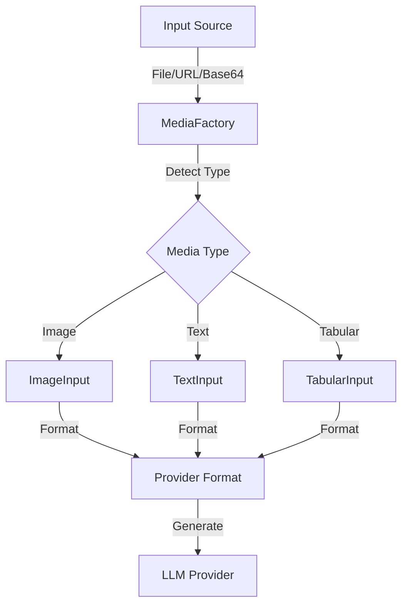

# Media Handling in AbstractLLM

## Overview

AbstractLLM provides a robust media handling system through the `MediaFactory` class, which standardizes the processing of various media types across different providers. The system is designed to be extensible, efficient, and provider-agnostic.

## Architecture



## Media Types

### 1. Images
- **Formats**: PNG, JPEG, GIF, WebP, BMP
- **Sources**: File paths, URLs, base64 strings, data URLs
- **Processing**:
  - Automatic format detection
  - Provider-specific formatting
  - Resolution optimization
  - Vision model compatibility checks
  - Format caching for performance

### 2. Text Files
- **Formats**: Plain text, Markdown, source code
- **Features**:
  - Encoding detection
  - Line ending normalization
  - Content type detection
  - Provider-specific formatting
  - Large file handling

### 3. Tabular Data
- **Formats**: CSV, TSV
- **Features**:
  - Delimiter detection
  - Header handling
  - Data type inference
  - Markdown table conversion
  - Provider-specific formatting

## Using MediaFactory

### Basic Usage

```python
from abstractllm import create_llm
from abstractllm.media.factory import MediaFactory

# Process a single file
media_input = MediaFactory.from_source("image.png")
response = llm.generate("Describe this:", files=[media_input])

# Process multiple files
media_inputs = MediaFactory.from_sources([
    "image.png",
    "document.txt",
    "data.csv"
])
response = llm.generate("Analyze these:", files=media_inputs)
```

### Provider-Specific Processing

```python
# OpenAI Format
image = MediaFactory.from_source("image.jpg")
openai_format = image.to_provider_format("openai")
# Result: {"type": "image_url", "image_url": {"url": "...", "detail": "auto"}}

# Anthropic Format
anthropic_format = image.to_provider_format("anthropic")
# Result: {"type": "image", "source": {"type": "base64", "media_type": "image/jpeg", "data": "..."}}

# Ollama Format
ollama_format = image.to_provider_format("ollama")
# Result: base64 string or URL

# HuggingFace Format
huggingface_format = image.to_provider_format("huggingface")
# Result: PIL Image or file path
```

## Provider Support Matrix

| Feature | OpenAI | Anthropic | Ollama | HuggingFace |
|---------|--------|-----------|---------|-------------|
| Images | ✅ | ✅ | ✅ | ✅ |
| Text Files | ✅ | ✅ | ✅ | ✅ |
| Tabular Data | ✅ | ✅ | ✅ | ✅ |
| Multiple Files | ✅ | ✅ | ✅ | ❌ |
| Base64 Input | ✅ | ✅ | ✅ | ❌ |
| URL Input | ✅ | ✅ | ✅ | ✅ |
| Format Caching | ✅ | ✅ | ✅ | ✅ |

## Image Processing

### Format Detection

```python
# Automatic format detection
image = MediaFactory.from_source("image.jpg")
print(image.mime_type)  # "image/jpeg"

# Explicit format
image = MediaFactory.from_source("image.dat", media_type="image")
```

### Size Optimization

```python
# Automatic size optimization
image = MediaFactory.from_source(
    "large_image.jpg",
    detail_level="auto"  # "low", "medium", "high", or "auto"
)
```

### Vision Model Support

```python
# Check vision capabilities
if llm.get_capabilities()[ModelCapability.VISION]:
    image = MediaFactory.from_source("image.jpg")
    response = llm.generate("Describe this:", files=[image])
```

## Text Processing

### File Handling

```python
# Process text file
text = MediaFactory.from_source(
    "document.txt",
    encoding="utf-8"
)

# Process with specific options
text = MediaFactory.from_source(
    "code.py",
    mime_type="text/x-python"
)
```

### Tabular Data

```python
# Process CSV file
table = MediaFactory.from_source(
    "data.csv",
    delimiter=","
)

# Process TSV file
table = MediaFactory.from_source(
    "data.tsv",
    delimiter="\t"
)
```

## Error Handling

```python
from abstractllm.exceptions import (
    FileProcessingError,
    UnsupportedFeatureError,
    ImageProcessingError
)

try:
    media = MediaFactory.from_source("image.jpg")
except FileProcessingError as e:
    print(f"File error: {e}")
except UnsupportedFeatureError as e:
    print(f"Feature not supported: {e}")
except ImageProcessingError as e:
    print(f"Image processing error: {e}")
```

## Best Practices

### 1. File Handling
```python
# Use pathlib for cross-platform compatibility
from pathlib import Path
image = MediaFactory.from_source(Path("images/photo.jpg"))

# Handle multiple files efficiently
files = MediaFactory.from_sources([
    "image1.jpg",
    "image2.png",
    "document.txt"
])
```

### 2. Memory Management
```python
# Process large files efficiently
text = MediaFactory.from_source(
    "large_file.txt",
    chunk_size=1024 * 1024  # 1MB chunks
)

# Clean up resources
del text  # Releases file handles
```

### 3. Format Caching
```python
# Cache formats for reuse
image = MediaFactory.from_source("image.jpg")
openai_format = image.to_provider_format("openai")  # Cached
anthropic_format = image.to_provider_format("anthropic")  # Cached
```

### 4. Error Recovery
```python
def process_media(file_path):
    try:
        return MediaFactory.from_source(file_path)
    except FileProcessingError:
        # Try alternative processing
        return MediaFactory.from_source(
            file_path,
            fallback_type="text"
        )
```

## Implementation Details

### MediaInput Interface
```python
class MediaInput(ABC):
    @abstractmethod
    def to_provider_format(self, provider: str) -> Any:
        """Convert to provider-specific format"""
        pass
    
    @property
    @abstractmethod
    def media_type(self) -> str:
        """Return media type"""
        pass
    
    @property
    def metadata(self) -> Dict[str, Any]:
        """Return metadata"""
        pass
```

### Provider-Specific Formatting
```python
class ImageInput(MediaInput):
    def to_provider_format(self, provider: str) -> Any:
        if provider == "openai":
            return self._format_for_openai()
        elif provider == "anthropic":
            return self._format_for_anthropic()
        elif provider == "ollama":
            return self._format_for_ollama()
        elif provider == "huggingface":
            return self._format_for_huggingface()
```

## Future Enhancements

1. **Audio Support**
   - Speech transcription
   - Audio analysis
   - Music processing

2. **Video Support**
   - Frame extraction
   - Video summarization
   - Motion analysis

3. **Advanced Processing**
   - Parallel processing
   - Streaming support
   - Format conversion

4. **Memory Optimization**
   - Lazy loading
   - Resource pooling
   - Cleanup strategies 