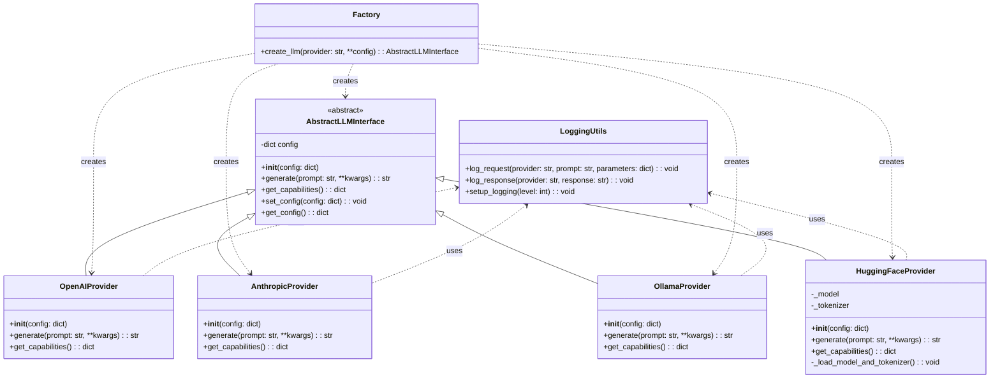
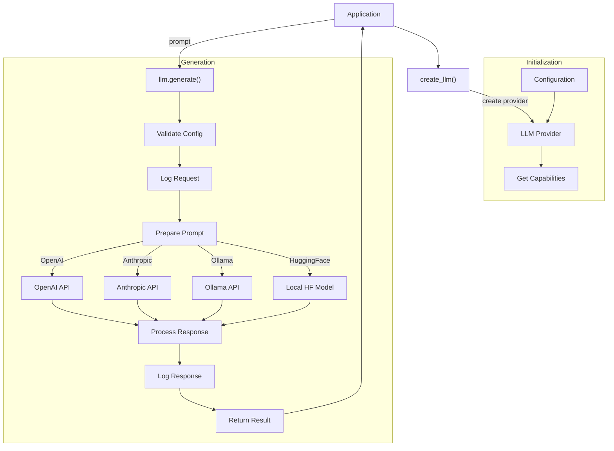

# AbstractLLM Architecture and Design

## Package Structure

```
abstractllm/
├── __init__.py                # Package exports and version
├── interface.py               # Abstract base class definition
├── factory.py                 # Factory for creating provider instances
├── providers/
│   ├── __init__.py            # Provider registry
│   ├── openai.py              # OpenAI implementation
│   ├── anthropic.py           # Anthropic implementation
│   ├── ollama.py              # Ollama implementation
│   └── huggingface.py         # Hugging Face implementation
└── utils/
    ├── __init__.py
    └── logging.py             # Logging utilities
```

## Architecture



## Data flow



## Core Components

### AbstractLLM Interface

The core of the package is the `AbstractLLMInterface` class, which defines the common interface that all provider implementations must follow:

```python
"""
Abstract interface for LLM providers.
"""

from abc import ABC, abstractmethod
from typing import Dict, Any, Optional, Union, Generator, AsyncGenerator


class AbstractLLMInterface(ABC):
    """
    Abstract interface for LLM providers.
    
    All LLM providers must implement this interface to ensure a consistent API.
    """
    
    def __init__(self, config: Optional[Dict[str, Any]] = None):
        """
        Initialize the LLM provider.
        
        Args:
            config: Configuration dictionary for the provider
        """
        self.config = config or {}
    
    @abstractmethod
    def generate(self, prompt: str, stream: bool = False, **kwargs) -> Union[str, Generator[str, None, None]]:
        """
        Generate a response to the prompt using the LLM.
        
        Args:
            prompt: The input prompt
            stream: Whether to stream the response
            **kwargs: Additional provider-specific parameters
            
        Returns:
            If stream=False: The complete generated response as a string
            If stream=True: A generator yielding response chunks
            
        Raises:
            Exception: If the generation fails
        """
        pass

    @abstractmethod
    async def generate_async(self, prompt: str, stream: bool = False, **kwargs) -> Union[str, AsyncGenerator[str, None]]:
        """
        Asynchronously generate a response to the prompt using the LLM.
        
        Args:
            prompt: The input prompt
            stream: Whether to stream the response
            **kwargs: Additional provider-specific parameters
            
        Returns:
            If stream=False: The complete generated response as a string
            If stream=True: An async generator yielding response chunks
            
        Raises:
            Exception: If the generation fails
        """
        pass
        
    def get_capabilities(self) -> Dict[str, Any]:
        """
        Return capabilities of this LLM.
        
        Returns:
            Dictionary of capabilities including:
            - streaming: bool - Whether streaming is supported
            - max_tokens: Optional[int] - Maximum tokens supported
            - supports_system_prompt: bool - Whether system prompts are supported
            - supports_async: bool - Whether async generation is supported
        """
        return {
            "streaming": False,
            "max_tokens": None,
            "supports_system_prompt": False,
            "supports_async": False
        }
        
    def set_config(self, config: Dict[str, Any]) -> None:
        """
        Update the configuration.
        
        Args:
            config: New configuration values to merge with existing config
        """
        self.config.update(config)
        
    def get_config(self) -> Dict[str, Any]:
        """
        Get the current configuration.
        
        Returns:
            Current configuration as a dictionary
        """
        return self.config.copy()
```

### Factory Function

A factory function provides a clean way to instantiate the appropriate provider:

```python
def create_llm(provider: str, **config) -> AbstractLLMInterface:
    """
    Create an LLM instance for the specified provider.
    
    Args:
        provider (str): The provider name ('openai', 'anthropic', 'ollama', 'huggingface')
        **config: Provider-specific configuration
        
    Returns:
        AbstractLLMInterface: An initialized LLM interface
        
    Raises:
        ValueError: If the provider is not supported
    """
    # Implementation will import and instantiate the appropriate provider
```

## Provider Implementations

Each provider implements the `AbstractLLMInterface` with provider-specific logic:

### Example: OpenAI Provider

```python
class OpenAIProvider(AbstractLLMInterface):
    """OpenAI API implementation."""
    
    def generate(self, prompt: str, **kwargs) -> str:
        # Combine self.config with kwargs
        # Log the request
        # Make API call
        # Log the response
        # Return the result
```

## Configuration Management

Each provider has default configurations that can be overridden:

1. **At initialization time**:
   ```python
   llm = create_llm("openai", api_key="sk-...", model="gpt-4")
   ```

2. **Via set_config**:
   ```python
   llm.set_config({"temperature": 0.7})
   ```

3. **Per request**:
   ```python
   response = llm.generate("Hello, world!", temperature=0.9)
   ```

Parameters at each level override the previous level, giving flexibility while maintaining reasonable defaults.

## Logging System

The logging system captures request/response details:

```python
# utils/logging.py
import logging
from datetime import datetime

logger = logging.getLogger("abstractllm")

def log_request(provider: str, prompt: str, parameters: dict):
    """Log an LLM request."""
    logger.debug(f"REQUEST [{provider}]: {datetime.now().isoformat()}")
    logger.debug(f"Parameters: {parameters}")
    logger.debug(f"Prompt: {prompt}")

def log_response(provider: str, response: str):
    """Log an LLM response."""
    logger.debug(f"RESPONSE [{provider}]: {datetime.now().isoformat()}")
    logger.debug(f"Response: {response}")
```

## System Prompt Handling

System prompts are handled via configuration:

```python
llm = create_llm("openai", system_prompt="You are a helpful assistant.")
```

Each provider implementation will incorporate the system prompt according to its API requirements.