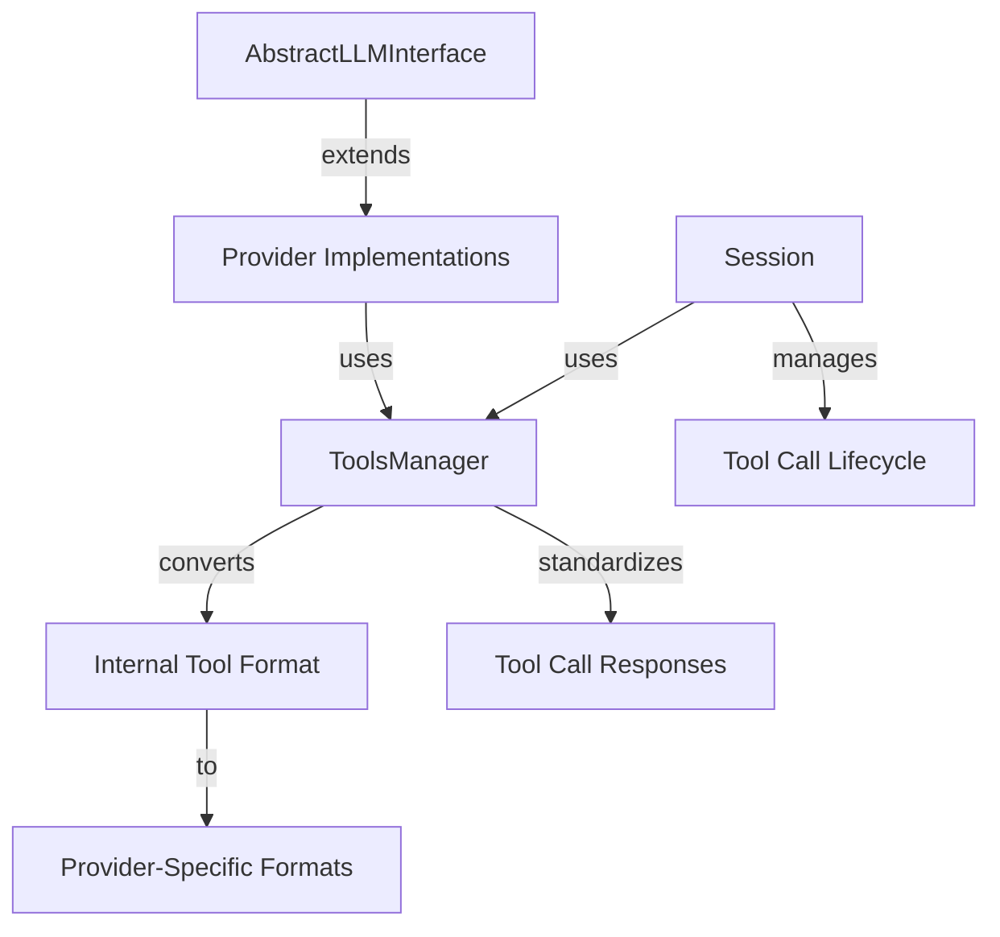

# Tool Call Implementation - Comprehensive Overview

This document provides a comprehensive overview for implementing tool call support in AbstractLLM, based on the strategy defined in previous planning documents. Unlike the earlier high-level plan, this implementation guide provides concrete technical details, code references, and architecture specifications.

## Architecture Overview

### Core Components & Relationships

The tool call implementation will add several new components to AbstractLLM's architecture, integrated with existing systems:



### Key Files to Create/Modify

1. **Tool Definition & Processing**:
   - `abstractllm/tools/__init__.py` - Package exports
   - `abstractllm/tools/types.py` - Type definitions for tool calls and responses
   - `abstractllm/tools/conversion.py` - Function conversion utilities

2. **Interface Extensions**:
   - `abstractllm/interface.py` - Update `AbstractLLMInterface` with tool capabilities
   - `abstractllm/enums.py` - Add tool-related capabilities

3. **Provider Adapters**:
   - `abstractllm/providers/openai.py` - OpenAI-specific tool implementation
   - `abstractllm/providers/anthropic.py` - Anthropic-specific tool implementation
   - `abstractllm/providers/ollama.py` - Ollama-specific tool implementation

4. **Session Management**:
   - `abstractllm/session.py` - Update Session class for tool call lifecycle

5. **Testing & Documentation**:
   - `tests/tools/` - Test suite for tool functionality
   - `docs/usage/tools.md` - User-facing documentation

## Integration with Existing Architecture

### Aligning with AbstractLLM Design Principles

The tool call implementation must align with AbstractLLM's core design principles:

1. **Provider Abstraction**: Tool call support should be abstracted behind a common interface, with provider-specific details hidden from client code.

2. **Capability System**: Tool call support should be exposed as a runtime capability that can be checked via the `get_capabilities()` method.

3. **Session Management**: Tool call interactions should integrate seamlessly with the existing session management system.

4. **Error Handling**: Tool call errors should use the existing exception hierarchy, with appropriate new exceptions added as needed.

5. **Configuration Management**: Tool-related configurations should be handled via the existing `ConfigurationManager`.

### Extending Provider Interface

The `AbstractLLMInterface` needs extended functionality to support tool calls:

```python
# Extending AbstractLLMInterface in interface.py
def generate(self, 
            prompt: str, 
            system_prompt: Optional[str] = None, 
            files: Optional[List[Union[str, Path]]] = None,
            tools: Optional[List[Union[Dict[str, Any], Callable]]] = None,  # <-- New parameter
            stream: bool = False, 
            **kwargs) -> Union[str, Generator[str, None, None], Dict[str, Any]]:  # <-- Modified return type
```

Note that the return type will be extended to allow for structured responses containing tool calls.

### Tool Definition Standard

As detailed in `docs/plans/general-tool-call-model.md`, we'll use the Anthropic-like tool definition format internally:

```python
tool_definition = {
    "name": "function_name",
    "description": "A detailed description of what the function does",
    "input_schema": {
        "type": "object",
        "properties": {
            "param1": {
                "type": "string",
                "description": "Description of param1"
            },
            # More parameters...
        },
        "required": ["param1"]
    }
}
```

### Standardized Tool Call Response

The standardized response structure for tool calls will be:

```python
response = {
    "content": "Optional text response from the assistant",
    "tool_calls": [
        {
            "id": "unique_call_id",
            "type": "function",
            "function": {
                "name": "function_name",
                "arguments": "{\"param1\": \"value1\"}"  # JSON string
            }
        }
    ]
}
```

## Implementation Phases

The implementation is divided into five phases, each detailed in its own document:

1. **[Tool Definition Foundation](foundation.md)**: Core data structures and conversion utilities
2. **[Core Interface Adaptation](interfaces.md)**: Updating AbstractLLM interfaces
3. **[Provider Implementations](providers.md)**: Provider-specific adapters
4. **[Session Lifecycle Management](session.md)**: Tool call conversation flow
5. **[Testing & Documentation](testing.md)**: Comprehensive testing strategy

Each phase document contains:
- Specific files to create/modify
- Implementation details with code examples
- Integration considerations
- Testing requirements

## Implementation Considerations

### Backward Compatibility

Tool call support should be implemented in a way that maintains backward compatibility:

1. The `tools` parameter should be optional with a default value of `None`
2. When tools are not provided, behavior should be identical to the current implementation
3. Return type changes should be carefully managed to avoid breaking existing code

### Error Handling

Tool-related errors should be handled consistently with AbstractLLM's existing error handling:

```python
# New exception types
class ToolCallError(ProviderError):
    """Base class for tool call errors."""
    pass

class UnsupportedToolError(ToolCallError):
    """Raised when a tool is not supported by the provider."""
    pass

class ToolExecutionError(ToolCallError):
    """Raised when there's an error executing a tool."""
    pass
```

### Testing Strategy

The implementation should be thoroughly tested, including:

1. Unit tests for tool conversion utilities
2. Provider-specific tests for tool call formatting
3. Integration tests for the complete tool call lifecycle
4. Edge cases, including error conditions
5. Performance tests for large numbers of tools

See the dedicated [testing document](testing.md) for a detailed testing strategy.

## Next Steps

Begin with the first phase: implementing the [Tool Definition Foundation](foundation.md). This establishes the core data structures and utilities that all other phases will depend on. 