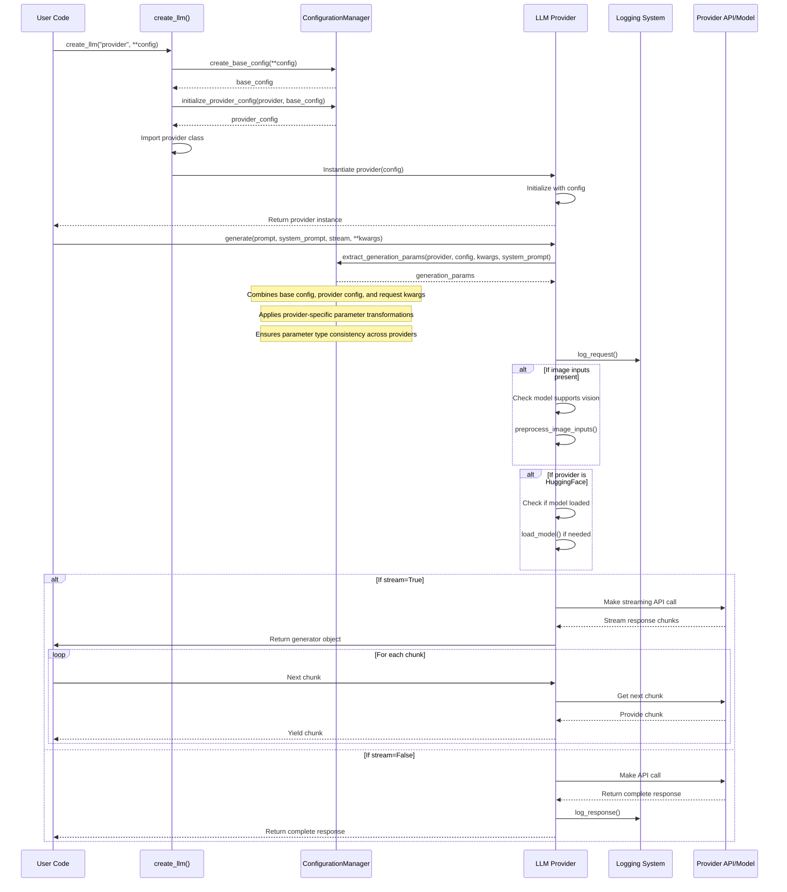
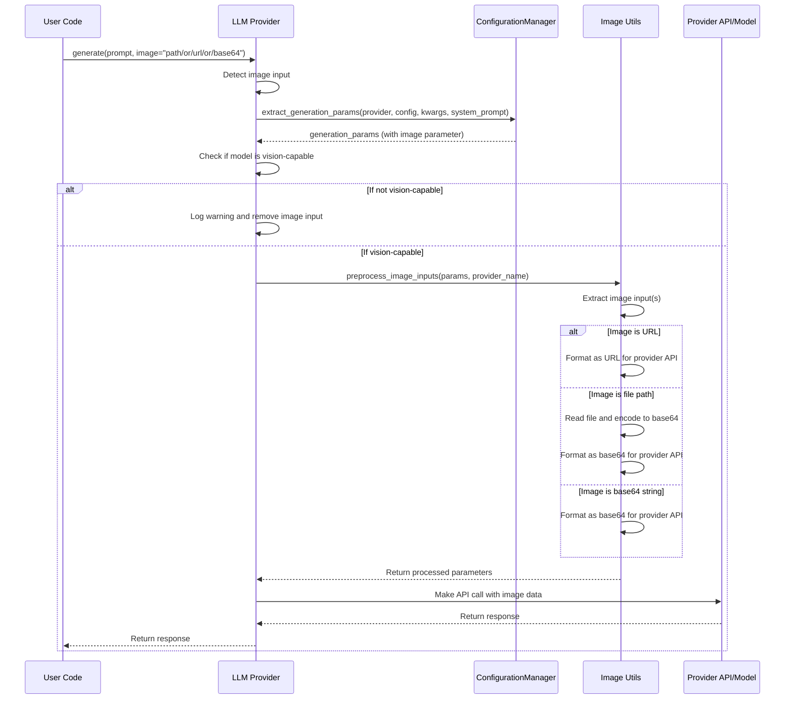
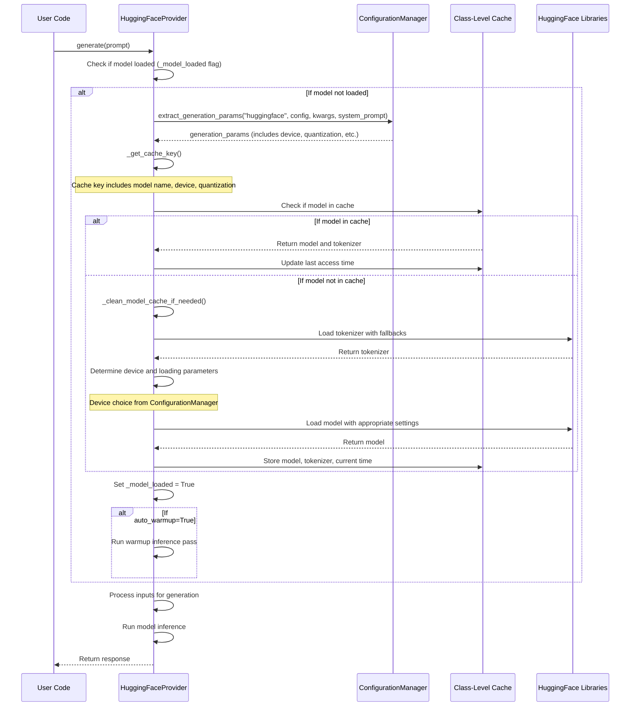
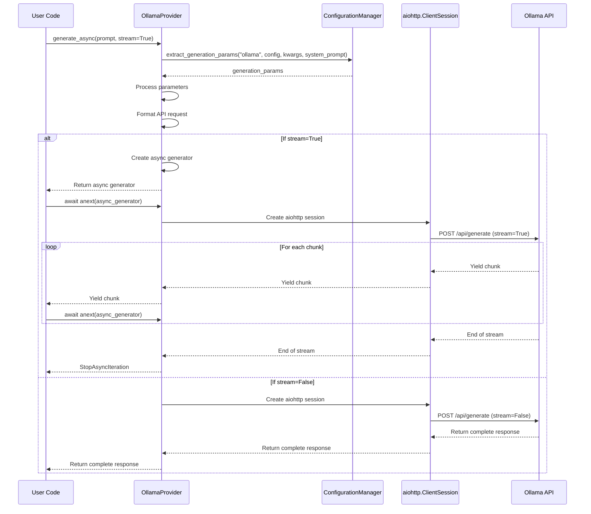
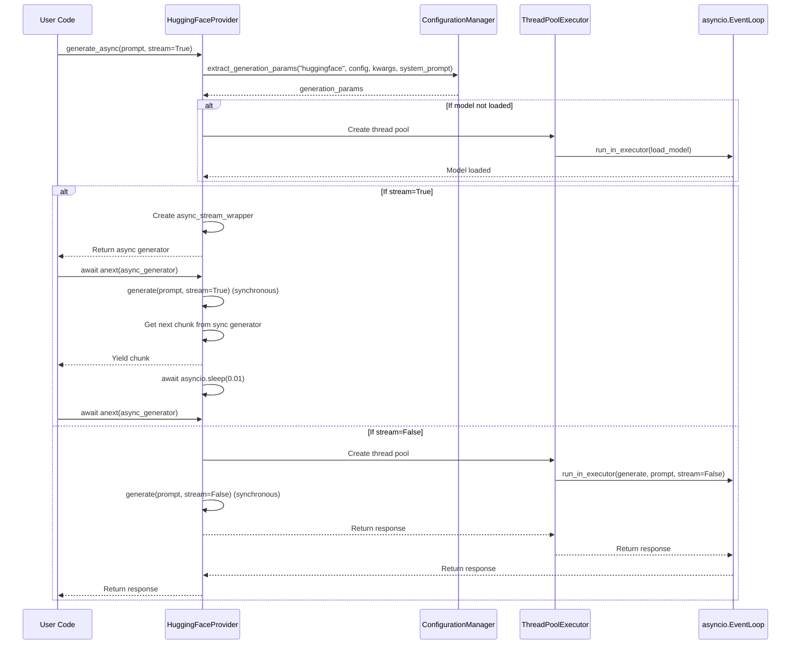
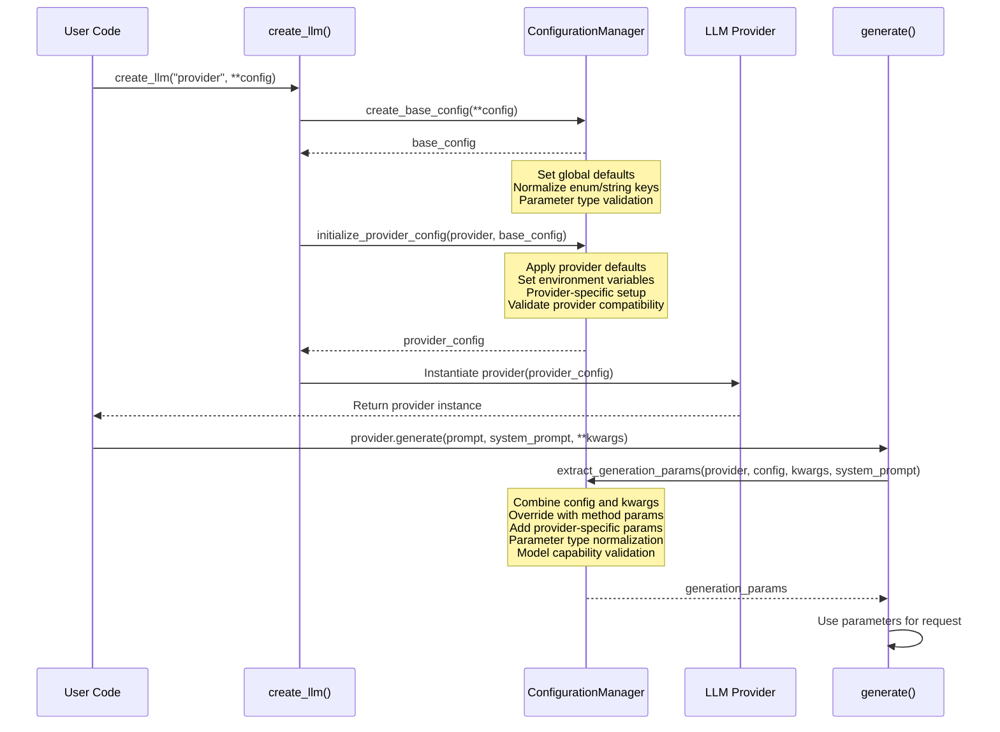
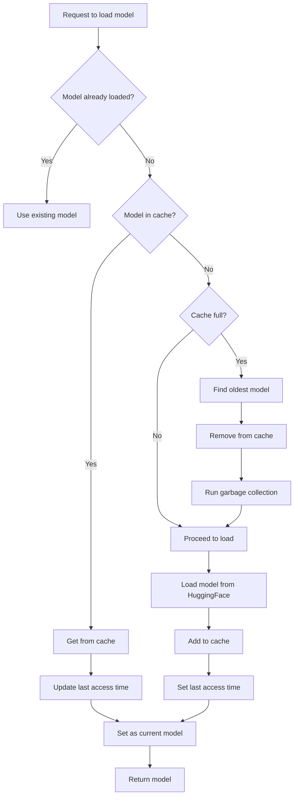
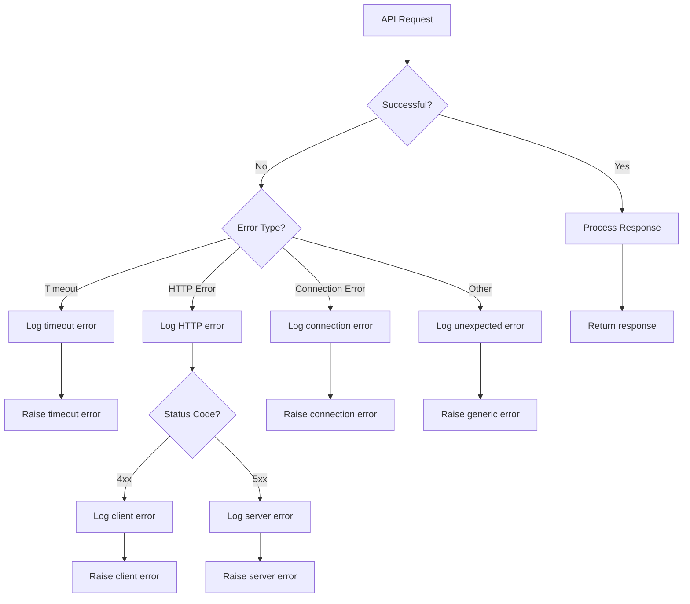
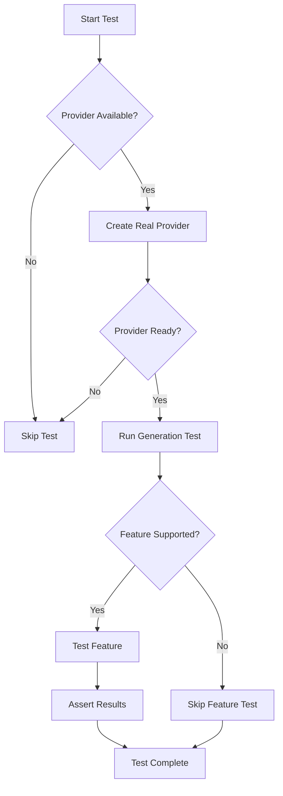

# Data Flow and Call Stack Analysis

This document provides a detailed technical analysis of the data flow and call stacks within AbstractLLM. Understanding these flows is essential for developers working with or extending the library.

## Core Request Flow

The following diagram illustrates the complete flow of a typical text generation request from user code to the LLM response:



## Image Processing Flow

When processing image inputs for vision-capable models, the following flow occurs:



## HuggingFace Model Loading and Caching Flow

The HuggingFace provider has a unique flow for model loading and caching:



## Method Call Hierarchy

### Factory Initialization

```
create_llm(provider, **config)
├── _PROVIDERS mapping lookup
├── importlib.import_module()
├── getattr(module, class_name)
├── ConfigurationManager.create_base_config(**config)
│   └── Normalizes string/enum params
├── ConfigurationManager.initialize_provider_config(provider, base_config)
│   ├── Sets provider defaults
│   ├── Loads API keys from environment 
│   └── Handles provider-specific base URLs
└── provider_class(config=provider_config)
    └── AbstractLLMInterface.__init__(config)
        └── Provider-specific initialization
```

### OpenAI Generation

```
OpenAIProvider.generate(prompt, system_prompt, stream, **kwargs)
├── ConfigurationManager.extract_generation_params("openai", config, kwargs, system_prompt)
│   ├── Merges instance config and method kwargs
│   ├── Extracts provider-agnostic parameters
│   └── Extracts OpenAI-specific parameters (organization, response_format, etc.)
├── Extract key parameters (model, temperature, etc.)
├── Check for image inputs
│   └── preprocess_image_inputs() if needed
├── log_request()
├── Prepare request payload
├── If stream=True:
│   ├── Make streaming API call
│   └── Return generator that yields chunks
└── If stream=False:
    ├── Make standard API call
    ├── Process response
    ├── log_response()
    └── Return complete response
```

### HuggingFace Generation

```
HuggingFaceProvider.generate(prompt, system_prompt, stream, **kwargs)
├── Check if model loaded
│   └── load_model() if needed
├── ConfigurationManager.extract_generation_params("huggingface", config, kwargs, system_prompt)
│   ├── Merges instance config and method kwargs
│   ├── Extracts provider-agnostic parameters  
│   └── Extracts HuggingFace-specific parameters (device, quantization, etc.)
├── Extract key parameters (model, temperature, etc.)
├── Check for image inputs
│   └── preprocess_image_inputs() if needed
├── log_request()
├── Prepare system prompt and user prompt
├── Tokenize input
├── Set up generation config
├── If stream=True:
│   ├── Create streaming generator
│   └── Return generator
└── If stream=False:
    ├── Generate output with timeout protection
    ├── Decode output
    ├── log_response()
    └── Return complete response
```

## Async Flow Implementation

### Ollama Async Generation



### HuggingFace Async Generation



## Configuration Flow

The following diagram illustrates how configuration parameters flow through the system during the creation of the LLM instance and generation requests:



### Detailed Configuration Data Flow

The `ConfigurationManager` centralizes all parameter handling in AbstractLLM, ensuring consistent behavior across providers. Here's a detailed breakdown of how configuration data flows through the system:

#### 1. Configuration Initialization

When a user calls `create_llm()`, the configuration flows through these steps:

```python
# User code
llm = create_llm("openai", temperature=0.7, model="gpt-4o")

# Inside factory.py
def create_llm(provider, **config):
    # Step 1: Create base configuration with global defaults
    base_config = ConfigurationManager.create_base_config(**config)
    
    # Step 2: Initialize provider-specific configuration
    provider_config = ConfigurationManager.initialize_provider_config(provider, base_config)
    
    # Step 3: Create provider instance with finalized config
    provider_instance = provider_class(config=provider_config)
    return provider_instance
```

The base configuration includes these default values:

```python
# Default configuration in ConfigurationManager.create_base_config()
config = {
    ModelParameter.TEMPERATURE: 0.7,
    ModelParameter.MAX_TOKENS: 2048,
    ModelParameter.SYSTEM_PROMPT: None,
    ModelParameter.TOP_P: 1.0,
    ModelParameter.FREQUENCY_PENALTY: 0.0,
    ModelParameter.PRESENCE_PENALTY: 0.0,
    ModelParameter.STOP: None,
    ModelParameter.MODEL: None,
    ModelParameter.API_KEY: None,
    ModelParameter.BASE_URL: None,
    ModelParameter.TIMEOUT: 120,
    ModelParameter.RETRY_COUNT: 3,
    ModelParameter.SEED: None,
    ModelParameter.LOGGING_ENABLED: True,
}
```

#### 2. Provider-Specific Initialization

The provider-specific initialization in `initialize_provider_config()` handles:

1. **Default Models**: Sets provider-specific default models if not specified
   ```python
   # Default model for provider
   if ModelParameter.MODEL not in config_copy and "model" not in config_copy:
       default_model = DEFAULT_MODELS.get(provider_name)
       if default_model:
           config_copy[ModelParameter.MODEL] = default_model
   ```

2. **Environment Variables**: Checks environment variables for API keys
   ```python
   # API Key from environment
   api_key = config_copy.get(ModelParameter.API_KEY, config_copy.get("api_key"))
   if not api_key:
       env_var = ENV_API_KEYS.get(provider_name)
       if env_var:
           env_api_key = os.environ.get(env_var)
           if env_api_key:
               config_copy[ModelParameter.API_KEY] = env_api_key
   ```

3. **Base URLs**: Sets provider-specific base URLs
   ```python
   # Base URL default
   if ModelParameter.BASE_URL not in config_copy and "base_url" not in config_copy:
       base_url = BASE_URLS.get(provider_name)
       if base_url:
           config_copy[ModelParameter.BASE_URL] = base_url
   ```

#### 3. Generation Parameter Extraction

When `generate()` is called, the configuration is combined with the method parameters:

```python
# User code
response = llm.generate("Hello, world!", temperature=0.9)

# Inside generate method
def generate(self, prompt, system_prompt=None, stream=False, **kwargs):
    # Extract and combine parameters
    params = ConfigurationManager.extract_generation_params(
        "provider_name", self.config, kwargs, system_prompt
    )
    
    # Use parameters for generation
    # ...
```

The parameter extraction process in `extract_generation_params()`:

1. **Combines configurations**: Merges the provider's base config with method-specific overrides
   ```python
   # Create a copy of the config and update with kwargs
   params = config.copy()
   params.update(kwargs)
   ```

2. **Handles system prompt override**: Prioritizes method-provided system prompt
   ```python
   # Handle system prompt override
   if system_prompt is not None:
       params[ModelParameter.SYSTEM_PROMPT] = system_prompt
   ```

3. **Extracts common parameters**: Gets standard parameters with fallbacks
   ```python
   # Extract common parameters
   result = {
       "model": ConfigurationManager.get_param(params, ModelParameter.MODEL),
       "temperature": ConfigurationManager.get_param(params, ModelParameter.TEMPERATURE, 0.7),
       # ...more parameters...
   }
   ```

4. **Adds provider-specific parameters**: Incorporates parameters specific to each provider
   ```python
   # For example, OpenAI-specific parameters
   if provider == "openai":
       result["organization"] = ConfigurationManager.get_param(params, "organization")
       # ...more OpenAI parameters...
   ```

### Parameter Override Hierarchy

The configuration system follows a clear hierarchy for parameter resolution:

1. **Global Defaults**: Set in `create_base_config()`
2. **Provider-Specific Defaults**: Set in `initialize_provider_config()`
3. **User-Provided Creation Parameters**: Passed to `create_llm()`
4. **Environment Variables**: For API keys and base URLs
5. **Per-Method Parameters**: Passed to `generate()`, `generate_async()`, etc.

This hierarchy ensures that the most specific parameters (method-level) take precedence over more general ones (global defaults).

### Environment Variable Integration

The system automatically looks for these environment variables:

```
OPENAI_API_KEY - For OpenAI provider authentication
ANTHROPIC_API_KEY - For Anthropic provider authentication
HUGGINGFACE_API_KEY - For HuggingFace Hub (optional)
OLLAMA_BASE_URL - For Ollama endpoint (default: http://localhost:11434)
```

The environment variable resolution happens during provider initialization and is logged at the DEBUG level:

```python
# Example: API key resolution
env_var = ENV_API_KEYS.get(provider_name)  # e.g., "OPENAI_API_KEY"
if env_var:
    env_api_key = os.environ.get(env_var)
    if env_api_key:
        config_copy[ModelParameter.API_KEY] = env_api_key
        log_api_key_from_env(provider_name, env_var)
```

### Dual Key Support

The configuration system supports both string keys and enum keys for flexibility:

```python
# Using enum keys (recommended for static typing)
llm = create_llm("openai", **{
    ModelParameter.TEMPERATURE: 0.7,
    ModelParameter.MAX_TOKENS: 1000
})

# Using string keys (more convenient for dynamic configuration)
llm = create_llm("openai", temperature=0.7, max_tokens=1000)
```

This is implemented via the `get_param()` helper method:

```python
@staticmethod
def get_param(config, param, default=None):
    """Get a parameter value from configuration, supporting both enum and string keys."""
    # Try with enum first, then with string key
    return config.get(param, config.get(param.value, default))
```

### ConfigurationManager's Cross-Provider Impact

The ConfigurationManager plays a pivotal role in ensuring consistent behavior across different providers:

1. **Parameter Normalization**:
   - Converts all parameters to a standardized format
   - Handles different naming conventions between providers (e.g., `max_new_tokens` vs `max_tokens`)
   - Ensures enum keys and string keys are treated consistently

2. **Capability Validation**:
   - Validates that vision parameters are only used with vision-capable models
   - Prevents incompatible parameters from being passed to providers
   - Ensures streaming is handled appropriately for each provider

3. **Default Management**:
   - Provides sensible defaults for all providers
   - Adjusts defaults based on provider capabilities
   - Maintains compatibility with different model versions

4. **Environmental Awareness**:
   - Detects available hardware (CUDA, MPS, CPU)
   - Sets appropriate quantization based on hardware constraints
   - Uses environment variables for sensitive data

### Performance Considerations

The centralized configuration system improves performance by:

1. **Reducing Redundancy**: Eliminates duplicate parameter handling code across providers
2. **Caching Defaults**: Computes provider-specific defaults once during initialization
3. **Selective Parameter Extraction**: Only extracts relevant parameters for each provider
4. **Efficient Copy Operations**: Uses shallow copies for configuration dictionaries

## Memory Management Flow

The following diagram details the memory management process in the HuggingFace provider:



## Error Handling Flow

The following flowchart illustrates how API request errors are handled:



## Call Stack Examples

### OpenAI Text Generation

```
User Code
└── create_llm("openai", **config)
    └── ConfigurationManager.create_base_config(**config)
    └── ConfigurationManager.initialize_provider_config("openai", base_config)
    └── OpenAIProvider.__init__(provider_config)
        └── AbstractLLMInterface.__init__(provider_config)

User Code
└── provider.generate(prompt, system_prompt, stream, **kwargs)
    └── ConfigurationManager.extract_generation_params("openai", config, kwargs, system_prompt)
    └── log_request(provider, prompt, parameters)
    └── OpenAI Client API call
    └── log_response(provider, response)
    └── return response
```

### HuggingFace Vision Generation

```
User Code
└── create_llm("huggingface", **config)
    └── ConfigurationManager.create_base_config(**config)
    └── ConfigurationManager.initialize_provider_config("huggingface", base_config)
    └── HuggingFaceProvider.__init__(provider_config)
        └── AbstractLLMInterface.__init__(provider_config)

User Code
└── provider.generate(prompt, image="path/to/image.jpg")
    └── HuggingFaceProvider.load_model() (if not loaded)
        └── _get_cache_key()
        └── _clean_model_cache_if_needed()
        └── AutoTokenizer.from_pretrained()
        └── AutoModelForCausalLM.from_pretrained()
    └── ConfigurationManager.extract_generation_params("huggingface", config, kwargs, system_prompt)
    └── preprocess_image_inputs(params, "huggingface")
    └── log_request(provider, prompt, parameters)
    └── _generate_phi4_vision() (for Phi-4 model)
        └── processor.process_images()
        └── tokenizer()
        └── model.generate()
        └── tokenizer.decode()
    └── log_response(provider, response)
    └── return response
```

## Performance Considerations

Based on the flow analysis, here are key performance optimizations identified in AbstractLLM:

1. **Lazy Loading**: Models are loaded only when needed, reducing startup time and memory usage when models aren't immediately used.

2. **Model Caching**: The HuggingFace provider implements a class-level cache to share models between instances, avoiding redundant loading.

3. **LRU Cache Policy**: The least-recently-used (LRU) cache eviction policy ensures that memory resources are used efficiently.

4. **Device Optimization**: Automatic selection of the optimal device (CUDA, MPS, CPU) ensures models run on the most efficient hardware available.

5. **Thread Pool Management**: The HuggingFace async implementation manages thread pools to avoid resource contention during async operations.

6. **Timeout Protection**: Timeouts are implemented to prevent hanging operations, particularly during model inference.

7. **Parameter Normalization**: Centralizing parameter handling through ConfigurationManager reduces redundant parameter extraction and provides consistent defaults.

8. **Centralized Configuration**: Using ConfigurationManager eliminates redundant code and provides a single source of truth for parameter handling.

9. **Configuration Reuse**: Similar configurations across providers can be reused with minimal changes due to the ConfigurationManager's abstraction.

10. **Hardware-Aware Settings**: The ConfigurationManager adjusts settings based on available hardware, such as optimizing for CUDA when available.

## Thread and Process Management

The library manages concurrency through different approaches, depending on the provider:

1. **API-based Providers** (OpenAI, Anthropic, Ollama):
   - Use `aiohttp` for asynchronous HTTP requests
   - Native async/await support with async generators

2. **Local Model Providers** (HuggingFace):
   - Use `ThreadPoolExecutor` to avoid blocking the event loop during model loading and inference
   - Wrapping synchronous generators in async generators for stream compatibility

3. **All Providers**:
   - No explicit multiprocessing is used in the library
   - `ThreadPoolExecutor` is used for concurrent operations
   - Async operations follow the asyncio pattern

Key insight: The library prefers thread-based parallelism over process-based parallelism, which avoids the overhead of inter-process communication at the cost of being subject to the Global Interpreter Lock (GIL) for Python operations (though model inference in libraries like PyTorch typically releases the GIL during computation-intensive operations). 

## Testing Flow Without Mocks

The AbstractLLM library employs a unique approach to testing providers that emphasizes real component integration over mocks, ensuring that tests validate actual functionality rather than simulated behavior. Below is a flowchart illustrating the testing flow:



### Ollama Testing Approach

The Ollama provider demonstrates this approach effectively:

1. **Availability Check**: Tests first attempt to connect to the local Ollama instance.
   ```python
   try:
       response = requests.get("http://localhost:11434/api/tags")
       if response.status_code != 200:
           self.skipTest("Ollama API not accessible")
   except Exception:
       self.skipTest("Ollama API not accessible or other error")
   ```

2. **Model Discovery**: Rather than hardcoding model names, tests discover available models at runtime.
   ```python
   models = response.json().get("models", [])
   if not models:
       self.skipTest("No Ollama models available")
       
   # Use the first available model
   self.model_name = models[0]["name"]
   ```

3. **Configuration Verification**: Tests verify that the configuration is properly set up before proceeding.
   ```python
   self.assertEqual(self.provider_config.get(ModelParameter.BASE_URL), "http://localhost:11434")
   ```

4. **Feature Capability Testing**: Tests check if features are supported before testing them.
   ```python
   capabilities = llm.get_capabilities()
   if not capabilities.get("supports_system_prompt", False):
       self.skipTest(f"Model {self.model_name} does not support system prompts")
   ```

5. **Real Parameter Extraction**: Tests verify that parameters are correctly extracted and processed.
   ```python
   gen_params = ConfigurationManager.extract_generation_params(
       "ollama", 
       llm.config, 
       {"temperature": 0.2}
   )
   self.assertEqual(gen_params["temperature"], 0.2)
   ```

6. **Actual Generation Testing**: Tests perform real generations and verify the results.
   ```python
   response = llm.generate("Say hello")
   self.assertIsInstance(response, str)
   self.assertTrue(len(response) > 0)
   ```

### Benefits of This Approach

This testing approach offers several advantages:

1. **Validates Real Behavior**: Tests confirm that the code works with actual LLM providers and models.
2. **Avoids Mock Drift**: No risk of tests passing while actual implementations drift.
3. **Self-Adapting**: Tests adjust to available models and capabilities.
4. **Comprehensive Coverage**: Tests exercise the full stack from configuration to response processing.
5. **Graceful Degradation**: Tests skip rather than fail when resources are unavailable.

### Implementation Across Providers

Each provider implements this testing pattern with variations:

* **OpenAI/Anthropic**: Tests check for API keys and skip if unavailable.
* **Ollama**: Tests verify local service availability and discover models.
* **HuggingFace**: Tests check for available models that can run on the current hardware.

This approach ensures that tests validate the actual behavior of the library in real-world scenarios while remaining flexible enough to run in various environments. 