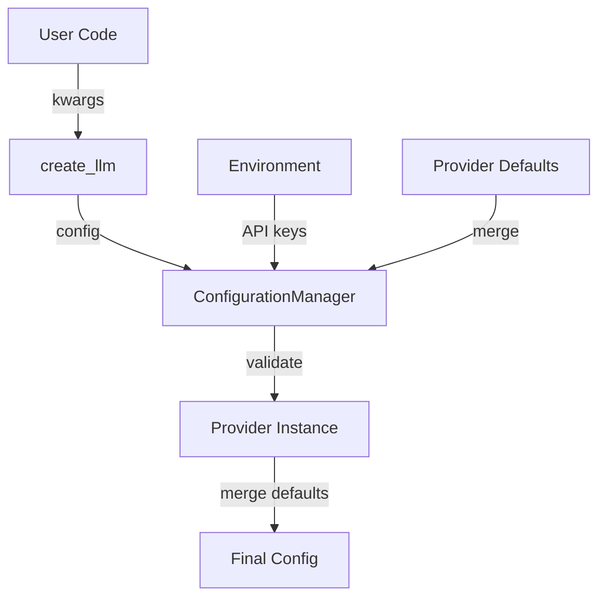

# Configuration Management in AbstractLLM

## Overview

AbstractLLM uses a centralized configuration management system through the `ConfigurationManager` class in `abstractllm/utils/config.py`. This system provides a unified approach to handling parameters across all providers, ensuring consistency and type safety.

## Core Features

- **Unified Parameter Handling**: Common parameters normalized across providers
- **Type-Safe Parameters**: Support for both enum and string parameter keys
- **Provider-Specific Defaults**: Each provider has appropriate default values
- **Environment Variable Integration**: Automatic API key handling from environment
- **Runtime Configuration Updates**: Parameters can be updated during execution
- **Parameter Validation**: Type and value validation for all parameters
- **Caching Settings**: Configuration for model and response caching
- **Device Management**: Automatic device selection for local models

## Configuration Flow



## Parameter Types

### Common Parameters

| Parameter | Type | Default | Description |
|-----------|------|---------|-------------|
| `temperature` | float | 0.7 | Controls randomness in generation |
| `max_tokens` | int | 2048 | Maximum tokens to generate |
| `system_prompt` | str | None | System instruction for the model |
| `model` | str | Provider-specific | Model identifier/name |
| `api_key` | str | From env var | API key for provider authentication |
| `timeout` | int | 120 | Request timeout in seconds |
| `retry_count` | int | 3 | Number of retries on failure |

### Vision Parameters

| Parameter | Type | Default | Description |
|-----------|------|---------|-------------|
| `image` | str/Path | None | Single image input |
| `images` | List[str/Path] | None | Multiple image inputs |
| `image_detail` | str | "auto" | Detail level for vision models |

### Local Model Parameters

| Parameter | Type | Default | Description |
|-----------|------|---------|-------------|
| `device` | str | "auto" | Device for model loading |
| `device_map` | str | "auto" | Device mapping strategy |
| `load_in_8bit` | bool | False | Use 8-bit quantization |
| `load_in_4bit` | bool | False | Use 4-bit quantization |
| `torch_dtype` | str | "auto" | PyTorch data type |
| `trust_remote_code` | bool | True | Allow remote code execution |

## Provider-Specific Configuration

### OpenAI

```python
llm = create_llm("openai", **{
    ModelParameter.MODEL: "gpt-4o"
    ModelParameter.API_KEY: "your-api-key",
    ModelParameter.TEMPERATURE: 0.7,
    ModelParameter.MAX_TOKENS: 1000,
})
```

### Anthropic

```python
llm = create_llm("anthropic", **{
    ModelParameter.MODEL: "claude-3-5-sonnet-20241022",
    ModelParameter.API_KEY: "your-api-key",
    ModelParameter.MAX_TOKENS: 4096,  # Higher limits for Claude 3
})
```

### HuggingFace

```python
llm = create_llm("huggingface", **{
    ModelParameter.MODEL: "microsoft/phi-2",
    ModelParameter.DEVICE: "cuda",
    ModelParameter.LOAD_IN_8BIT: True,
    ModelParameter.DEVICE_MAP: "auto",
    ModelParameter.TORCH_DTYPE: "float16",
    ModelParameter.TRUST_REMOTE_CODE: True,
})
```

### Ollama

```python
llm = create_llm("ollama", **{
    ModelParameter.MODEL: "phi4-mini:latest",
    ModelParameter.BASE_URL: "http://localhost:11434",
})
```

## Environment Variables

The configuration system automatically checks for these environment variables:

```bash
# API Keys
OPENAI_API_KEY="your-openai-key"
ANTHROPIC_API_KEY="your-anthropic-key"
HUGGINGFACE_API_KEY="your-huggingface-key"  # Optional

# Provider URLs
OLLAMA_BASE_URL="http://localhost:11434"  # Default for Ollama

# Logging
ABSTRACTLLM_LOG_LEVEL="INFO"  # Default logging level
ABSTRACTLLM_LOG_DIR="/path/to/logs"  # Log directory
```

## Runtime Configuration

Configuration can be updated during runtime:

```python
# Update single parameter
llm.set_config(temperature=0.9)

# Update multiple parameters
llm.update_config({
    ModelParameter.TEMPERATURE: 0.8,
    ModelParameter.MAX_TOKENS: 1000,
})

# Per-request configuration
response = llm.generate(
    "Hello",
    temperature=0.9,
    max_tokens=500,
)
```

## Best Practices

1. **Use Enum Parameters**
   ```python
   # Prefer this (type-safe)
   config = {ModelParameter.TEMPERATURE: 0.7}
   
   # Over this (string-based)
   config = {"temperature": 0.7}
   ```

2. **API Key Management**
   ```python
   # Development: Use environment variables
   llm = create_llm("openai")  # Reads from OPENAI_API_KEY
   
   # Production: Explicitly pass keys
   llm = create_llm("openai", api_key=get_secret("openai_key"))
   ```

3. **Device Management**
   ```python
   # Let AbstractLLM choose optimal device
   llm = create_llm("huggingface", device="auto")
   
   # Or specify explicitly for control
   llm = create_llm("huggingface", device="cuda:0")
   ```

4. **Memory Management**
   ```python
   # For large models, use quantization
   llm = create_llm("huggingface", **{
       ModelParameter.LOAD_IN_8BIT: True,
       ModelParameter.LOW_CPU_MEM_USAGE: True,
   })
   ```

5. **Error Handling**
   ```python
   # Set appropriate timeouts and retries
   llm = create_llm("openai", **{
       ModelParameter.TIMEOUT: 30,
       ModelParameter.RETRY_COUNT: 3,
   })
   ```

## Configuration Validation

The configuration system validates parameters to ensure they are appropriate for each provider:

```python
# This will raise InvalidParameterError
llm = create_llm("openai", temperature=2.0)  # Temperature must be 0-1

# This will raise UnsupportedFeatureError
llm = create_llm("anthropic", model="gpt-4")  # Wrong provider's model
```

## Caching Configuration

For providers that support local models (HuggingFace, Ollama):

```python
llm = create_llm("huggingface", **{
    ModelParameter.CACHE_DIR: "/path/to/cache",
    ModelParameter.MAX_CACHE_SIZE: "10GB",
    ModelParameter.CACHE_IMPLEMENTATION: "disk",
})
```

## Logging Configuration

Configure logging behavior:

```python
llm = create_llm("openai", **{
    ModelParameter.LOGGING_ENABLED: True,
    ModelParameter.LOG_LEVEL: "DEBUG",
    ModelParameter.LOG_DIR: "/path/to/logs",
})
```
