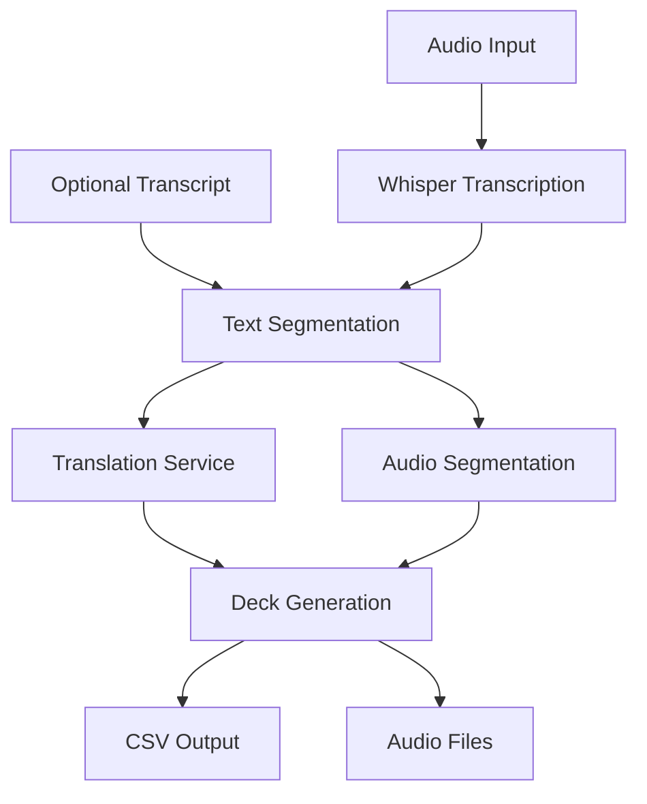

# audio2anki Specification

## Overview

`audio2anki` is a command-line tool that converts audio content into Anki flashcards. It processes audio files to create study materials with synchronized text, translations, and audio segments.

## System Architecture

## Components

### 1. Input Processing
- Accept audio files (mp3, wav, m4a) or video files
- Optional transcript input in plain text or SRT format
- Validate input files and formats

### 2. Transcription (via OpenAI Whisper)
- Transcribe audio to text with timestamps
- Auto-detect or specify source language
- Handle long audio files in chunks

### 3. Segmentation
- Split transcription into meaningful utterances
- Maintain timestamp mapping
- Smart sentence boundary detection

### 4. Translation (via OpenAI)
- Translate source text to English
- Generate pronunciation (e.g., pinyin for Mandarin)
- Preserve segment alignment

### 5. Audio Processing
- Extract audio from video if needed
- Split audio file into segments
- Export in Anki-compatible format

### 6. Output Generation
- Create CSV with fields:
  - Source text
  - Pronunciation
  - English translation
  - Audio filename
- Generate media files in Anki format
- Package for easy import

## File Formats

### Input
- Audio: mp3, wav, m4a, mp4 (audio extracted)
- Transcript (optional): txt, srt

### Output Directory Structure
The output directory for a deck is determined through the following process:

1. When an output folder is specified via CLI:
   a. First, resolve the path:
      - For absolute paths: use as-is
      - For relative paths: resolve relative to current working directory
      This resolved path is called A.

   b. Then, determine final output location:
      - If A exists and is either **empty** or a valid **deck folder**: use A
      - Otherwise: create path B = A/input_filename
        (e.g., if A is "/path/to/output" and input is "lesson1.mp3", B becomes "/path/to/output/lesson1")
      - If B exists and is neither **empty** nor a **deck folder**: exit with error

2. When no output folder is specified:
   - Create path A = "./decks/input_filename"
     (e.g., for input "lesson1.mp3", creates "./decks/lesson1")
   - If A exists and is neither **empty** nor a **deck folder**: exit with error

Notes:

**Empty** directory: Contains no files except common system metadata files:
- macOS: `.DS_Store`, `.AppleDouble`, `.LSOverride`, `._*`
- Windows: `Thumbs.db`, `ehthumbs.db`, `Desktop.ini`, `$RECYCLE.BIN`
- Linux: `.directory`, `.Trash-*`
- IDE/Editor: `.idea/`, `.vscode/`, `*.swp`, `.*.swp`, `*~`

**Deck folder**: Contains only audio2anki-generated files:
- deck.txt
- CSV file
- README
- Script file
- media directory

The final output directory will contain:
- Text file for Anki import
- CSV file for Anki import
- README.md
- Script
- Directory of audio snippets (mp3)

## Voice Isolation (Optional)

If the `--voice-isolation` flag is specified, the pipeline will run a voice isolation stage using the ElevenLabs API before transcription. This uses approximately 1000 ElevenLabs credits per minute of audio (free plan: 10,000 credits/month). If not specified, transcription is performed on the transcoded audio without voice isolation.

## Dependencies

- OpenAI Whisper for transcription
- OpenAI GPT-4 for translation
- pydub for audio processing
- rich for CLI interface
- ElevenLabs for voice isolation

## Error Handling

- Validate input files before processing
- Graceful handling of API failures
- Clear error messages for common issues
- Debug mode for troubleshooting

## Future Enhancements

1. Support for batch processing
2. Web interface
3. Custom vocabulary lists
4. Alternative translation services
5. Support for other languages
6. Progress saving for long files
7. Custom Anki note types
