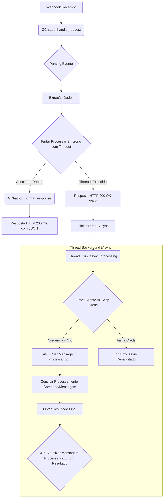
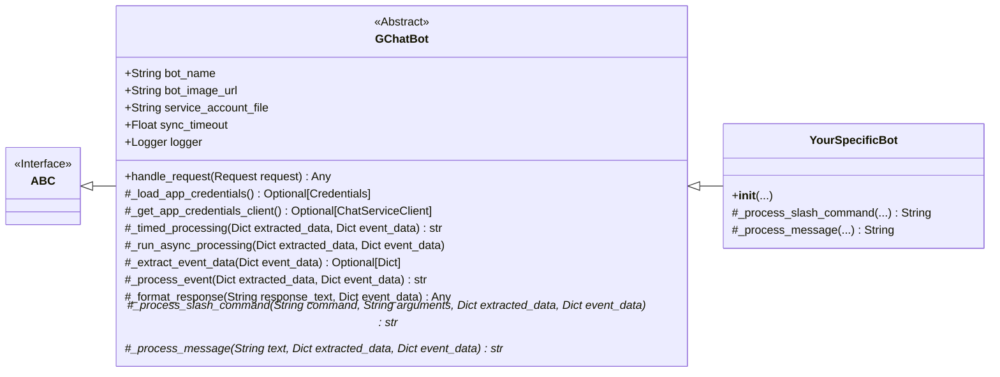

# Google Chat Bot Library (`gchatbot`)

Uma biblioteca Python para simplificar a criação de bots para o Google Chat, utilizando uma abordagem híbrida para processamento eficiente de eventos.

## Visão Geral

Esta biblioteca fornece uma estrutura base robusta (`GChatbot`) para criar bots para o Google Chat, oferecendo:

- Processamento simplificado de solicitações HTTP do Google Chat via Flask.
- Extração automática de dados de eventos em diversos formatos de payload.
- Roteamento de eventos (comandos de barra, mensagens) para manipuladores específicos.
- **Abordagem Híbrida (Síncrona/Assíncrona):** Tenta responder rapidamente para tarefas curtas e alterna para processamento em background para tarefas longas, garantindo robustez e boa experiência do usuário.
- Gerenciamento de credenciais de aplicativo (Service Account) para interações assíncronas com a API do Chat.

## Classe Base: `GChatbot`

A biblioteca agora se concentra em uma única classe abstrata, `GChatbot`, que você deve herdar para criar seu bot.

**Propósito:** Fornecer uma base flexível que lida tanto com interações rápidas quanto com tarefas que podem exceder o tempo limite padrão do Google Chat (~5 segundos).

**Funcionamento (Modelo Híbrido):**
1. Recebe a requisição HTTP POST do Google Chat via Flask.
2. Extrai os dados do evento (usuário, espaço, comando, texto, etc.).
3. **Tenta processar a lógica do bot** (`_process_slash_command` ou `_process_message`) **sincronamente** dentro de um tempo limite configurável (`sync_timeout`, padrão 5 segundos).
4. **Se o processamento terminar ANTES do timeout:**
    a. Formata a resposta (texto ou cartão) em JSON.
    b. Retorna a resposta diretamente na requisição HTTP 200 OK original.
5. **Se o processamento EXCEDER o timeout:**
   - **Responde imediatamente 200 OK** com um corpo JSON vazio para o Google Chat (liberando a conexão).
   - Inicia uma **thread em background** (`_run_async_processing`).
   - **Na thread:**
     - Utiliza **credenciais de aplicativo (Service Account)** para autenticar na API do Chat.
     - Cria uma *nova* mensagem no chat (ex: "🔄 Processando...").
     - Conclui a execução da lógica do bot (`_process_slash_command` ou `_process_message`) para obter a resposta final.
     - **Atualiza** a mensagem "Processando..." com a resposta final (ou erro), usando as credenciais de app. (Por padrão, atualiza o texto da mensagem).

**Vantagens:**
- **Flexibilidade:** Lida bem com comandos rápidos e tarefas demoradas.
- **Experiência do Usuário:** Responde instantaneamente para ações simples e fornece feedback ("Processando...") para ações complexas, evitando mensagens de erro de timeout.
- **Robustez:** Garante que tarefas longas sejam concluídas sem falhar devido a limites de tempo HTTP.


**Desvantagens/Requisitos:**
- Requer configuração de uma **Conta de Serviço (Service Account)** com as permissões corretas (API do Chat habilitada, escopo `chat.bot`) para que o modo **assíncrono** funcione corretamente (postar/atualizar mensagens). Sem ela, o bot funcionará apenas no modo síncrono e falhará se o timeout for atingido.
- O fluxo assíncrono é um pouco mais complexo internamente.

**Requisitos:**
- Arquivo JSON da chave da Conta de Serviço (altamente recomendado).
- Dependências Python listadas na seção "Instalação".

**Diagrama de Fluxo (`GChatbot` - Híbrido):**


**Quando usar:** Praticamente qualquer bot do Google Chat. É a abordagem recomendada por sua flexibilidade.

**(Veja o Exemplo abaixo para uso com `GChatbot`)**


## Como Usar

### Instalação

Instale a biblioteca `gchatbot` para usar a classe `GChatBot` e suas funcionalidades:

**Dependências Principais:**

*   **`Flask`**: Necessário para receber as requisições HTTP POST do Google Chat. A biblioteca é projetada para ser usada dentro de um contexto Flask.
*   **`google-auth`**, **`google-api-python-client`**, **`google-apps-chat`**, **`protobuf`**: Utilizadas pela classe `GChatBot` para autenticar usando a Conta de Serviço e interagir com a API do Google Chat no modo assíncrono.

*Instalação da Biblioteca:*
```bash
pip install gchatbot
```

### Exemplo: `GChatBot` Localmente com Flask (Híbrido)

Este exemplo demonstra como usar `GChatBot`, mostrando tanto respostas rápidas (síncronas) quanto lentas (assíncronas):

```python
# app.py
import os
import time
import random
from flask import Flask, request
from gchatbot import GChatBot

class MeuBotHibrido(GChatBot):
    """
    Bot híbrido de exemplo que usa a lógica automática de decisão entre
    respostas síncronas e assíncronas baseada no tempo de processamento.
    """
    
    def __init__(self):
        # Caminho para o arquivo de credenciais da conta de serviço
        service_account_file = os.environ.get("SERVICE_ACCOUNT_FILE", "service.json")
        
        # Inicializa o bot com nome, imagem e timeout personalizado
        super().__init__(
            bot_name="AssistenteHibrido",
            service_account_file=service_account_file,
            sync_timeout=3.0  # Responde sincronamente se levar menos de 3 segundos
        )
    
    def _process_slash_command(self, command: str, arguments: str, extracted_data: dict, event_data: dict) -> str:
        """
        Processa comandos de barra como /ajuda, /rapido, /lento
        """
        user = extracted_data.get('user_display_name', 'Usuário')
        
        if command == 'ajuda':
            # Comando rápido - responderá de forma síncrona
            return (
                f"👋 Olá {user}! Aqui estão meus comandos:\n\n"
                "• */ajuda* - Mostra esta mensagem\n"
                "• */rapido* - Executa uma tarefa rápida (modo síncrono)\n"
                "• */lento* - Executa uma tarefa demorada (modo assíncrono)\n"
                "• */aleatorio* - Às vezes rápido, às vezes lento\n\n"
                "Você também pode me enviar uma mensagem normal."
            )
            
        elif command == 'rapido':
            # Simula uma tarefa rápida (menos de 3 segundos)
            time.sleep(0.5)
            return f"✅ Tarefa rápida concluída para {user} em 0.5 segundos! (Resposta síncrona)"
        
        elif command == 'hello':
            # Simula uma tarefa lenta (mais de 3 segundos) para forçar modo assíncrono
            time.sleep(5)
            return f"👋 Olá {user}! Esta é uma resposta assíncrona que levou 5 segundos para ser processada."
            
        elif command == 'lento':
            # Simula uma tarefa lenta (mais de 3 segundos)
            # Como vai exceder o timeout configurado, automaticamente mudará para modo assíncrono
            time.sleep(8)
            return f"⏱️ Tarefa lenta concluída para {user} após 8 segundos! (Resposta assíncrona)"
            
        elif command == 'aleatorio':
            # Às vezes rápido, às vezes lento - demonstra a flexibilidade do bot híbrido
            delay = random.uniform(1, 6)  # Entre 1 e 6 segundos
            time.sleep(delay)
            if delay <= 3:
                return f"🎲 Tarefa concluída em {delay:.1f} segundos (Resposta síncrona)"
            else:
                return f"🎲 Tarefa demorada concluída em {delay:.1f} segundos (Resposta assíncrona)"
        
        return f"Comando desconhecido: /{command}. Use /ajuda para ver os comandos disponíveis."
    
    def _process_message(self, text: str, extracted_data: dict, event_data: dict) -> str:
        """
        Processa mensagens normais enviadas ao bot
        """
        user = extracted_data.get('user_display_name', 'Usuário')
        
        # Exemplo de processamento baseado no conteúdo da mensagem
        if "olá" in text.lower() or "oi" in text.lower():
            return f"Olá {user}! Como posso ajudar hoje?"
            
        elif "tempo" in text.lower() or "demorado" in text.lower():
            # Simula uma tarefa demorada para demonstrar o modo assíncrono
            time.sleep(7)
            return f"⏱️ Você mencionou algo sobre tempo, então simulei uma tarefa demorada de 7 segundos!"
            
        # Resposta padrão
        return f"Recebi sua mensagem: '{text}'. Use /ajuda para ver o que posso fazer."


# Configuração da aplicação Flask
app = Flask(__name__)

# Inicializa o bot
bot_hibrido = MeuBotHibrido()

@app.route('/', methods=['POST'])
def webhook():
    """Endpoint que recebe eventos do Google Chat"""
    return bot_hibrido.handle_request(request)

@app.route('/', methods=['GET'])
def home():
    """Página inicial para verificar se o serviço está rodando"""
    return "Bot híbrido está ativo! Configure o webhook do Google Chat para apontar para /webhook"

if __name__ == '__main__':
    # Certifique-se de definir a variável de ambiente SERVICE_ACCOUNT_FILE 
    # ou coloque o arquivo no caminho padrão
    port = int(os.environ.get('PORT', 8080))
    app.run(host='0.0.0.0', port=port, debug=True)
```
*Execute com `python chat-general.py` (após opcionalmente definir `SERVICE_ACCOUNT_FILE`) e use `ngrok` ou similar direcionado para a porta 8080.*

## Arquitetura e Detalhes Técnicos

A biblioteca é baseada na classe abstrata `GChatBot` que implementa a lógica comum, permitindo que você se concentre na lógica específica do seu bot.

### Diagrama de Classes



### Fluxo de Requisições (ASCII)

**1. Desenvolvimento/Teste com `ngrok`:**

```ascii
+-------------+      +-------+      +-------+      +----------+
| Google Chat | ---> | NGROK | ---> | Flask | ---> | GChatBot |
+-------------+      +-------+      +-------+      +----------+
```
*   **Fluxo:** Google Chat envia o evento para a URL pública do `ngrok`, que redireciona para a aplicação Flask local, que por sua vez utiliza a classe `GChatBot` para processar o evento.

**2. Produção com Cloud Functions:**

```ascii
+-------------+      +----------------+      +----------+
| Google Chat | ---> | Cloud Function | ---> | GChatBot |
+-------------+      +----------------+      +----------+
```
*   **Fluxo:** Google Chat envia o evento para a URL da Cloud Function. A função executa o código que utiliza a classe `GChatbot` para processar o evento.


### Estrutura de Dados do Evento (Payload)

`GChatBot` lida internamente com os diferentes formatos de payload enviados pelo Google Chat e extrai um dicionário unificado `extracted_data` contendo:

- `raw_text`: Texto original da mensagem.
- `processed_text`: Texto após remover menção/comando (usado por `_process_message`).
- `command`: Nome do comando de barra (sem `/`) ou `None`.
- `arguments`: String de argumentos após o comando.
- `user_email`: E-mail do remetente.
- `user_display_name`: Nome de exibição do remetente.
- `space_name`: ID do espaço (formato `spaces/XXXXXXXXXXX`).
- `is_direct_message_event`: Booleano indicando se é um DM.
- `message_name`: ID da mensagem original (formato `spaces/.../messages/...`) ou `None`.
- `is_fallback_event`: Booleano indicando se o parsing foi mínimo.

### Formato de Resposta (`GChatBot`)

`GChatBot` adapta o formato da resposta com base no modo de operação:

1.  **Modo Síncrono (Rápido):** Se o processamento for concluído dentro do `sync_timeout`, `GChatBot` responde diretamente na requisição HTTP com uma mensagem formatada usando a estrutura `cardsV2` do Google Chat. Por padrão, a biblioteca gera um cartão simples contendo:
    *   **Cabeçalho (Header):** Com o nome (`bot_name`) e a imagem (`bot_image_url`) configurados, e um subtítulo indicando o usuário.
    *   **Seção (Section):** Um widget `textParagraph` com a string de resposta dos seus métodos `_process_slash_command` ou `_process_message`.
    `GChatBot` lida com as variações da API (como `hostAppDataAction`) para entregar o cartão corretamente.

2.  **Modo Assíncrono (Lento):** Se o `sync_timeout` for excedido:
    *   **Resposta HTTP Imediata:** `GChatBot` responde `200 OK` com um corpo JSON vazio (`{}`).
    *   **Mensagens via API (Thread):** A thread background (usando a Service Account) faz chamadas à API do Chat para:
        *   Criar a mensagem "🔄 Processando...".
        *   Atualizar essa mensagem com a resposta final (retornada por `_process_slash_command` ou `_process_message`). Por padrão, a atualização modifica apenas o campo `text` da mensagem. Se você precisar atualizar com um *card* no modo assíncrono, precisará customizar a lógica de atualização (possivelmente sobrescrevendo `_run_async_processing` ou ajustando a forma como `GChatBot` lida com a atualização).

## Configuração do Google Chat

Para configurar seu bot no Google Chat:

1. Acesse o [Google Cloud Console](https://console.cloud.google.com/).
2. Crie/Configure um projeto.
3. **Habilite a API do Google Chat**.
4. Vá para a configuração da API do Chat:
    - **Nome do App, Avatar, Descrição:** Preencha os detalhes.
    - **Funcionalidade:**
        - Habilite "Receber mensagens 1:1".
        - Habilite "Participar de espaços e conversas em grupo".
    - **Configurações de Conexão:**
        - Selecione "App URL".
        - Insira a URL pública do seu endpoint Flask. Ex: `https://sua-url/`.
          * **Para testes:** Você pode usar uma URL temporária gerada por ferramentas como `ngrok` que direciona para sua máquina local (`http://localhost:8080`), por exemplo: `https://example-49af.ngrok-free.app`.
          * **Para Cloud Functions:** Use diretamente a URL de gatilho HTTP da sua função, que terá o formato `https://REGIÃO-PROJETO.cloudfunctions.net/NOME-DA-FUNÇÃO`.

# Changelog

## 0.2.3 - 2025-04-24 - Correções de Concorrência, Timeout e Tipo de Resposta

### Correção (Fixed)

Esta versão inclui correções importantes para o manuseio de timeouts e para a robustez do processamento de respostas:

1.  **Manuseio de Timeout e Concorrência:**
    * **Problema:** O uso anterior de `with ThreadPoolExecutor()` no `handle_request` causava um bloqueio (`shutdown(wait=True)`) no handler HTTP quando o `sync_timeout` era atingido. Isso levava o Google Chat a reenviar o evento, resultando em múltiplas threads e respostas duplicadas.
    * **Solução:** Substituído por instanciação manual do `ThreadPoolExecutor` e chamada explícita `executor.shutdown(wait=False)` no caso de timeout, liberando o handler HTTP imediatamente. A thread `_run_async_processing` para a resposta assíncrona agora é iniciada apenas uma vez por evento original.
    * **Resultado:** Resposta HTTP 200 OK imediata em caso de timeout, sem bloqueios e sem respostas duplicadas.

2.  **Prevenção de `TypeError` na Resposta:**
    * **Problema:** Potencial `TypeError: bad argument type for built-in operation` poderia ocorrer durante a criação/atualização do card de resposta se os métodos de processamento da subclasse (`_process_message`, `_process_slash_command`) retornassem valores não-string (ex: `None`, números).
    * **Solução:** Adicionada conversão automática para string (`str()`) ao resultado dentro do método `GChatBot._process_event` antes de ser usado.
    * **Resultado:** Garante que o texto da resposta seja sempre uma string, prevenindo o `TypeError` e aumentando a robustez da classe base.

---

## 0.2.2 - Versão base

| Componente            | Descrição                                                                                          |
|-----------------------|----------------------------------------------------------------------------------------------------|
| **GChatBot** | Classe base com lógica híbrida síncrona/assíncrona, parsing de payloads e criação de cards.        |
| **handle_request** | Gerencia timeout síncrono e fallback para processamento assíncrono via thread.                     |
| **_run_async_processing** | Envia card “Processando…” e atualiza com o resultado final.                                     |
| **MeuBotHibrido** | Exemplo de comandos (/ajuda, /rapido, /lento, /skills) e respostas simuladas.                    |