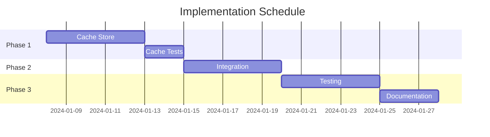

# Caching Implementation Plan

## Overview

This document provides a detailed plan for implementing the schema-aware caching system for the Graph Context component, leveraging the core event system. The implementation is divided into phases, with each phase building upon the previous one.

## Expected Folder Structure

```
graph-context/
├── src/
│   └── graph_context/
│       ├── __init__.py
│       ├── interface.py           # Core GraphContext abstract base class
│       ├── context_base.py        # Common implementations
│       ├── exceptions.py          # Context-specific exceptions
│       ├── event_system.py        # Core event system
│       ├── types/                 # Existing type system
│       │   ├── __init__.py
│       │   ├── type_base.py
│       │   └── validators.py
│       ├── caching/              # New caching system
│       │   ├── __init__.py
│       │   ├── cache_store.py    # Cache store implementation
│       │   └── cache_manager.py  # Cache manager implementation
│       └── cached_context/       # New cached context
│           ├── __init__.py
│           └── cached_graph_context.py  # Cache-aware context implementation
└── tests/
    └── graph_context/
        ├── __init__.py
        ├── test_interface.py
        ├── test_context_base.py
        ├── test_exceptions.py
        ├── test_event_system.py   # Event system tests
        ├── types/                 # Existing type system tests
        │   ├── __init__.py
        │   ├── test_type_base.py
        │   └── test_validators.py
        ├── caching/             # New caching system tests
        │   ├── __init__.py
        │   ├── test_cache_store.py
        │   └── test_cache_manager.py
        └── cached_context/      # New cached context tests
            ├── __init__.py
            └── test_cached_graph_context.py
```

## Prerequisites

1. **Development Environment**
   - Python 3.10+ (matching pyproject.toml)
   - Hatch for dependency management
   - pytest for testing
   - ruff for linting

2. **Dependencies**
   - Already included in pyproject.toml:
     - cachetools>=5.3.2
     - pydantic>=2.5.2
     - typing-extensions>=4.8.0
     - asyncio>=3.4.3

## Phase 1: Cache Store Implementation

### 1.1 Cache Entry and Store Interface

```python
from typing import TypeVar, Generic, Optional, AsyncIterator, Tuple, Set
from datetime import datetime
from pydantic import BaseModel, Field

T = TypeVar('T', bound=BaseModel)

class CacheEntry(BaseModel, Generic[T]):
    """Cache entry with metadata."""
    value: T
    created_at: datetime = Field(default_factory=datetime.utcnow)
    expires_at: Optional[datetime] = None
    entity_type: Optional[str] = None
    relation_type: Optional[str] = None
    operation_id: str = Field(default_factory=lambda: str(uuid4()))

class CacheStore(ABC):
    """Abstract base class for cache storage implementations."""

    @abstractmethod
    async def get(self, key: str) -> Optional[CacheEntry]:
        """Retrieve a cache entry by key."""
        pass

    @abstractmethod
    async def set(self, key: str, entry: CacheEntry) -> None:
        """Store a cache entry."""
        pass

    @abstractmethod
    async def delete(self, key: str) -> None:
        """Delete a cache entry."""
        pass

    @abstractmethod
    async def delete_many(self, keys: Set[str]) -> None:
        """Delete multiple cache entries efficiently."""
        pass

    @abstractmethod
    async def scan(self) -> AsyncIterator[Tuple[str, CacheEntry]]:
        """Iterate over all cache entries."""
        pass

    @abstractmethod
    async def clear(self) -> None:
        """Clear all cache entries."""
        pass
```

### 1.2 Cache Manager Implementation

```python
from typing import Optional
from ..event_system import EventSystem, GraphEvent, EventContext, EventMetadata

class CacheManager:
    """Manages cache operations and event handling."""

    def __init__(
        self,
        store: CacheStore,
        max_size: int = 10000,
        ttl: Optional[int] = None
    ):
        self.store = store
        self.max_size = max_size
        self.ttl = ttl
        self._enabled = True

    async def handle_event(self, context: EventContext) -> None:
        """Handle graph events for caching."""
        if not self._enabled:
            return

        match context.event:
            case GraphEvent.ENTITY_READ:
                await self._handle_entity_read(context)
            case GraphEvent.ENTITY_WRITE | GraphEvent.ENTITY_BULK_WRITE:
                await self._handle_entity_write(context)
            case GraphEvent.ENTITY_DELETE | GraphEvent.ENTITY_BULK_DELETE:
                await self._handle_entity_delete(context)
            case GraphEvent.RELATION_READ:
                await self._handle_relation_read(context)
            case GraphEvent.RELATION_WRITE | GraphEvent.RELATION_BULK_WRITE:
                await self._handle_relation_write(context)
            case GraphEvent.RELATION_DELETE | GraphEvent.RELATION_BULK_DELETE:
                await self._handle_relation_delete(context)
            case GraphEvent.QUERY_EXECUTED:
                await self._handle_query_executed(context)
            case GraphEvent.TRAVERSAL_EXECUTED:
                await self._handle_traversal_executed(context)
            case GraphEvent.SCHEMA_MODIFIED | GraphEvent.TYPE_MODIFIED:
                await self._handle_schema_modified(context)

    async def _handle_entity_read(self, context: EventContext) -> None:
        """Handle entity read event."""
        if not context.metadata.entity_type:
            return

        key = f"entity:{context.metadata.entity_type}:{context.data.get('entity_id')}"
        entry = CacheEntry(
            value=context.data.get('entity'),
            entity_type=context.metadata.entity_type,
            operation_id=context.metadata.operation_id
        )
        await self.store.set(key, entry)

    # ... similar handlers for other events ...
```

### 1.3 Cached Graph Context

```python
from typing import Optional, Type
from ..context_base import BaseGraphContext
from ..event_system import EventSystem, GraphEvent, EventContext, EventMetadata

class CachedGraphContext(BaseGraphContext):
    """Graph context with caching support."""

    def __init__(
        self,
        cache_store: Optional[CacheStore] = None,
        max_cache_size: int = 10000,
        ttl_seconds: Optional[int] = None
    ):
        super().__init__()
        self.cache_manager = CacheManager(
            store=cache_store or InMemoryCacheStore(),
            max_size=max_cache_size,
            ttl=ttl_seconds
        )
        # Subscribe to events using the event system's pattern
        self._event_system = EventSystem()
        for event in GraphEvent:
            await self._event_system.subscribe(event, self.cache_manager.handle_event)

    async def get_entity(self, entity_type: Type, entity_id: str) -> Optional[dict]:
        """Get an entity with caching support."""
        cache_key = f"entity:{entity_type.__name__}:{entity_id}"

        # Try cache first
        if entry := await self.cache_manager.store.get(cache_key):
            await self._event_system.emit(
                GraphEvent.ENTITY_READ,
                metadata=EventMetadata(
                    entity_type=entity_type.__name__,
                    operation_id=str(uuid4()),
                    timestamp=datetime.utcnow()
                ),
                data={'entity': entry.value, 'entity_id': entity_id}
            )
            return entry.value

        # Cache miss, fetch from storage
        result = await super().get_entity(entity_type, entity_id)
        if result is not None:
            await self._event_system.emit(
                GraphEvent.ENTITY_READ,
                metadata=EventMetadata(
                    entity_type=entity_type.__name__,
                    operation_id=str(uuid4()),
                    timestamp=datetime.utcnow()
                ),
                data={'entity': result, 'entity_id': entity_id}
            )
        return result
```

## Phase 2: Integration

### 2.1 Create Cache-Aware Context

```python
# src/graph_context/cached_context/cached_graph_context.py

from typing import Any
from ..context_base import BaseGraphContext
from ..caching.cache_manager import SchemaAwareCacheManager
from ..event_system import GraphEvent, EventContext, EventSystem
from ..types.type_base import Entity, Relation, QuerySpec, TraversalSpec

class CachedGraphContext(BaseGraphContext):
    """Graph context with caching support."""

    def __init__(self, maxsize: int = 1000, ttl: int = 300):
        super().__init__()
        self.cache_manager = SchemaAwareCacheManager(maxsize=maxsize, ttl=ttl)
        self._event_system = EventSystem()
        self._event_system.subscribe(GraphEvent.ENTITY_READ, self.cache_manager.handle_event)
        self._event_system.subscribe(GraphEvent.ENTITY_WRITE, self.cache_manager.handle_event)
        self._event_system.subscribe(GraphEvent.RELATION_READ, self.cache_manager.handle_event)
        self._event_system.subscribe(GraphEvent.RELATION_WRITE, self.cache_manager.handle_event)
        self._event_system.subscribe(GraphEvent.QUERY_EXECUTED, self.cache_manager.handle_event)
        self._event_system.subscribe(GraphEvent.SCHEMA_MODIFIED, self.cache_manager.handle_event)

    async def get_entity(self, entity_id: str) -> Entity | None:
        """Get entity with caching."""
        # Try cache first
        cached = await self.cache_manager.cache.get(
            "get_entity",
            entity_id=entity_id
        )
        if cached:
            return cached.value

        # Get from backend
        entity = await super().get_entity(entity_id)
        if entity:
            await self._event_system.emit(
                GraphEvent.ENTITY_READ,
                entity=entity,
                entity_id=entity_id,
                entity_type=entity.type
            )
        return entity

    # ... similar implementations for other methods ...
```

## Phase 3: Testing

### 3.1 Cache Tests

```python
# tests/test_cache.py

import pytest
from graph_context.caching.cache_store import TypeAwareCache
from graph_context.event_system import GraphEvent, EventContext

@pytest.mark.asyncio
async def test_cache_type_invalidation():
    cache = TypeAwareCache()

    # Set cache entries
    await cache.set(
        "get_entity",
        {"id": "123", "type": "person"},
        type_name="person",
        entity_id="123"
    )

    # Verify cache hit
    result = await cache.get("get_entity", entity_id="123")
    assert result is not None

    # Invalidate type
    await cache.invalidate_type("person")

    # Verify cache miss
    result = await cache.get("get_entity", entity_id="123")
    assert result is None
```

### 3.2 Integration Tests

```python
# tests/test_integration.py

import pytest
from graph_context.cached_context import CachedGraphContext
from graph_context.types.type_base import EntityType, PropertyType
from graph_context.event_system import GraphEvent, EventContext

@pytest.mark.asyncio
async def test_cached_entity_operations():
    context = CachedGraphContext()

    # Register entity type
    person_type = EntityType(
        name="person",
        properties={
            "name": PropertyType.STRING
        }
    )
    await context.register_entity_type(person_type)

    # Create entity
    entity = await context.create_entity(
        "person",
        {"name": "John Doe"}
    )

    # First read should cache
    entity1 = await context.get_entity(entity.id)
    assert entity1 is not None

    # Second read should hit cache
    entity2 = await context.get_entity(entity.id)
    assert entity2 is not None
    assert entity2 == entity1

    # Verify event emission
    # Note: In a real test, you'd want to use a mock or spy to verify events
    # This is just for illustration
    context._event_system.disable()  # Prevent further events during test cleanup
```

## Query Dependency Tracking

The cache system will maintain a graph of dependencies between cached entities/relations and the queries that use them. This enables efficient invalidation of dependent query results when underlying data changes.

```python
from typing import Dict, Set
from collections import defaultdict

class DependencyTracker:
    """Tracks dependencies between cached entities/relations and queries."""

    def __init__(self):
        self._forward_deps: Dict[str, Set[str]] = defaultdict(set)  # entity/relation -> queries
        self._reverse_deps: Dict[str, Set[str]] = defaultdict(set)  # query -> entities/relations

    async def add_dependency(self, data_key: str, query_key: str) -> None:
        """Record that a query depends on a piece of data."""
        self._forward_deps[data_key].add(query_key)
        self._reverse_deps[query_key].add(data_key)

    async def get_dependent_queries(self, data_key: str) -> Set[str]:
        """Get all queries that depend on a piece of data."""
        return self._forward_deps.get(data_key, set())

    async def remove_query(self, query_key: str) -> None:
        """Remove all dependencies for a query."""
        if deps := self._reverse_deps.pop(query_key, None):
            for data_key in deps:
                self._forward_deps[data_key].discard(query_key)
```

## Cache Store Interface

```python
from abc import ABC, abstractmethod
from typing import AsyncIterator, Optional, Tuple

class CacheStore(ABC):
    """Abstract base class for cache storage implementations."""

    @abstractmethod
    async def get(self, key: str) -> Optional[CacheEntry]:
        """Retrieve a cache entry by key."""
        pass

    @abstractmethod
    async def set(self, key: str, entry: CacheEntry) -> None:
        """Store a cache entry."""
        pass

    @abstractmethod
    async def delete(self, key: str) -> None:
        """Delete a cache entry."""
        pass

    @abstractmethod
    async def delete_many(self, keys: Set[str]) -> None:
        """Delete multiple cache entries efficiently."""
        pass

    @abstractmethod
    async def scan(self) -> AsyncIterator[Tuple[str, CacheEntry]]:
        """Iterate over all cache entries."""
        pass

    @abstractmethod
    async def clear(self) -> None:
        """Clear all cache entries."""
        pass
```

## Integration with Graph Context

```python
from typing import Optional, Type
from graph_context import BaseGraphContext
from graph_context.events import EventContext, GraphEvent

class CachedGraphContext(BaseGraphContext):
    """Graph context with integrated caching support."""

    def __init__(
        self,
        cache_store: Optional[CacheStore] = None,
        max_cache_size: int = 10000,
        ttl_seconds: Optional[int] = None
    ):
        super().__init__()
        self.cache_manager = CacheManager(
            store=cache_store or InMemoryCacheStore(),
            max_size=max_cache_size,
            ttl=ttl_seconds
        )
        # Subscribe to all relevant events
        self.subscribe(self.cache_manager.handle_event)

    async def get_entity(self, entity_type: Type, entity_id: str) -> Optional[dict]:
        """Get an entity with caching support."""
        cache_key = f"entity:{entity_type.__name__}:{entity_id}"

        # Try cache first
        if entry := await self.cache_manager.store.get(cache_key):
            await self.emit(EventContext(
                event=GraphEvent.ENTITY_READ,
                metadata=EventMetadata(
                    entity_type=entity_type.__name__,
                    operation_id=str(uuid4()),
                    timestamp=datetime.utcnow()
                ),
                data=entry.value
            ))
            return entry.value

        # Cache miss, fetch from storage
        result = await super().get_entity(entity_type, entity_id)
        if result is not None:
            # Cache the result
            await self.cache_manager.store.set(
                cache_key,
                CacheEntry(
                    key=cache_key,
                    value=result,
                    entity_type=entity_type.__name__,
                    operation_id=str(uuid4())
                )
            )
        return result
```

## Testing Strategy

1. Unit Tests
   - Test each cache operation in isolation
   - Verify correct event handling
   - Test dependency tracking
   - Test cache invalidation logic
   - Test bulk operations
   - Test TTL functionality

2. Integration Tests
   - Test cache integration with graph operations
   - Verify cache hit/miss behavior
   - Test concurrent access patterns
   - Test memory usage and cleanup

3. Performance Tests
   - Measure cache hit ratios
   - Benchmark common operations
   - Test under high load
   - Verify memory usage stays within bounds

## Implementation Schedule

1. Week 1: Core Cache Infrastructure
   - Implement CacheEntry and CacheStore
   - Basic cache operations (get/set/delete)
   - Event system integration

2. Week 2: Advanced Features
   - Dependency tracking
   - Query result caching
   - Bulk operations support
   - TTL implementation

3. Week 3: Integration & Testing
   - Integration with BaseGraphContext
   - Unit test suite
   - Integration test suite
   - Performance benchmarks

4. Week 4: Optimization & Documentation
   - Performance tuning
   - Memory optimization
   - API documentation
   - Usage examples

## Success Criteria

1. Functionality
   - All cache operations work correctly
   - Event handling is reliable
   - Dependency tracking is accurate
   - Cache invalidation is consistent

2. Performance
   - Cache hit ratio > 80% for common patterns
   - Query response time improved by 50%
   - Memory usage within configured limits
   - No significant CPU overhead

3. Reliability
   - No cache inconsistencies
   - Graceful handling of errors
   - No memory leaks
   - Thread-safe operations

## Documentation Requirements

1. API Documentation
   - Complete docstrings for all classes/methods
   - Usage examples
   - Configuration options
   - Best practices

2. Integration Guide
   - Step-by-step setup instructions
   - Common patterns and use cases
   - Performance tuning tips
   - Troubleshooting guide

3. Monitoring Guide
   - Cache statistics
   - Performance metrics
   - Health checks
   - Debug logging

## Implementation Schedule



## Success Criteria

1. **Functionality**
   - All cache operations work as designed
   - Cache invalidation works reliably
   - Type awareness is maintained
   - Proper integration with event system

2. **Performance**
   - Cache hit rate > 80% for repeated operations
   - Event handling overhead < 1ms
   - Memory usage within configured limits

3. **Quality**
   - Test coverage must be maintained at 95% or higher for all new code
   - Each component must have its own test suite
   - Integration tests must cover all major interaction paths
   - No critical bugs
   - Documentation complete
   - Code passes all linting

## Rollout Strategy

1. **Development Phase**
   - Implement in feature branch
   - Regular code reviews
   - Continuous testing

2. **Testing Phase**
   - Unit tests
   - Integration tests
   - Performance tests
   - Memory leak tests

3. **Deployment Phase**
   - Feature flag for cache enablement
   - Gradual rollout
   - Monitoring and metrics
   - Rollback plan

## Monitoring and Maintenance

1. **Metrics to Track**
   - Cache hit/miss rates
   - Memory usage
   - Cache invalidation frequency

2. **Maintenance Tasks**
   - Regular cache size review
   - Performance monitoring
   - Dependency updates
   - Security patches

## Documentation Updates

1. **Code Documentation**
   - Update all docstrings
   - Add type hints
   - Include usage examples

2. **System Documentation**
   - Update architecture docs
   - Add cache configuration guide
   - Add troubleshooting guide

## Risk Mitigation

1. **Technical Risks**
   - Memory leaks: Regular monitoring
   - Performance issues: Profiling
   - Data inconsistency: Validation checks

2. **Operational Risks**
   - Cache stampede: Rate limiting
   - Cache invalidation storms: Throttling
   - Resource exhaustion: Circuit breakers

## Event Handling
