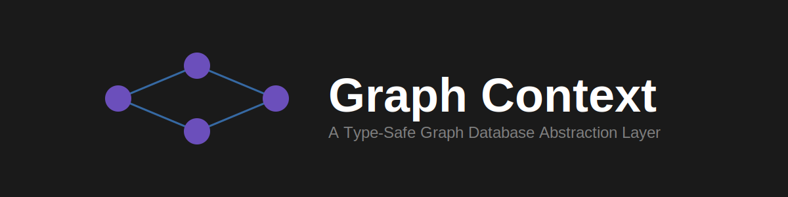
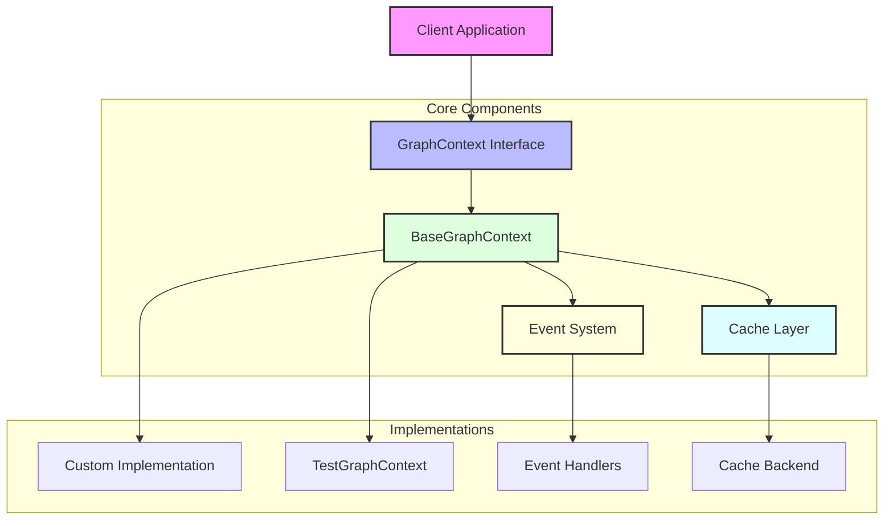
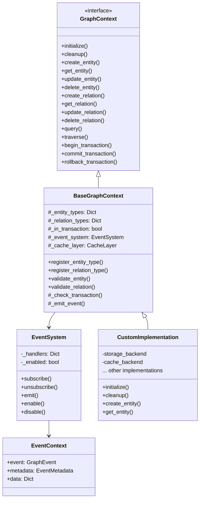
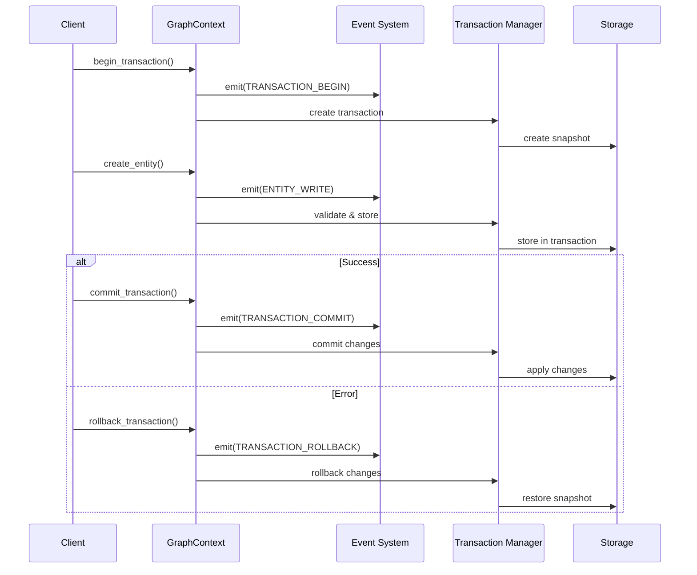
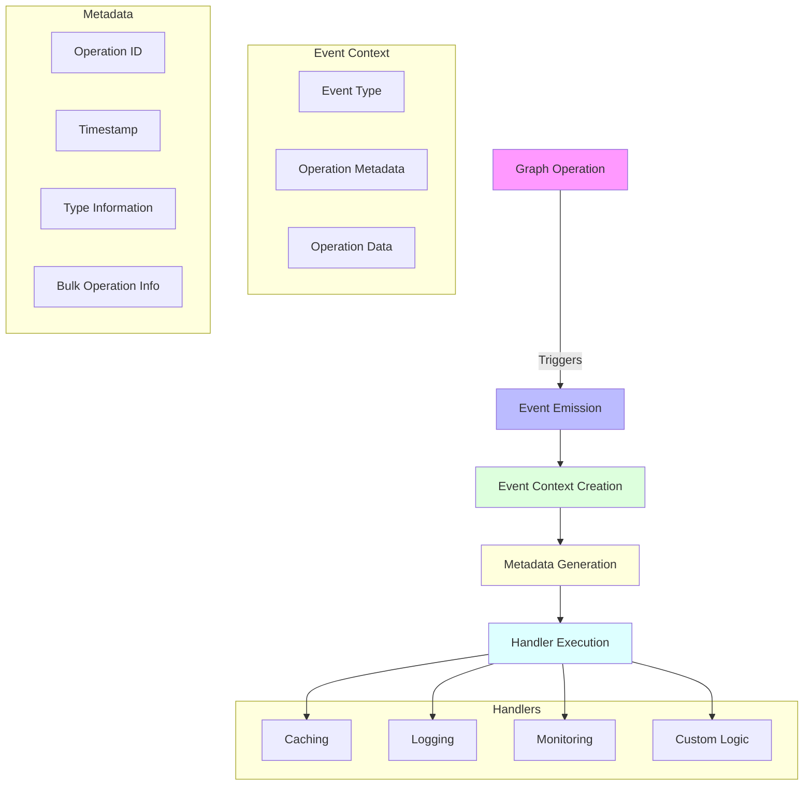
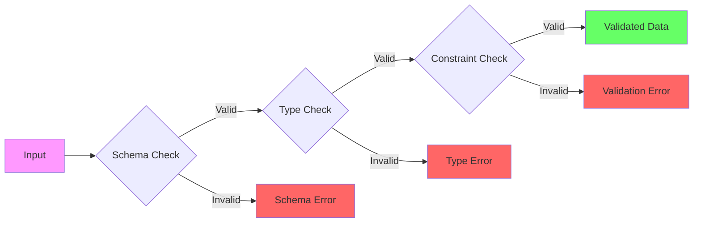

<p align="center">
  
</p>

A flexible and type-safe graph database abstraction layer for Python, providing a robust foundation for building graph-based applications with strong validation and transaction support.

[](https://pypi.org/project/graph-context)
[](https://github.com/beanone/graph-context/blob/main/LICENSE)
[](https://github.com/beanone/graph-context/actions?query=workflow%3Atests)
[](https://codecov.io/gh/beanone/graph-context)
[](https://github.com/astral-sh/ruff)
[](https://pypi.org/project/graph-context)

## Table of Contents

- [Features](#features)
- [Installation](#installation)
- [Quick Start](#quick-start)
- [Core Concepts](#core-concepts)
  - [Event System](#event-system)
  - [Entities](#entities)
  - [Relations](#relations)
  - [Transactions](#transactions)
  - [Validation](#validation)
- [Architecture](#architecture)
  - [Component Overview](#component-overview)
  - [Class Structure](#class-structure)
  - [Transaction Flow](#transaction-flow)
  - [Event System Architecture](#event-system-architecture)
  - [Validation Pipeline](#validation-pipeline)
- [API Reference](#api-reference)
  - [Entity Operations](#entity-operations)
  - [Relation Operations](#relation-operations)
  - [Query and Traversal](#query-and-traversal)
- [Development](#development)
  - [Setup](#setup)
  - [Running Tests](#running-tests)
  - [Code Style](#code-style)
- [Contributing](#contributing)
  - [Guidelines](#guidelines)
- [License](#license)
- [Acknowledgments](#acknowledgments)
- [Documentation](#documentation)

- 🔍 **Type-Safe**: Full type hints and runtime type checking
- 🔒 **Schema Validation**: Strict schema validation for entities and relations
- 💼 **Transaction Support**: ACID-compliant transactions with commit/rollback
- 🎯 **Property Validation**: Rich property validation with constraints
- 🌐 **Graph Operations**: Comprehensive graph traversal and query capabilities
- 🔌 **Extensible**: Easy to implement custom storage backends
- 🧪 **Well-Tested**: High test coverage and comprehensive test suite
- 📡 **Event System**: Sophisticated pub/sub system with metadata tracking and bulk operation support
- 💾 **Caching Support**: Flexible caching system with various backend options
- 🛡️ **Error Handling**: Comprehensive error handling with detailed error types
- 📊 **Bulk Operations**: Efficient bulk entity and relation operations
- 🔄 **Metadata Tracking**: Detailed operation metadata for debugging and monitoring

## Installation

```bash
pip install graph-context
```

## Quick Start

```python
from graph_context import BaseGraphContext
from graph_context.types import EntityType, PropertyDefinition, RelationType

# Define your schema
class MyGraphContext(BaseGraphContext):
    async def initialize(self) -> None:
        # Register entity types
        self.register_entity_type(EntityType(
            name="Person",
            properties={
                "name": PropertyDefinition(type="string", required=True),
                "age": PropertyDefinition(type="integer", required=False)
            }
        ))

        # Register relation types
        self.register_relation_type(RelationType(
            name="KNOWS",
            from_types=["Person"],
            to_types=["Person"]
        ))

    async def cleanup(self) -> None:
        pass

# Use the graph context
async def main():
    context = MyGraphContext()
    await context.initialize()

    # Start a transaction
    await context.begin_transaction()

    try:
        # Create entities
        alice_id = await context.create_entity(
            entity_type="Person",
            properties={"name": "Alice", "age": 30}
        )

        bob_id = await context.create_entity(
            entity_type="Person",
            properties={"name": "Bob", "age": 25}
        )

        # Create relation
        await context.create_relation(
            relation_type="KNOWS",
            from_entity=alice_id,
            to_entity=bob_id
        )

        # Commit the transaction
        await context.commit_transaction()
    except:
        # Rollback on error
        await context.rollback_transaction()
        raise

if __name__ == "__main__":
    import asyncio
    asyncio.run(main())
```

## Core Concepts

### Event System

The graph-context library includes a sophisticated event system that allows you to:
- Subscribe to graph operations (entity/relation CRUD, queries, traversals)
- Track detailed operation metadata
- Handle bulk operations efficiently
- Implement cross-cutting concerns like caching and logging

Example usage:

```python
from graph_context import GraphEvent

async def log_entity_changes(event_context):
    metadata = event_context.metadata
    print(f"Entity changed: {metadata.entity_type} at {metadata.timestamp}")
    print(f"Operation ID: {metadata.operation_id}")

# Subscribe to entity write events
await context.event_system.subscribe(GraphEvent.ENTITY_WRITE, log_entity_changes)
```

### Entities

Entities are nodes in the graph with:
- Type definitions (e.g., "Person", "Document")
- Properties with validation rules
- Unique IDs

### Relations

Relations are edges connecting entities with:
- Type definitions (e.g., "KNOWS", "AUTHORED")
- Direction (from_entity → to_entity)
- Optional properties
- Type constraints

### Transactions

All operations can be wrapped in transactions:
- Begin/commit/rollback support
- Isolation of changes
- Atomic operations
- Consistent state
- Event emission for transaction lifecycle
- Automatic metadata tracking

Example with error handling:

```python
try:
    await context.begin_transaction()

    # Create entities with validation
    try:
        alice_id = await context.create_entity(
            entity_type="Person",
            properties={"name": "Alice", "age": 30}
        )
    except ValidationError as e:
        print(f"Validation failed: {e.detail}")
        await context.rollback_transaction()
        return

    # Create relation with type checking
    try:
        await context.create_relation(
            relation_type="KNOWS",
            from_entity=alice_id,
            to_entity=bob_id
        )
    except (EntityNotFoundError, SchemaError) as e:
        print(f"Relation creation failed: {e}")
        await context.rollback_transaction()
        return

    await context.commit_transaction()
except TransactionError as e:
    print(f"Transaction error: {e}")
    await context.rollback_transaction()

### Validation

Comprehensive validation system:
- Schema validation
- Property type checking
- Required/optional fields
- Default values
- Custom constraints (patterns, ranges, etc.)

## Architecture

### Component Overview



### Class Structure



### Transaction Flow



### Event System Architecture



### Validation Pipeline



## API Reference

### Entity Operations

```python
# Create an entity
entity_id = await context.create_entity(
    entity_type="Person",
    properties={"name": "Alice"}
)

# Get an entity
entity = await context.get_entity(entity_id)

# Update an entity
await context.update_entity(
    entity_id,
    properties={"age": 31}
)

# Delete an entity
await context.delete_entity(entity_id)
```

### Relation Operations

```python
# Create a relation
relation_id = await context.create_relation(
    relation_type="KNOWS",
    from_entity=alice_id,
    to_entity=bob_id,
    properties={"since": 2023}
)

# Get a relation
relation = await context.get_relation(relation_id)

# Update a relation
await context.update_relation(
    relation_id,
    properties={"strength": "close"}
)

# Delete a relation
await context.delete_relation(relation_id)
```

### Query and Traversal

```python
# Query relations
results = await context.query({
    "start": alice_id,
    "relation": "KNOWS",
    "direction": "outbound"
})

# Traverse the graph
results = await context.traverse(
    start_entity=alice_id,
    traversal_spec={
        "max_depth": 2,
        "relation_types": ["KNOWS"],
        "direction": "any"
    }
)
```

## Development

### Setup

```bash
# Clone the repository
git clone https://github.com/yourusername/graph-context.git
cd graph-context

# Create and activate virtual environment
python -m venv .venv
source .venv/bin/activate  # On Windows: .venv\Scripts\activate

# Install dependencies
pip install -e ".[dev]"
```

### Running Tests

```bash
# Run all tests
pytest

# Run tests with coverage
pytest --cov=src/graph_context

# Run specific test file
pytest tests/graph_context/test_context_base.py
```

### Code Style

This project uses [ruff](https://github.com/astral-sh/ruff) for code formatting and linting:

```bash
# Format code
ruff format .

# Run linter
ruff check .
```

## Contributing

Contributions are welcome! Please feel free to submit a Pull Request. For major changes, please open an issue first to discuss what you would like to change.

Please make sure to update tests as appropriate.

### Guidelines

1. Fork the repository
2. Create your feature branch (`git checkout -b feature/amazing-feature`)
3. Commit your changes (`git commit -m 'Add some amazing feature'`)
4. Push to the branch (`git push origin feature/amazing-feature`)
5. Open a Pull Request

## License

This project is licensed under the MIT License - see the [LICENSE](LICENSE) file for details.

## Acknowledgments

- Thanks to all contributors who have helped shape this project
- Inspired by graph database concepts and best practices

## Documentation

- [Graph Context Architecture](docs/graph-context.md)
- [Event System](docs/event-system.md) - Flexible pub/sub system for implementing cross-cutting concerns
- [Caching Implementation Plan](docs/caching-implementation-plan.md)
