# Schema-Aware Event-Based Caching Design

## Overview

The caching system for the Graph Context component is designed to be schema-aware and event-driven, providing efficient caching while maintaining data consistency with schema changes. The implementation uses a decorator pattern to add caching capabilities to any graph context implementation, with a focus on transaction support, type awareness, and efficient invalidation strategies.

## Architecture Diagrams

### Component Architecture

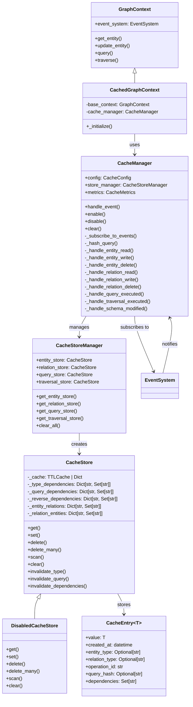

### Component Lifecycle Interactions

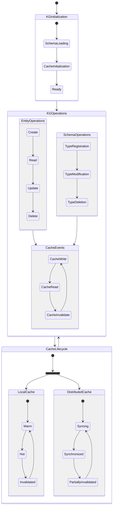

### Component Interaction Details

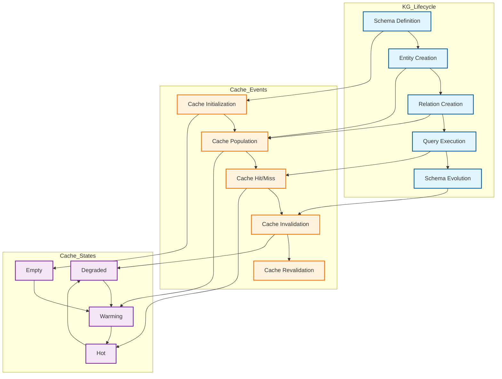

### Event Propagation Matrix

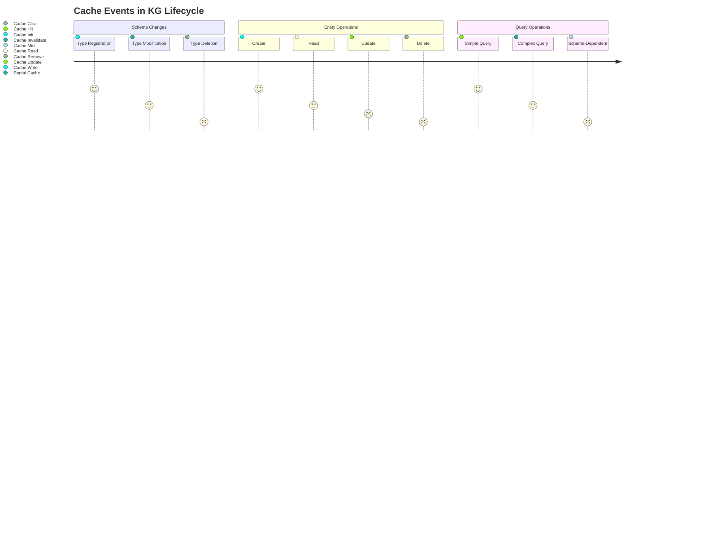

### Event Flow

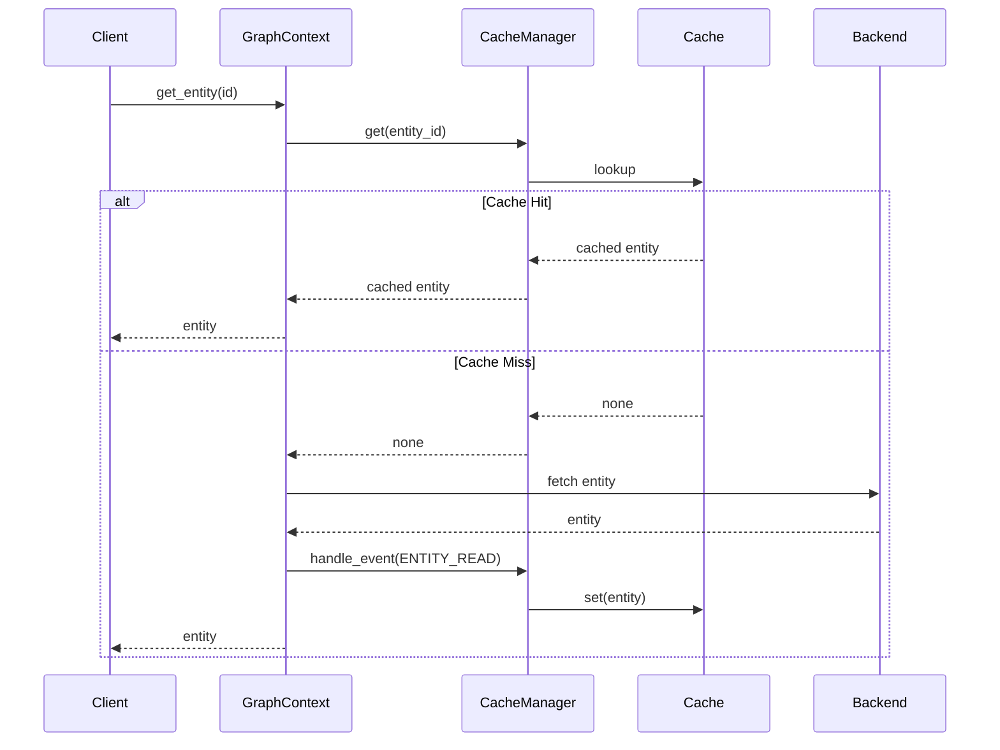

### Cache Invalidation Flow

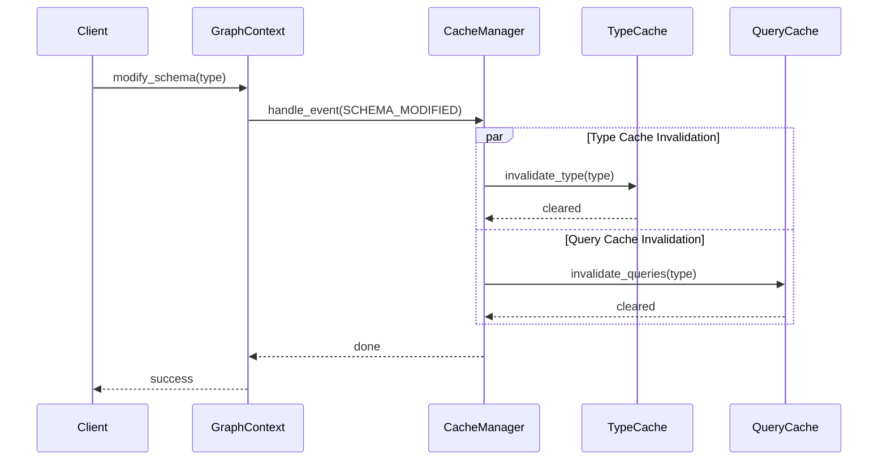

### Dependency Tracking

Note: The following diagram uses example entity types (Person, Address) and cache keys for illustration purposes only. The actual types and cache keys depend on your specific graph schema and use cases. The `CacheStore` implementation uses several internal dictionaries to track dependencies:

- `_type_dependencies`: Maps type names (e.g., "Person") to a set of cache keys that depend on this type.
- `_query_dependencies`: Maps query hashes to a set of cache keys representing the results of that query.
- `_reverse_dependencies`: Maps a cache key to a set of other cache keys that depend on it (e.g., a query result key might depend on several entity keys).
- `_entity_relations`: Maps an entity ID to a set of relation cache keys involving that entity.
- `_relation_entities`: Maps a relation cache key to a set of entity IDs involved in that relation.

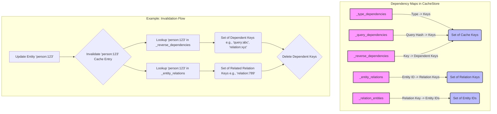

### Cache Key Structure

Cache keys are structured strings to identify the operation and parameters:

- **Entities:** `entity:<entity_id>` (e.g., `entity:person-123`)
- **Relations:** `relation:<relation_id>` (e.g., `relation:knows-456`)
- **Queries:** `query:<query_hash>` (e.g., `query:a1b2c3d4...`)
- **Traversals:** `traversal:<traversal_hash>` (e.g., `traversal:e5f6g7h8...`)

Query and traversal hashes are generated using `hashlib.sha256` on the JSON representation of the respective specification.

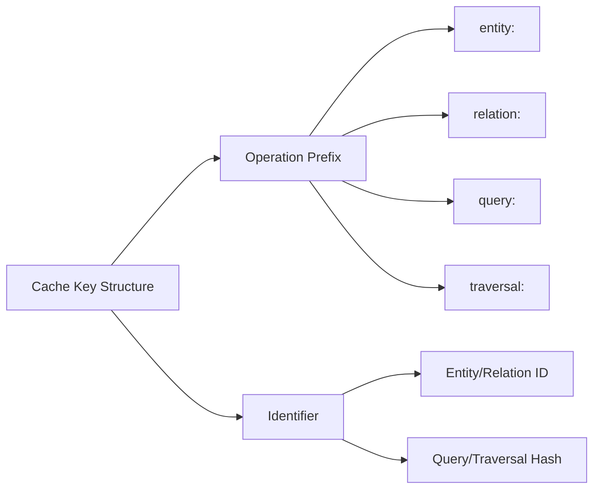

## Implementation Details

### Core Components

1. **CachedGraphContext**
   - Implements decorator pattern to wrap any graph context
   - Provides caching for all graph operations
   - Maintains transaction awareness
   - Delegates to underlying context when needed

2. **CacheManager**
   - Central component for cache operations
   - Handles all graph events
   - Manages transaction state
   - Collects cache metrics
   - Coordinates between components

3. **CacheStore**
   - Provides TTL-based caching
   - Tracks type dependencies
   - Manages query result caching
   - Handles entity-relation dependencies
   - Supports efficient bulk operations

4. **CacheEntry**
   - Generic container for cached values
   - Stores metadata (creation time, types)
   - Tracks dependencies
   - Supports query result caching

### Key Features

1. **Transaction Support**
   - Separate transaction cache
   - Proper handling of transaction boundaries
   - Rollback support
   - Consistency during concurrent operations

2. **Type Awareness**
   - Schema-based invalidation
   - Type dependency tracking
   - Efficient type-based cache clearing
   - Support for schema evolution

3. **Query Caching**
   - Result caching with dependency tracking
   - Query hash-based lookup
   - Automatic invalidation on dependencies
   - Support for complex queries

4. **Event System Integration**
   - Subscription to all graph events
   - Event-driven cache updates
   - Automatic invalidation
   - Metrics collection

5. **Performance Optimizations**
   - TTL-based expiration
   - Bulk operation support
   - Efficient dependency tracking
   - Memory-efficient storage

### Cache Invalidation Strategies

1. **Type-Based Invalidation**
   - Triggered by schema changes
   - Clears all entries of affected type
   - Handles cascading dependencies
   - Maintains consistency

2. **Query-Based Invalidation**
   - Triggered by data changes
   - Clears affected query results
   - Tracks query dependencies
   - Supports partial invalidation

3. **Dependency-Based Invalidation**
   - Tracks entity-relation dependencies
   - Handles cascading updates
   - Maintains referential integrity
   - Supports complex graphs

4. **Transaction-Aware Invalidation**
   - Respects transaction boundaries
   - Supports rollback scenarios
   - Maintains ACID properties
   - Handles concurrent access

### Configuration

The caching system is highly configurable through the `CacheConfig` class:

1. **Cache Settings**
   - TTL duration
   - Maximum cache size
   - Metrics collection
   - Debug logging

2. **Store Configuration**
   - Store implementation selection
   - Store-specific settings
   - Connection parameters
   - Persistence options

3. **Event System Integration**
   - Event subscription configuration
   - Handler registration
   - Event filtering
   - Custom event support

### Metrics and Monitoring

1. **Cache Performance**
   - Hit/miss ratios
   - Operation latencies
   - Cache size tracking
   - Memory usage

2. **Health Monitoring**
   - Store connectivity
   - Cache consistency
   - Error tracking
   - Performance alerts

### Best Practices

1. **Cache Usage**
   - Configure appropriate TTLs
   - Monitor cache size
   - Use transactions appropriately
   - Handle errors gracefully

2. **Performance Optimization**
   - Enable metrics collection
   - Monitor hit ratios
   - Tune cache settings
   - Optimize queries

3. **Maintenance**
   - Regular monitoring
   - Performance tuning
   - Error handling
   - Capacity planning

## Caching Strategies

### 1. Entity Caching

Entities are cached with their type information:
```python
cache_key = f"get_entity:entity_id={entity_id}"
type_dependencies[entity.type].add(cache_key)
```

Cache Invalidation Triggers:
- Entity updates/deletes
- Schema modifications to entity type
- Related type modifications

### 2. Relation Caching

Relations are cached with both relation type and connected entity types:
```python
cache_key = f"get_relation:relation_id={relation_id}"
type_dependencies[relation.type].add(cache_key)
```

Cache Invalidation Triggers:
- Relation updates/deletes
- Schema modifications to relation type
- Connected entity type modifications

### 3. Query Result Caching

Query results are cached with involved type tracking:
```python
cache_key = f"query:query_hash={query_hash}"
for involved_type in involved_types:
    query_dependencies[involved_type].add(cache_key)
```

Cache Invalidation Triggers:
- Any modification to involved types
- Schema changes to involved types
- Query specification changes

## Event Handling

The `CacheManager` subscribes to various `GraphEvent`s emitted by the base `GraphContext`'s `EventSystem`. The `handle_event` method routes these events to specific handlers:

-   **Read Events (`ENTITY_READ`, `RELATION_READ`, `QUERY_EXECUTED`, `TRAVERSAL_EXECUTED`)**: These events trigger attempts to populate the cache if the item wasn't already present (cache miss).
-   **Write Events (`ENTITY_WRITE`, `RELATION_WRITE`, `ENTITY_BULK_WRITE`, `RELATION_BULK_WRITE`)**: These events trigger invalidation of the corresponding cache entries and potentially dependent entries (like queries).
-   **Delete Events (`ENTITY_DELETE`, `RELATION_DELETE`, `ENTITY_BULK_DELETE`, `RELATION_BULK_DELETE`)**: Similar to write events, these trigger invalidation.
-   **Schema Events (`SCHEMA_MODIFIED`, `TYPE_MODIFIED`)**: These events typically trigger broad cache invalidation, often clearing significant portions or all of the cache via `invalidate_type` or `clear`.

```python
# Example CacheManager Event Handler Snippet (Conceptual)

class CacheManager:
    # ... (init and other methods)

    async def handle_event(self, context: EventContext) -> None:
        if not self.is_enabled():
            return

        event_handlers = {
            GraphEvent.ENTITY_READ: self._handle_entity_read,
            GraphEvent.RELATION_READ: self._handle_relation_read,
            GraphEvent.QUERY_EXECUTED: self._handle_query_executed,
            GraphEvent.TRAVERSAL_EXECUTED: self._handle_traversal_executed,
            # Write/Delete events often map to similar invalidation handlers
            GraphEvent.ENTITY_WRITE: self._handle_entity_write, # Invalidate entity
            GraphEvent.ENTITY_BULK_WRITE: self._handle_entity_write,
            GraphEvent.ENTITY_DELETE: self._handle_entity_write,
            GraphEvent.ENTITY_BULK_DELETE: self._handle_entity_write,
            GraphEvent.RELATION_WRITE: self._handle_relation_write, # Invalidate relation
            GraphEvent.RELATION_BULK_WRITE: self._handle_relation_write,
            GraphEvent.RELATION_DELETE: self._handle_relation_write,
            GraphEvent.RELATION_BULK_DELETE: self._handle_relation_write,
            GraphEvent.SCHEMA_MODIFIED: self._handle_schema_modified, # Clear relevant caches
            GraphEvent.TYPE_MODIFIED: self._handle_schema_modified,
        }

        handler = event_handlers.get(context.event)
        if handler:
            await handler(context)

    async def _handle_entity_read(self, context: EventContext):
        # Called *after* a successful read from the base context (cache miss)
        entity = context.data.get("entity")
        entity_id = context.data.get("entity_id")
        if entity and entity_id:
            entry = CacheEntry(value=entity, entity_type=entity.type)
            store = self.store_manager.get_entity_store()
            await store.set(entity_id, entry)

    async def _handle_entity_write(self, context: EventContext):
        # Handles write, bulk write, delete, bulk delete for entities
        entity_id = context.data.get("entity_id")
        if entity_id:
            store = self.store_manager.get_entity_store()
            # Invalidate the entity itself and any dependent entries
            await store.invalidate_dependencies(entity_id)
            await store.delete(entity_id)

    async def _handle_schema_modified(self, context: EventContext):
        # Broad invalidation for schema changes
        affected_type = context.metadata.get("entity_type") or context.metadata.get("relation_type")
        if affected_type:
            await self.store_manager.entity_store.invalidate_type(affected_type)
            await self.store_manager.relation_store.invalidate_type(affected_type)
            # Potentially invalidate relevant queries/traversals too
        else:
            # If no specific type, clear everything as a safety measure
            await self.clear()

    # ... other handlers ...
```

## Cache Invalidation

Invalidation is crucial for maintaining consistency. The `CacheStore` implements several invalidation methods:

1.  **`delete(key)`**: Removes a single entry and cleans up its dependencies.
2.  **`delete_many(keys)`**: Efficiently removes multiple entries.
3.  **`invalidate_type(type_name)`**: Removes all cache entries associated with a specific entity or relation type using `_type_dependencies`. This is critical for handling schema changes.
4.  **`invalidate_query(query_hash)`**: Removes cache entries for a specific query hash using `_query_dependencies`.
5.  **`invalidate_dependencies(key)`**: This is the core cascading invalidation logic. When an entry (e.g., an entity) is invalidated, this method finds all other entries (e.g., relations involving the entity, query results depending on the entity) that depend on it using `_reverse_dependencies`, `_entity_relations`, etc., and removes them recursively.

TTL expiration is handled automatically by `cachetools.TTLCache` if configured.

## Integration with GraphContext

### 1. Base Implementation

```python
class BaseGraphContext(GraphContext):
    def __init__(self):
        self.cache_manager = SchemaAwareCacheManager()
        self._entity_types: Dict[str, EntityType] = {}
        self._relation_types: Dict[str, RelationType] = {}
```

### 2. Operation Integration

```python
async def get_entity(self, entity_id: str) -> Optional[Entity]:
    # Try cache
    cached = await self.cache_manager.cache.get(
        "get_entity",
        entity_id=entity_id
    )
    if cached:
        return cached

    # Get from backend and cache
    entity = await self._get_entity_from_backend(entity_id)
    if entity:
        await self.cache_manager.handle_event(
            GraphEvent.ENTITY_READ,
            EventContext(operation="get_entity", result=entity)
        )
    return entity
```

## Deployment Scenarios

The caching system can be deployed in various configurations depending on scale, performance requirements, and infrastructure constraints. Below are some common deployment patterns:

### Single-Node Deployment

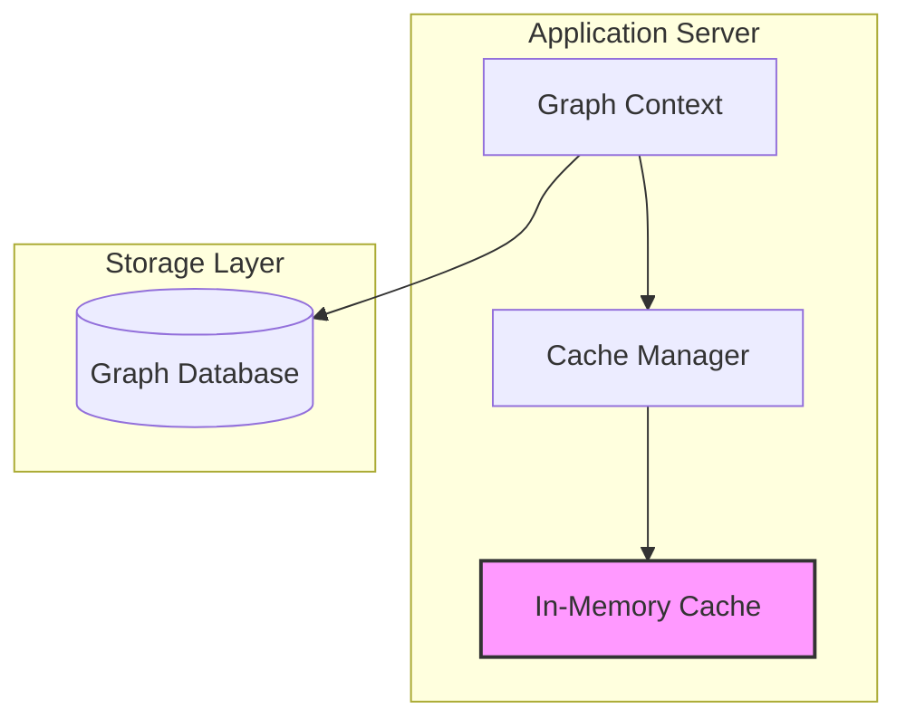

### Distributed Cache Deployment

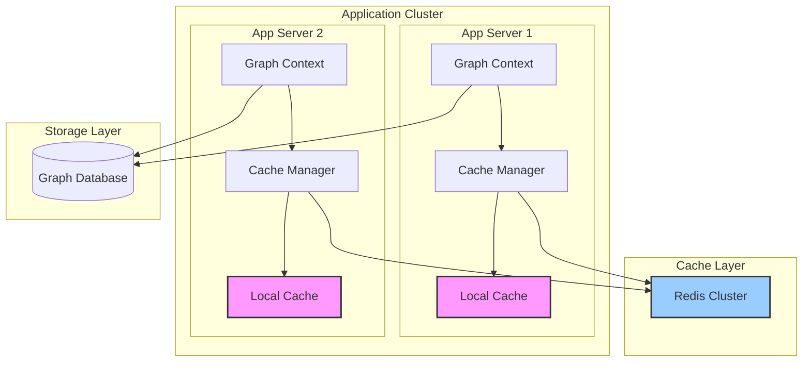

### High-Availability Configuration

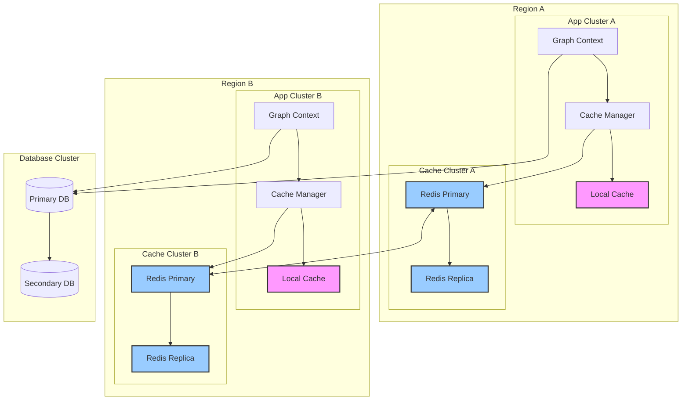

Note: These deployment diagrams are illustrative examples showing possible configurations. The actual deployment architecture should be designed based on specific requirements such as:
- Scale and performance needs
- High availability requirements
- Data consistency requirements
- Geographic distribution
- Infrastructure constraints
- Cost considerations

### Deployment Considerations

1. **Single-Node Deployment**
   - Suitable for development and small-scale deployments
   - Simple to maintain and debug
   - Limited by single node capacity
   - No high availability

2. **Distributed Cache Deployment**
   - Scales horizontally with application servers
   - Shared cache layer for consistency
   - Better resource utilization
   - Requires cache synchronization strategy

3. **High-Availability Configuration**
   - Multi-region support
   - Disaster recovery capability
   - Complex cache synchronization
   - Higher operational overhead

### Cache Synchronization Strategies

1. **Write-Through**
   ```mermaid
   sequenceDiagram
       participant App
       participant Local
       participant Redis
       participant DB

       App->>Local: Write Data
       App->>Redis: Write Data
       App->>DB: Write Data
       DB-->>App: Confirm
   ```

2. **Write-Behind**
   ```mermaid
   sequenceDiagram
       participant App
       participant Local
       participant Redis
       participant DB

       App->>Local: Write Data
       App->>Redis: Write Data
       Redis-->>App: Confirm
       Redis->>DB: Async Write
       DB-->>Redis: Confirm
   ```

## Performance Considerations

### 1. Cache Key Design
- Efficient key generation
- Minimal string operations
- Predictable key patterns

### 2. Memory Management
- Cache size limits
- Dependency tracking overhead
- Query result size considerations

### 3. Invalidation Efficiency
- Fast type-based lookup
- Efficient dependency tracking
- Minimal lock contention

## Future Extensions

### 1. Schema Versioning
- Version hash per type
- Version-aware cache keys
- Migration support

### 2. Advanced Caching Features
- TTL support
- Priority-based eviction
- Partial cache invalidation

### 3. Monitoring and Debugging
- Cache hit/miss metrics
- Invalidation tracking
- Performance monitoring

## Usage Examples

### 1. Basic Entity Caching

```python
# Create and cache entity
person = await graph_context.create_entity(
    "Person",
    {"name": "John Doe", "age": 30}
)

# Cached read
person = await graph_context.get_entity(person.id)

# Modify schema and invalidate cache
person_type = graph_context._entity_types["Person"]
person_type.properties["email"] = PropertyDefinition(
    type=PropertyType.STRING,
    required=True
)

await graph_context.cache_manager.handle_event(
    GraphEvent.SCHEMA_ENTITY_TYPE_MODIFIED,
    EventContext(
        operation="modify_entity_type",
        result=person_type,
        metadata={"type_name": "Person"}
    )
)
```

### 2. Query Caching

```python
# Execute and cache query
results = await graph_context.query({
    "entity_type": "Person",
    "conditions": [
        {"field": "age", "operator": "gt", "value": 25}
    ]
})

# Modify person type and invalidate query cache
await graph_context.cache_manager.handle_event(
    GraphEvent.SCHEMA_ENTITY_TYPE_MODIFIED,
    EventContext(
        operation="modify_entity_type",
        metadata={"type_name": "Person"}
    )
)
```

## Best Practices

1. **Event Handling**
   - Always emit events for schema changes
   - Include relevant metadata in events
   - Handle event failures gracefully

2. **Cache Management**
   - Monitor cache size and hit rates
   - Implement cache warming for critical data
   - Regular cache maintenance

3. **Type Dependencies**
   - Track all relevant type dependencies
   - Consider indirect dependencies
   - Maintain clean dependency graphs

4. **Error Handling**
   - Graceful degradation on cache failures
   - Clear error messages
   - Automatic recovery mechanisms

## Limitations

1. **Current Limitations**
   - No schema versioning support
   - Simple invalidation strategy
   - Basic query dependency tracking

2. **Known Trade-offs**
   - Memory usage vs cache effectiveness
   - Invalidation granularity vs complexity
   - Event handling overhead

## Next Steps

1. **Short Term**
   - Implement basic monitoring
   - Add cache size limits
   - Improve query dependency tracking

2. **Medium Term**
   - Add schema versioning support
   - Implement TTL support
   - Add partial cache invalidation

3. **Long Term**
   - Distributed cache support
   - Advanced query caching
   - Real-time cache updates
