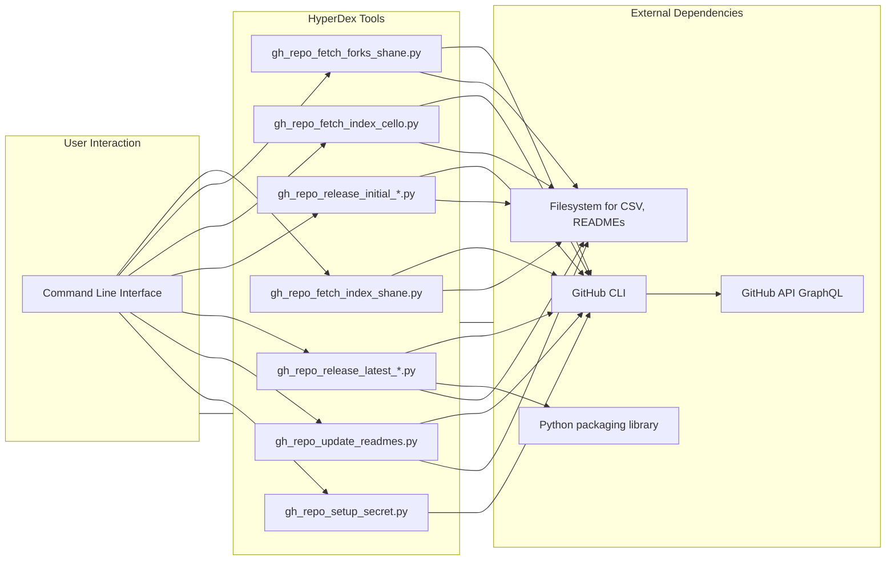

# System Patterns: hyperdex

## Architecture Overview

hyperdex employs a **CLI-centric architecture**. It consists of a collection of independent Python scripts located in the `tools/` directory. These scripts are designed to be executed directly from the command line to perform specific tasks related to GitHub repository management. There is no central application state or server component; each tool operates independently based on its arguments and interacts directly with the GitHub API via the `gh` CLI.

_Correction: Only `gh*repo_release_latest*_.py`scripts directly depend on the`packaging` library.\*

## Key Technical Decisions & Patterns

1. **GitHub CLI (`gh`) Wrapper:** Instead of using a Python GitHub API library (like PyGithub), the project wraps the official `gh` CLI using Python's `subprocess` module.
   - **Rationale:** Leverages the robust, maintained, and authenticated CLI tool directly. Avoids managing API authentication within Python. Simplifies interaction for common tasks already exposed by `gh`.
   - **Implementation:** A helper function `run_gh_command` standardizes executing `gh` commands and handling output/errors.
2. **GraphQL Optimization:** For fetching organization repositories with authorship filtering (`CelloCommunications` use case), GraphQL is used via `gh api graphql`.
   - **Rationale:** Significantly reduces API calls compared to fetching all repos and then checking authorship individually (1+N problem). Improves performance and reduces rate limit consumption. (See `docs/optimization.md`).
   - **Implementation:** Specific GraphQL queries are embedded in Python scripts and executed using `gh api graphql`.
3. **Configuration via Constants/Args:** Configuration like GitHub username, organization, output directories, and filenames are primarily managed via constants within each script, with some overrides possible via command-line arguments (`argparse`) - e.g., the `--limit` option in `gh_repo_fetch_forks_shane.py`.
4. **Separate Tools for Targets:** Distinct scripts exist for handling personal source repositories (`gh_repo_fetch_index_shane.py`), personal forked repositories (`gh_repo_fetch_forks_shane.py`), and organization (`CelloCommunications`) repositories authored by the user. This separation simplifies logic within each script.
5. **CSV as Intermediate Data Store:** Some scripts (`gh_repo_release_*.py` for personal repos, `gh_repo_update_readmes.py`) rely on a `repositories.csv` file (generated by `gh_repo_fetch_index_shane.py` or potentially `gh_repo_fetch_forks_shane.py`) as input. _Note: Need to confirm if release/update scripts should operate on forks._
6. **Semantic Versioning Focus:** Release management scripts specifically look for and operate on semantic version tags (using the `packaging` library for parsing and comparison in the "latest" scripts).
7. **Idempotency (Partial):** Release creation scripts attempt to be idempotent by checking if tags/releases already exist before attempting creation, although race conditions are possible.
8. **Standardized Output:** Terminal output uses consistent, color-coded indicators (`[x]`, `[ ]`, `[-]`) as defined in `.clinerules`, avoiding emojis.

## Component Relationships

- **Data Flow:** `gh_repo_fetch_index_shane.py` and `gh_repo_fetch_forks_shane.py` generate `repositories.csv` and local README files in their respective output directories. Other scripts (`gh_repo_release_*.py`, `gh_repo_update_readmes.py`) consume the CSV or local READMEs (currently configured for the non-fork directory).
- **Dependencies:** All tools depend on the `gh` CLI being installed and authenticated. Release scripts depend on the `packaging` library.

- **Automation:** `gh_repo_fetch_index_*.py` scripts are designed to be run automatically via GitHub Actions, using a PAT stored as a secret (set up by `gh_repo_setup_secret.py`). The fork script is not currently included in automation.
