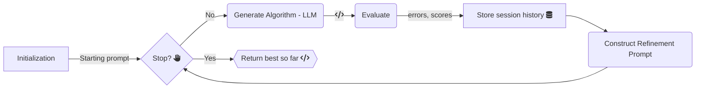

<p align="center">
  <picture>
    <source media="(prefers-color-scheme: dark)" srcset="logo-dark.png">
    <source media="(prefers-color-scheme: light)" srcset="logo.png">
    
  </picture>
</p>

<h1 align="center">LLaMEA: Large Language Model Evolutionary Algorithm</h1>

<p align="center">
  <a href="https://pypi.org/project/llamea/">
    
  </a>
  
  
  <a href="https://codecov.io/gh/XAI-liacs/LLaMEA" > 
     
 </a>
</p>

## Table of Contents
- [Introduction](#introduction)
- [News](#-news)
- [Installation](#-installation)
- [Quick Start](#-quick-start)
- [Examples](#-examples)
  - [Running `example.py`](#running-examplepy)
  - [Running `example_HPO.py` (LLaMEA-HPO)](#running-example_hpopy-llamea-hpo)
- [Contributing](#-contributing)
- [License](#-license)
- [Citation](#-citation)


## Introduction

**LLaMEA** (Large Language Model Evolutionary Algorithm) is an innovative framework that leverages the power of large language models (LLMs) such as GPT-4 for the automated generation and refinement of metaheuristic optimization algorithms. The framework utilizes a novel approach to evolve and optimize algorithms iteratively based on performance metrics and runtime evaluations without requiring extensive prior algorithmic knowledge. This makes LLaMEA an ideal tool for both research and practical applications in fields where optimization is crucial.

**Key Features:**
- **Automated Algorithm Generation**: Automatically generates and refines algorithms using GPT-based or similar LLM models.
- **Performance Evaluation**: Integrates seamlessly with the IOHexperimenter for real-time performance feedback, guiding the evolutionary process.
- **LLaMEA-HPO**: Provides an in-the-loop hyper-parameter optimization mechanism (via SMAC) to offload numerical tuning, so that LLM queries focus on novel structural improvements.
- **Extensible & Modular**: You can easily integrate additional models and evaluation tools.

<p align="center">
  
</p>


## 🔥 News 

+ 2025.03 🎉🎉 **LLaMEA v1.0.0 released**!  

+ 2025.01 🎉🎉 **LLaMEA paper accepted in IEEE TEVC** [“Llamea: A large language model evolutionary algorithm for automatically generating metaheuristics"](https://ieeexplore.ieee.org/abstract/document/10752628/)!  


## 🎁 Installation

It is the easiest to use LLaMEA from the pypi package.

```bash
  pip install llamea
```
> [!Important]
> The Python version **must** be larger or equal to Python 3.10.
> You need an OpenAI/Gemini/Ollama API key for using LLM models.

You can also install the package from source using Poetry (1.8.5).

1. Clone the repository:
   ```bash
   git clone https://github.com/XAI-liacs/LLaMEA.git
   cd LLaMEA
   ```
2. Install the required dependencies via Poetry:
   ```bash
   poetry install
   ```

## 💻 Quick Start

1. Set up an OpenAI API key:
   - Obtain an API key from [OpenAI](https://openai.com/).
   - Set the API key in your environment variables:
     ```bash
     export OPENAI_API_KEY='your_api_key_here'
     ```

2. Running an Experiment

    To run an optimization experiment using LLaMEA:

    ```python
    from llamea import LLaMEA

    # Define your evaluation function
    def your_evaluation_function(solution):
        # Implementation of your function
        # return feedback, quality score, error information
        return "feedback for LLM", 0.1, ""

    # Initialize LLaMEA with your API key and other parameters
    optimizer = LLaMEA(f=your_evaluation_function, api_key="your_api_key_here")

    # Run the optimizer
    best_solution, best_fitness = optimizer.run()
    print(f"Best Solution: {best_solution}, Fitness: {best_fitness}")
    ```

---

## 💻 Examples

Below are two example scripts demonstrating LLaMEA in action for black-box optimization with a BBOB (24 noiseless) function suite. One script (`example.py`) runs basic LLaMEA, while the other (`example_HPO.py`) incorporates a **hyper-parameter optimization** pipeline—known as **LLaMEA-HPO**—that employs SMAC to tune the algorithm’s parameters in the loop.

### Running `example.py`

**`example.py`** showcases a straightforward use-case of LLaMEA. It:
- Defines an evaluation function `evaluateBBOB` that runs generated algorithms on a standard set of BBOB problems (24 functions).
- Initializes LLaMEA with a specific model (e.g., GPT-4, GPT-3.5) and prompts the LLM to generate metaheuristic code.
- Iterates over a `(1+1)`-style evolutionary loop, refining the code until a certain budget is reached.

**How to run:**
```bash
python example.py
```

The script will:
1. Query the specified LLM with a prompt describing the black-box optimization task.
2. Dynamically execute each generated algorithm on BBOB problems.
3. Log performance data such as AOCC (Area Over the Convergence Curve).
4. Iteratively refine the best-so-far algorithms.


### Running `example_HPO.py` (LLaMEA-HPO)

**`example_HPO.py`** extends LLaMEA with **in-the-loop hyper-parameter optimization**—termed **LLaMEA-HPO**. Instead of having the LLM guess or refine hyper-parameters directly, the code:
- Allows the LLM to generate a Python class representing the metaheuristic **plus** a ConfigSpace dictionary describing hyper-parameters.
- Passes these hyper-parameters to SMAC, which then searches for good parameter settings on a BBOB training set.
- Evaluates the best hyper-parameters found by SMAC on the full BBOB suite.
- Feeds back the final performance (and errors) to the LLM, prompting it to mutate the algorithm’s structure (rather than simply numeric settings).
  
**Why LLaMEA-HPO?**  
Offloading hyper-parameter search to SMAC significantly reduces LLM query overhead and encourages the LLM to focus on novel structural improvements.

**How to run:**
```bash
python example_HPO.py
```

**Script outline:**
1. **Prompt & Generation**: Script sets up a role/task prompt, along with hyper-parameter config space templates.
2. **HPO Step**: For each newly generated algorithm, SMAC tries different parameter values within a budget.
3. **Evaluation**: The final best configuration from SMAC is tested across BBOB instances.
4. **Refinement**: The script returns the performance to LLaMEA, prompting the LLM to mutate the algorithm design.

> [!Note]
> Adjust the model name (`ai_model`) or API key as needed in the script.
> Changing `budget` or the HPO budget can drastically affect runtime and cost.
> Additional arguments (e.g., logging directories) can be set if desired.

---

## 🤖 Contributing

Contributions to LLaMEA are welcome! Here are a few ways you can help:

- **Report Bugs**: Use [GitHub Issues](https://github.com/XAI-liacs/LLaMEA/issues) to report bugs.
- **Feature Requests**: Suggest new features or improvements.
- **Pull Requests**: Submit PRs for bug fixes or feature additions.

Please refer to CONTRIBUTING.md for more details on contributing guidelines.

## 🪪 License

Distributed under the [MIT](https://choosealicense.com/licenses/mit/) License. See `LICENSE` for more information.


## ✨ Citation

If you use LLaMEA in your research, please consider citing the associated paper:

```bibtex
@article{stein2025llamea,
  author={Stein, Niki van and Bäck, Thomas},
  journal={IEEE Transactions on Evolutionary Computation}, 
  title={LLaMEA: A Large Language Model Evolutionary Algorithm for Automatically Generating Metaheuristics}, 
  year={2025},
  volume={29},
  number={2},
  pages={331-345},
  keywords={Benchmark testing;Evolutionary computation;Metaheuristics;Codes;Large language models;Closed box;Heuristic algorithms;Mathematical models;Vectors;Systematics;Automated code generation;evolutionary computation (EC);large language models (LLMs);metaheuristics;optimization},
  doi={10.1109/TEVC.2024.3497793}
}
```

If you only want to cite the LLaMEA-HPO variant use the folllowing:

```bibtex
@article{stein2024loop,
  title={In-the-loop hyper-parameter optimization for llm-based automated design of heuristics},
  author={van Stein, Niki and Vermetten, Diederick and B{\"a}ck, Thomas},
  journal={arXiv preprint arXiv:2410.16309},
  year={2024}
}
```

Other works about extensions or integrations of LLaMEA:

```bibtex
@misc{yin2024controllingmutation,
      title={Controlling the Mutation in Large Language Models for the Efficient Evolution of Algorithms}, 
      author={Haoran Yin and Anna V. Kononova and Thomas Bäck and Niki van Stein},
      year={2024},
      eprint={2412.03250},
      archivePrefix={arXiv},
      primaryClass={cs.NE},
      url={https://arxiv.org/abs/2412.03250}, 
}
```

---

For more details, please refer to the documentation and tutorials available in the repository.



---

CodeCov test coverage

 

