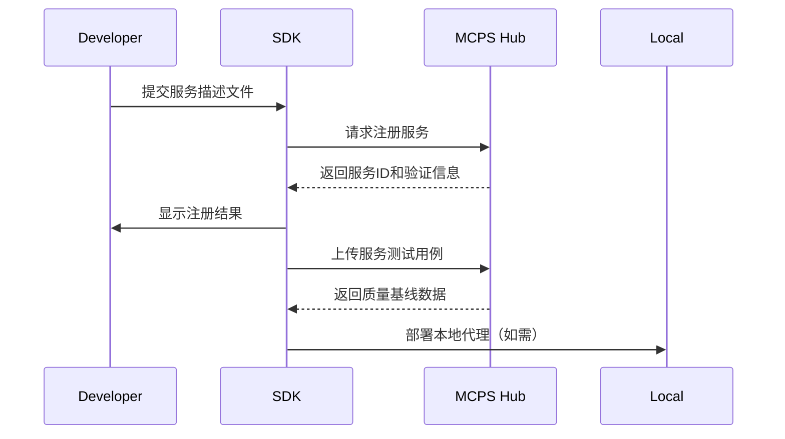
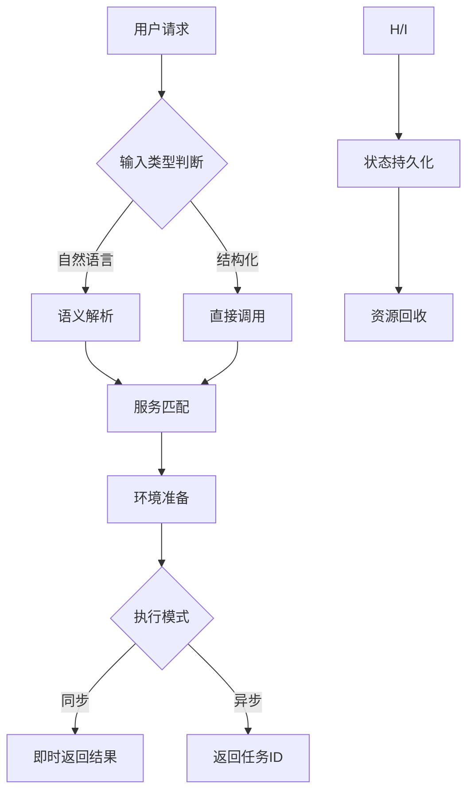

# MCPS SDK 技术需求设计文档

## 一、总体设计目标

### 核心功能 


- 工具发现和调用: 通过自然语言描述或结构化请求自动匹配，并调用最佳MCP服务类型包括

* 本地 mcp / camel
* 中心化基于aws ec2/gcloud/aliyun等云服务的各类互联网服务 

- 服务管理：支持开发者注册/更新/下架服务，通过单一Accesskey实现与Hub所有资源的交互


- 状态管理：处理需要上下文维护的服务（如IPython交互），自动绑定UID/PID并释放资源，而不是必须大模型cover状态


- 协议兼容：兼容MCP/CAMLEL原生协议及扩展的MCPS中心化服务协议

- 智能体召回和管理：由于我们有Moros2框架，所以理论上可以推行moros2标准的智能体生成，线上开发，测试适配做到更大范围，把agent管理也融合进SDK/即智能体开发，注册。运行。甚至trace也可以直接使用langfuse，实现snapshot/replay等高级特性。同时也可以进一步支持langchain/autogen等框架语法

- 智能体运行管理，能够将异构的智能体和工具集合，用统一标准进行执行，输入输出，状态数据IO。比如docker compose用来环境托管。


重点：
Agent最关键要素，可以统一，通用，一键使用，例如
- 记忆智能体组件/工具集
- 垂直领域任务组件/工具集
服务调用标准化：通过自然语言或结构化请求自动匹配最佳服务端点。
协议兼容性：MCP（无状态服务）与MCPS（有状态服务）协议。
资源治理：自动管理有状态服务的上下文生命周期（如会话绑定/释放）。
开发者友好：内置工具链简化服务注册、调试和本地管理。

1. 用户场景示例

* 场景1：开发者注册一个OCR服务，通过SDK直接调用或分享给其他开发者。

* 场景2：web playground用户使用自然语言查询“北京的天气”，SDK自动路由到天气服务以及对应的智能体。

* 场景3：某开发者本地运行需要文件系统访问，以及基于Git管理得智能体。
 
#### 用户场景 
* Agent开发者：快捷集成工具服务到Agent中，SDK调用服务时，自动获取最优服务组合，无需关心底层协议
* toolkit服务提供方：通过SDK将服务注册到平台，并监控调用质量，获得收益等。
* Agent用户：playground 运行

### 二、功能模块设计
#### 1. 服务发现与调用

API设计 

- auto mode:
```python
Python示例：根据输入自动推荐并调用服务
from mcps import MCPS_Client
from mcps import Agents_Client

query = "北京的天气怎么样？"

# TOOLS
mcps_tools_client = MCPS_Client(api_key="YOUR_KEY")
# 自然语言工具召回模式
tools = mcps_tools_client.query("北京的天气怎么样？",topk=1)[0]  # 自动路由到天气服务
# tools: list<tool>

# AGENT:
mcps_agent_client = Agents_Client(api_key="YOUR_KEY")
# 自然语言智能体召回模式
agent = mcps_agent_client.call_from_query("北京的天气怎么样？",topl=1)[0]
# agent:list<agent>

# Agent
result=agents.run(query=query,tools=tools)

```
- direactly:
```python

# 显式调用模式
tools_calling_result = mcps_tools_client.call_service(
    service_id="weather_api_v1", 
    params={"location": "北京", "unit": "celsius"}
)

result = mcps_agent_client.call_agent(
     agent_id="weather_agent_1",
     tools=["weather_api_v1"],
     query=query
)

# 多服务降级机制：主服务不可用时自动切换备用服务
result = mcps_tools_client.call_with_fallback(
    primary_service="ocr_v2",
    fallback_services=["ocr_v1", "ocr_legacy"],
    image_data=image_bytes
)
```


同时也给一些CLI系统的示例
##
```bash
# 服务管理
mcps service register postman.json    # 从文档注册服务
mcps service list --filter "category=OCR"

# 调用调试
mcps invoke weather_api_v1 --params '{"location":"北京"}'

# 密钥管理
mcps auth login                       # 交互式登录
mcps auth create-service-key --service-id asr_v2

# 本地服务管理
mcps local install git_service       # 安装本地服务代理
mcps local start git_service         # 启动本地服务
```

### MCPS 架构设计

---

#### 一、工程结构设计
```markdown
mcps/
├── core/                       # 核心基础设施
│   ├── transports/            # 协议传输层
│   ├── auth/                  # 认证授权体系
│   └── exceptions/           # 异常体系
├── services/                  # 服务管理层
│   ├── discovery/            # 服务发现机制
│   ├── registry/             # 服务注册中心
│   └── governance/           # 服务治理
├── agents/                    # 智能体管理层
│   ├── runtime/              # 运行时环境
│   ├── lifecycle/            # 生命周期管理
│   └── monitoring/           # 监控追踪
├── tools/                     # 工具集管理
│   ├── local/                # 本地工具管理
│   └── remote/               # 远程工具集成
├── utils/                     # 公共组件
│   ├── crypto/               # 加解密模块
│   ├── schemas/              # 数据模型
│   └── state/                # 状态管理
└── cli/                       # 命令行接口
    ├── commands/             # 命令集
    └── plugins/              # 插件系统
```

---

#### 二、核心基类定义

##### 1. 基础传输协议类
```python
class BaseTransport(ABC):
    @abstractmethod
    def connect(self, endpoint: str, credentials: AuthToken):
        """建立协议连接"""
    
    @abstractmethod
    def send_request(self, payload: dict) -> Response:
        """发送请求并接收响应"""
    
    @abstractmethod
    def close(self):
        """释放连接资源"""
```

##### 2. 服务发现抽象类
```python
class ServiceDiscoverer(ABC):
    @abstractmethod
    def find_by_nlp(self, query: str, top_k: int = 3) -> List[ServiceDescriptor]:
        """自然语言服务发现"""
    
    @abstractmethod
    def find_by_metadata(self, filters: dict) -> List[ServiceDescriptor]:
        """结构化服务检索"""
```

##### 3. 智能体运行时基类
```python
class AgentRuntime:
    def __init__(self, env: RuntimeEnvironment):
        self.environment = env  # 包含Docker/K8s等运行时配置
    
    def deploy(self, agent_package: AgentPackage):
        """部署智能体实例"""
    
    def execute(self, session: ExecutionSession) -> AgentOutput:
        """执行智能体任务"""
    
    def snapshot(self) -> RuntimeSnapshot:
        """获取运行时状态快照"""
```

---

#### 三、核心功能模块定义

##### 1. 服务枢纽交互层
• **远程服务发现**
  • 与MCPS Hub的gRPC/HTTP API交互
  • 服务元数据缓存机制（TTL可配置）
  • 自动心跳检测与服务健康状态更新

• **服务调用引擎**
  • 智能协议选择（根据服务类型自动切换）
  • 负载均衡策略（轮询/加权/一致性哈希）
  • 传输层优化（连接池/压缩/二进制序列化）

##### 2. 本地服务治理
• **环境隔离系统**
  • 基于Docker Compose的沙箱环境
  • 资源配额管理（CPU/内存/GPU）
  • 网络隔离策略（虚拟网桥/NAT）

• **生命周期控制器**
  • 服务进程守护（自动重启崩溃实例）
  • 依赖项自动安装（requirements.txt）
  • 版本热更新支持（无需重启服务）

##### 3. 智能体运行时
• **标准化执行环境**
  • 统一输入输出格式（JSON Schema验证）
  • 文件系统虚拟化（隔离工作目录）
  • 环境变量注入机制

• **状态管理引擎**
  • 会话级状态存储（Redis/内存/SQLite）
  • 自动垃圾回收（基于引用计数）
  • 断点续传支持（任务状态持久化）

##### 4. 权限控制体系
• **细粒度访问控制**
  • 服务级权限（读/写/执行）
  • 资源级访问策略（正则表达式匹配）
  • 临时令牌颁发（JWT短期凭证）

• **密钥管理服务**
  • 密钥轮换自动化（定期更新策略）
  • 密钥使用审计日志
  • 硬件安全模块集成（HSM支持）

---

#### 四、关键交互流程

##### 1. 服务注册流程


##### 2. 智能体执行流程


---

#### 五、扩展性设计

##### 1. 插件系统架构
• **插件类型**
  • 协议适配插件（新增传输协议）
  • 服务发现插件（自定义匹配算法）
  • 运行时插件（支持新执行环境）

• **插件生命周期**
  • 动态加载/卸载
  • 依赖冲突检测
  • 热更新支持

##### 2. 跨平台支持矩阵
| 平台        | 服务托管 | 本地执行 | 硬件加速 |
|-------------|----------|----------|----------|
| Docker      | ✓        | ✓        | ✓        |
| Kubernetes  | ✓        | ✗        | ✓        |
| 裸金属服务器| ✓        | ✓        | ✓        |
| 边缘设备    | ✓        | ✓        | 部分支持 |

---

#### 六、质量保障体系

##### 1. 测试策略
• **协议兼容性测试套件**
  • 跨版本兼容性验证
  • 压力测试（峰值10k QPS）
  • 错误注入测试

• **智能体沙箱测试**
  • 内存泄漏检测
  • 系统调用监控
  • 性能基准测试

##### 2. 监控指标
| 指标类别     | 具体指标                   | 告警阈值       |
|--------------|---------------------------|----------------|
| 运行时       | CPU使用率                 | >90%持续5分钟  |
| 网络         | 请求延迟(P99)             | >2000ms        |
| 存储         | 磁盘使用率                | >85%           |
| 安全         | 异常登录尝试              | >5次/分钟      |

---

该设计方案实现了以下核心创新点：
1. **双模运行架构**：同时支持本地服务托管与云端服务调用
2. **智能路由决策**：结合服务质量指标与语义理解的混合路由
3. **安全沙箱技术**：基于Linux命名空间的资源隔离方案
4. **动态扩展机制**：模块化设计支持快速功能扩展

通过分层架构设计和清晰的接口定义，既保证了核心功能的稳定性，又为未来扩展保留了充足空间。各模块通过标准化协议通信，可独立演进升级，符合现代SDK设计的最佳实践。