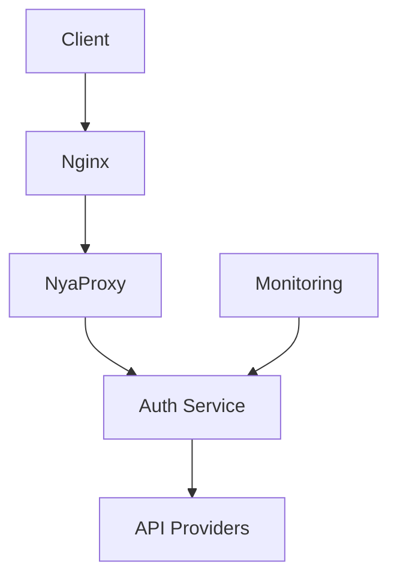

# 🐾 NyaProxy - Universal API Proxy

[](https://pypi.org/project/nya-proxy/)
[](https://pypi.org/project/nya-proxy/)
[](https://github.com/Nya-Foundation/nyaproxy/blob/main/LICENSE)
[](https://codecov.io/gh/Nya-Foundation/nyaproxy)
[](https://github.com/Nya-Foundation/nyaproxy/actions/workflows/publish.yml)
[](https://hub.docker.com/r/k3scat/nya-proxy)


*Your Swiss Army Knife for API Proxy Management*

## 🌟 Core Capabilities
| Feature               | Description                                                                 | Config Reference          |
|-----------------------|-----------------------------------------------------------------------------|---------------------------|
| 🔄 Token Rotation     | Automatic key cycling across multiple providers                             | `variables.keys`          |
| ⚖️ Load Balancing    | 5 strategies: Round Robin, Random, Least Connections, Fastest Response, Weighted | `load_balancing_strategy` |
| 🚦 Rate Limiting     | Granular controls per endpoint/key with smart queuing                       | `rate_limit`              |
| 🕵️ Request Masking   | Dynamic header substitution across multiple identity providers              | `headers` + `variables`   |
| 📊 Real-time Metrics | Interactive dashboard with request analytics and system health              | `dashboard.enabled`       |

## 🚀 Installation

### Docker (Production)
```bash
docker run -d \
  -p 8080:8080 \
  -v ${PWD}/config.yaml:/app/config.yaml \
  -v nya-proxy-logs:/app/logs \
  k3scat/nya-proxy:latest
```

### PyPI (Development)
```bash
pip install nya-proxy
nyaproxy --config config.yaml --log-level debug
```

## 📡 Service Endpoints

| Service    | Endpoint                          | Description                        |
|------------|-----------------------------------|------------------------------------|
| API Proxy  | `http://localhost:8080/api/<endpoint_name>` | Main proxy endpoint for API requests |
| Dashboard  | `http://localhost:8080/dashboard` | Real-time metrics and monitoring   |
| Config UI  | `http://localhost:8080/config`    | Visual configuration interface     |

**Note**: Replace `8080` with your configured port if different

## 🔧 API Configuration

### OpenAI-Compatible APIs (Gemini, Anthropic, etc)
```yaml
gemini:
  name: Google Gemini API
  endpoint: https://generativelanguage.googleapis.com/v1beta/openai
  aliases:
    - /gemini
  key_variable: keys
  headers:
    Authorization: 'Bearer ${{keys}}'
  variables:
    keys:
      - your_gemini_key_1
      - your_gemini_key_2
  load_balancing_strategy: least_requests
  rate_limit:
    endpoint_rate_limit: 75/d     # Total endpoint limit
    key_rate_limit: 5/m          # Per-key limit
    rate_limit_paths:
      - "/v1/chat/*"            # Apply limits to specific paths
      - "/v1/images/*"
```

### Generic REST APIs
```yaml
novelai:
  name: NovelAI API
  endpoint: https://image.novelai.net
  aliases:
    - /novelai
  key_variable: tokens
  headers:
    Authorization: 'Bearer ${{tokens}}'
  variables:
    tokens:
      - your_novelai_token_1
      - your_novelai_token_2
  load_balancing_strategy: round_robin
  rate_limit:
    endpoint_rate_limit: 10/s
    key_rate_limit: 2/s
```

## 🖥️ Management Interfaces

### Real-time Metrics Dashboard


Monitor at `http://localhost:8080/dashboard`:
- Request volumes and response times
- Rate limit status and queue depth
- Key usage and performance metrics
- Error rates and status codes

### Visual Configuration Interface


Manage at `http://localhost:8080/config`:
- Live configuration editing
- Syntax validation
- Variable management
- Rate limit adjustments
- Auto reload on save

## 🛡️ Advanced Reference Architecture (Advanced Deployment)


## 🌌 Future Roadmap

```mermaid
graph LR
A[Q3 2025] --> B[🔄 Smart Request Routing]
A --> C[📡 gRPC/WebSocket Support]
B --> D[📈 Auto-scaling Rules]
C --> E[📊 Protocol Analytics]
F[Q4 2025] --> G[🧩 Plugin System]
F --> H[🔍 Custom Metrics API]
```



## ❤️ Community

[](https://discord.gg/jXAxVPSs7K)

*Need enterprise support? Contact [k3scat@gmail.com](mailto:k3scat@gmail.com)*

## 📈 Project Growth

[](https://star-history.com/#Nya-Foundation/NyaProxy&Date)
