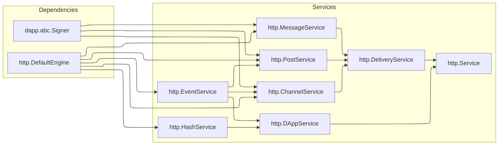

> [!WARNING] 
> This is an unstable version. Changes may be backwards incompatible


# `py-pletyvo`

Typed, async‑first Python client for [the Pletyvo decentralized platform](https://pletyvo.osyah.com/) and it's protocols (Python ≥ 3.9)


## Install

```bash
pip install -U pletyvo
```


## Usage


### Engine

To begin using the client, you need to create an `engine` — the core component responsible for all communication with the Pletyvo gateway. You can create one using `http.DefaultEngine`:

```py
from pletyvo.client import http

engine: http.abc.Engine = http.DefaultEngine(
    config=http.Config(
        url="http://testnet.pletyvo.osyah.com",
        network="AAEAAAAB",
    ),
)
```

The `http.Config` accepts:
- `url`: The gateway endpoint.
- `network | None`: [the network identifier](https://pletyvo.osyah.com/reference#network-identify) encoded as a `base64` string. By default, has an already set network on the node side


### Service

A service is a high-level interface that aggregates protocol-specific HTTP services. This top-level object internally composes [`http.DAppService`](#dapp) & [`http.DeliveryService`](#delivery). The service requires a `signer` — an object responsible for producing cryptographic signatures over [event bodies](https://pletyvo.osyah.com/protocols/dapp#event-body). The `signer` must implement the [`dapp.abc.Signer`](#cryptography-signing-with-dappauthheader) interface.

```py
from pletyvo.client import http

service = http.Service.di(
    engine=engine,
    signer=signer,
)
```


#### Want full control?

You can instantiate each service manually by passing required dependencies.

```py
from pletyvo.client import http

service = http.Service(
    dapp=http.DAppService(
        hash=http.HashService(...),
        event=http.EventService(...),
    ),
    delivery=http.DeliveryService(
        channel=http.ChannelService(...),
        post=http.PostService(...),
        message=http.MessageService(...),
    )
)
```


#### Dependency graph




### dApp

[Platform docs: dApp](https://pletyvo.osyah.com/protocols/dapp)

The dApp protocol defines how signed events are created, verified, and published on the Pletyvo network. Each [`dapp.Event`](https://pletyvo.osyah.com/protocols/dapp#event) consists of [`dapp.EventBody`](https://pletyvo.osyah.com/protocols/dapp#event-body) and a corresponding signature, both of which are required for persistence. You can create a dApp service using either the shorthand or [manual constructor](#want-full-control):

The dApp service itself does not construct or validate signatures — it only transmits fully-formed signed events.

```py
from pletyvo.client import http

dapp_service = http.DAppService.di(
    engine=engine,
)
dapp_service = http.DAppService(
    hash=http.HashService(...),
    event=http.EventService(...),
)
```


#### Cryptography: signing with `dapp.AuthHeader`

Most dApp calls that create or update data must be signed with an `ED25519` keypair; read‑only requests work without it.

`py‑pletyvo` lets you obtain a keypair from a random seed, raw bytes, or a file. If you prefer BIP‑39 mnemonics, generate a seed with an external helper such as [`osyah/homin`](https://github.com/osyah/homin) and load it into the `signer`.

```py
from pletyvo.protocol import dapp

signer: dapp.abc.Signer

signer = dapp.ED25519.gen()
signer = dapp.ED25519.from_file(...)
signer = dapp.ED25519(...)
```

[Pletyvo: decentralized applications (`UA`)](https://osyah.com/stattya/pletyvo-detsentralizovani-zastosunky)


### Delivery

[Platform docs: Delivery](https://pletyvo.osyah.com/protocols/delivery)

The delivery layer exposes three narrow services — `http.ChannelService`, `http.PostService`, and `http.MessageService` — bundled under `http.DeliveryService`.

```py
from pletyvo.client import http

delivery_service = http.DeliveryService.di(
    engine=engine,
    signer=signer,
    event=event_service,
)
delivery_service = http.DeliveryService(
    channel=http.ChannelService(...),
    post=http.PostService(...),
    message=http.MessageService(...),
)
```
