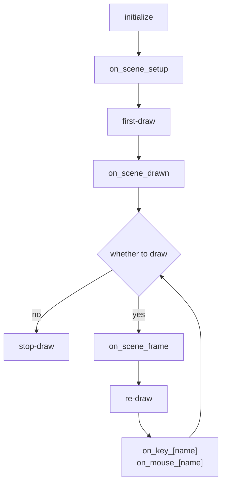

# PsychoPy-Scene


English | [简体中文](README-zh.md)

This project is a lightweight experiment framework for [PsychoPy](https://github.com/psychopy/psychopy), source code only **200 lines**.

> [!NOTE]
> this project aim to provide a new way to build PsychoPy experiments, only provide the basic API and encourage developers to develop on top of this project.

## Features

- Lightweight: Only 1 file, no extra dependencies
- Type-safe: All parameters are type annotated
- Newcomer-friendly: Only the concepts of `Context` and `Scene` are required to get started.

## Install

```bash
pip install psychopy-scene
```

or copy the `psychopy_scene` folder directly to the root directory of your project.

## Get Started

### Context

Experiment context `Context` means this experiment's global settings,
including environment parameters and task parameters.
The first step to writing an experiment is to create an experiment context.

```python
from psychopy_scene import Context
from psychopy.visual import Window
from psychopy.monitors import Monitor
from psychopy.data import ExperimentHandler

# create monitor
monitor = Monitor(
    name="testMonitor",
    width=52.65,
    distance=57,
)
monitor.setSizePix((1920, 1080))

# create window
win = Window(
    monitor=monitor,
    units="deg",
    fullscr=False,
    size=(800, 600),
)

# create experiment context
ctx = Context(
    win,
    exp=ExperimentHandler(extraInfo={"subject": "test"}),
)
```

### Scene

The experiment can be seen as a composition of a series of scenes,
only 2 steps are required to write an experiment program:

1. create scene
2. write scene presentation logic

scene provides some configuration parameters:

- `duration`：seconds unit
- `close_on`：the [event](#event) to close scene, such as `key_f` means pressing the `f` key to close the scene
- `on_key_[name]`：when the keyboard key is pressed, execute the function
- `on_mouse_[name]`：when the mouse button is clicked, execute the function
- `on_scene_[name]`：when the scene reaches a specific stage, execute the function

Creating a scene only requires a function that accepts stimulus parameters and returns the stimulus:

```python
from psychopy.visual import TextStim

# create stimulus
stim_1 = TextStim(ctx.win, text="Hello")
stim_2 = TextStim(ctx.win, text="World")

# create scene
@ctx.scene(
    duration=1,
    close_on=["key_f", "mouse_right"],
    on_key_escape=lambda: print("escape key was pressed"),
    on_mouse_left=lambda: print("left mouse button was pressed"),
    on_scene_drawn=lambda: print("it will be called after first drawing"),
    on_scene_frame=lambda: print("it will be called each frame"),
)
def demo(color: str, ori: float): # it will be used as on_scene_setup
    print('it will be called before first drawing')
    stim_1.color = color
    stim_2.ori = ori
    return stim_1, stim_2

# show scene
demo.show(color="red", ori=45)
```

scene can also be configured dynamically, it is useful in some cases, such as presentations with variable duration:

```python
@ctx.scene()
def demo():
    return stim
demo.config(duration=0.5).show()
```

this `ctx.scene` method is a shortcut for `demo.config`, so they are equivalent.

### Event

An event represents a specific moment in the program's running, such as pressing a key or clicking the mouse.
To execute some operation when an event occurs, we need to add a callback function for it:

```python
demo = ctx.scene(close_on="key_f") # or
demo = ctx.scene(on_key_f=lambda: demo.close()) # or
demo = ctx.scene().on("key_f", lambda: demo.close())
```

> [!NOTE]
> each event can only have one callback function, adding repeatedly will raise an error.

each callback parameter name should follow the format `on_[type]_[name]`.
Now we support the following events:

| type  | name                                                      |
| ----- | --------------------------------------------------------- |
| scene | setup、drawn、frame                                       |
| key   | any、other keys is same as returned by `Keyboard.getKeys` |
| mouse | left、right、middle                                       |

these events will be triggered in the following order after the `show` method is executed:



### Data

scene will collect data automatically in showing:
| name | description |
| --------- | ---------------------------- |
| show_time | first drawing timestamp |
| events | interaction events list: keyboard events and mouse events |

we can access these data by `scene.get`:

```python
@ctx.scene(close_on=["key_f", "key_j"])
def demo():
    return stim
demo.show()
close_event = demo.get("events")[-1]
close_key = close_event.key.value
close_time = close_event.timestamp - demo.get('show_time')
```

we can also collect data manually:

```python
@ctx.scene(
    on_key_f=lambda: demo.set('rt', core.getTime() - demo.get('show_time')),
)
def demo():
    return stim
demo.show()
rt = demo.get('rt')
```

## Shortcut

`Context` also provides some shortcut methods：

```python
ctx.text('Welcome to the experiment!', pos=(0, 0)).show() # show static text
ctx.fixation(1).show()
ctx.blank(1).show()
ctx.addRow(a='', b=1, c=True) # collect data to ExperimentHandler
```

## Best Practices

### Separation of context and task

It is recommended to write the task as a function,
pass the experimental context as the first parameter,
the task-specific parameters as the rest of the parameters,
and return the experimental data.

```python
from psychopy_scene import Context

def task(ctx: Context, duration: float):
    from psychopy.visual import TextStim

    stim = TextStim(ctx.win, text="")
    scene = ctx.scene(duration, on_scene_setup=lambda: stim)
    scene.show()
    ctx.addRow(time=scene.get('show_time'))
```

### Focus only on task-related logic

Task functions should not contain any logic that is not related to the task itself, for example:

- Introductory and closing statements
- Number of blocks
- Data processing, analysis, presentation of results

If there are no data dependencies between blocks,
it is recommended to write the task function as a single block.
For experiments that require the presentation of multiple blocks,
consider the following example.

```python
from psychopy_scene import Context
from psychopy.visual import Window

def task(ctx: Context):
    from psychopy.visual import TextStim

    stim = TextStim(ctx.win, text="")
    scene = ctx.scene(1, on_scene_setup=lambda: stim)
    scene.show()
    ctx.addRow(time=scene.get('show_time'))

win = Window()
data = []
for block_index in range(10):
    ctx = Context(win)
    ctx.exp.extraInfo['block_index'] = block_index
    task(ctx)
    block_data = ctx.exp.getAllEntries()
    data.extends(block_data)
```
