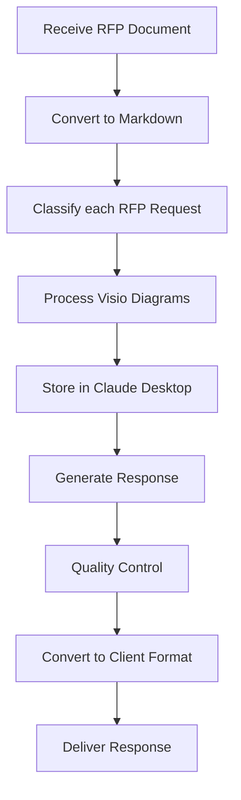

# RFP Assistant Project

[](https://github.com/shaneholloman/rfp-assistant-project/actions/workflows/rfp-test-all.yml)
[](https://github.com/shaneholloman/rfp-assistant-project/actions/workflows/dependency-audit.yml)
[](https://nodejs.org/)
[](https://www.python.org/)

> [!TIP]
> The project will become a part of `ARIA`: Adaptive Research Intelligence Agency

A pragmatic approach to automating RFP (Request for Proposal) processing, starting with immediate practical solutions while building toward a comprehensive system.

See the complete [Technical Brief](docs/core/technical-brief.md) for detailed implementation plans.

## Project Overview

This system evolves through three strategic stages:

1. **Claude Desktop MVP** (current and almost ready)
    - Immediate practical implementation
    - Clean markdown RFP conversion
    - Project-system prompts
    - GitHub-based version control
    - Quality check processes

2. **Database-Centric System** (next quarter)
    - SQLite core implementation
    - Version-controlled templates
    - Manual workflow validation
    - Integration with existing tools
    - Structured data storage

3. **Full System Integration** (long-term)
    - Agentic AI capabilities
    - Proven database structure
    - Established term mappings
    - Human verification
    - Agent Based evaluations
    - Complete audit trail
    - see private repo: langgraph-anthropic-agency

## Technology Stack

The project uses several technologies working together:

### Python Components

- Document conversion scripts
- MkDocs for documentation
- Dependencies managed exclusively via `uv` (Python package manager)

### Node.js Components

- Visio diagram parsing and conversion to Mermaid format
- Image alt text fixing for accessibility
- Aspose.Diagram for Visio file processing

### External Tools

- Pandoc for document format conversion
- Claude AI for intelligent processing
- GitHub for version control and collaboration

## Getting Started

### Prerequisites

- Python 3.13+
- Node.js
- Pandoc
- `uv` Python package manager

### Environment Setup

1. **Python Environment Setup**

    ```sh
    # Install Python dependencies using uv
    uv venv
    source .venv/bin/activate
    uv sync
    ```

2. **Node.js Environment Setup**

    ```sh
    # Install Node.js dependencies
    npm install
    ```

3. **Verify Installation**

    ```sh
    # Test Visio parser installation
    npm run test
    ```

## Usage Examples

### Document Conversion

The system includes a sophisticated DOCX to Markdown converter with extensive features:

- Converts DOCX to clean, GitHub Flavored Markdown via HTML
- Extracts and manages images with consistent naming
- Supports batch processing with configurable output structure
- Applies comprehensive formatting rules:
  - Header hierarchy normalization
  - Image placement and alt text optimization
  - Table formatting and separation
  - List marker spacing
  - Link handling and URL auto-linking
  - Whitespace normalization

```sh
# Convert a single file
uv run scripts/docsuite_converter/cli.py sources/my-doc.docx exports/my-doc_output

# Batch process a directory (nested output)
uv run scripts/docsuite_converter/cli.py "sources/docs" "exports/nested" --clean-first

# Batch process with flat output structure
uv run scripts/docsuite_converter/cli.py "sources/docs" "exports/flat" --clean-first --flat-output
```

See [Docsuite Converter Documentation](scripts/docsuite_converter/README.md) for detailed usage and features.

### Visio Diagram Processing

Parse and convert Visio diagrams to Mermaid format:

```sh
# Convert a Visio file to Mermaid format
npm run to-mermaid -- path/to/diagram.vsdx

# Parse a Visio file and output JSON information
npm run parse -- path/to/diagram.vsdx
```

### Image Alt Text Fixing

Update image alt text using existing figure captions:

```sh
node scripts/alt-text-fixer/alt-text-fixer.js path/to/markdown-file.md
```

## Workflow



1. **Document Intake**: Receive RFP documents in various formats (DOCX, PDF, etc.)
2. **Conversion**: Transform documents to clean, standardized Markdown
3. **AI/Human Hybrid Request Classification**: Categorize each request by type, complexity, and required expertise
4. **Diagram Processing**: Convert Visio diagrams to Mermaid format for inclusion in Markdown
5. **AI Processing**: Use Claude Desktop to analyze and assist with response generation
6. **Response Generation**: Create structured, accurate responses to RFP requirements
7. **Quality Control**: Verify technical accuracy and completeness
8. **Format Conversion**: Convert responses to client-required formats
9. **Delivery**: Provide final RFP response to client

## Documentation Structure

The project documentation is organized into five main categories:

- **core/** - Core system documentation and technical briefs
- **guidelines/** - Process standards and implementation guidelines
- **reference/** - Helper documents and general reference materials
- **templates/** - Document structure templates and patterns
- **briefs/** - Project briefs, plans and proposals summaries

## Current Status

In development - Following the evolutionary approach outlined in the technical brief, starting with practical, immediate solutions while building toward the comprehensive system.

## Project Status & Contributing

See [memory-bank/progress.md](memory-bank/progress.md) for comprehensive information on current implementation status, in-progress work, and future development priorities.

## Memory Bank

The `memory-bank/` directory serves as the canonical documentation for project context, designed for AI session continuity:

- **projectBrief.md** - Core purpose and project scope
- **productContext.md** - Problem statement and solution approach
- **systemPatterns.md** - System architecture and design patterns
- **techContext.md** - Technology stack and implementation details
- **activeContext.md** - Current focus and recent changes
- **progress.md** - Implementation status and roadmap
