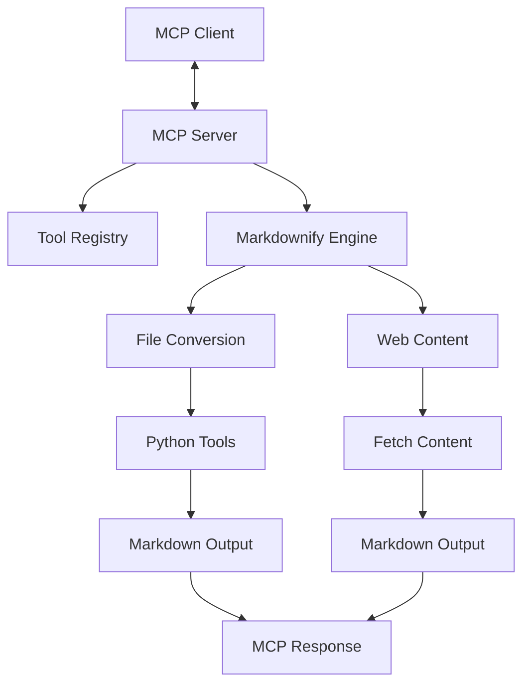

# MCP Moose

MCP Moose is a Model Context Protocol (MCP) server that converts various file types and web content to Markdown format. It provides a unified interface for AI assistants and other systems to transform different document formats into a standardized, easily processable Markdown representation.



## Overview

MCP Moose acts as a content transformation bridge between diverse document formats and systems that prefer working with Markdown. It implements the Model Context Protocol (MCP) standard, allowing it to be integrated with any MCP-compatible client.

## Project Status

MCP Moose is currently in active development following a comprehensive audit. Key focus areas include:

- Security hardening for command execution
- Improved error handling and logging
- Resource management for temporary files
- Cross-platform support
- Comprehensive testing framework

For detailed project status, see the [Progress Document](memory-bank/progress.md).

## Features

### Document Conversion

- **PDF Documents**: Convert PDF files to structured Markdown
- **Office Documents**: Transform DOCX, XLSX, and PPTX files to Markdown
- **Images**: Convert images to Markdown with metadata and descriptions
- **Audio**: Transcribe audio files and convert to Markdown

### Web Content

- **YouTube Videos**: Extract transcripts and metadata from YouTube videos
- **Web Pages**: Convert general web pages to clean Markdown
- **Bing Search Results**: Transform search results to structured Markdown

### Utility Functions

- **Markdown Retrieval**: Fetch existing Markdown files
- **Content Optimization**: Format and structure content for readability

## Requirements

- **Node.js**: v18 or higher
- **Python**: v3.10 or higher
- **UV Package Manager**: For Python dependencies
- **Unix-like OS**: Primary support for macOS and Linux, experimental support for Windows

## Architecture

The system follows a modular architecture with clear separation of concerns:

1. **MCP Server Layer**: Handles protocol communication and request routing
2. **Tool Definitions**: Defines the available tools and their input schemas
3. **Markdownify Engine**: Core conversion logic for different content types
4. **External Tools**: Integrates with Python-based conversion utilities

## Getting Started

1. Clone this repository
2. Install dependencies:

    ```sh
    pnpm install
    ```

    Note: This will also install `uv` and required Python dependencies.

3. Build the project:

    ```sh
    pnpm run build
    ```

4. Start the server:

    ```sh
    pnpm start
    ```

## Development

- Use `pnpm run dev` to start the TypeScript compiler in watch mode
- Modify `src/server.ts` to customize server behavior
- Add or modify tools in `src/tools.ts`
- Follow project conventions in [.clinerules](.clinerules)

### Project Organization

```tree
mcp-moose/
├── src/               # TypeScript source code
├── dist/              # Compiled JavaScript output
├── memory-bank/       # Project documentation
├── audits/            # Security and quality audits
├── tests/             # Test files (planned)
└── .clinerules        # Project conventions
```

## Usage with Desktop App

To integrate this server with a desktop app, add the following to your app's server configuration:

```js
{
  "mcpServers": {
    "mcp-moose": {
      "command": "node",
      "args": [
        "{ABSOLUTE PATH TO FILE HERE}/dist/index.js"
      ],
      "env": {
        // By default, the server will use the default install location of `uv`
        "UV_PATH": "/path/to/uv"
      }
    }
  }
}
```

## Available Tools

### MCP Server Tools

| Tool Name | Description | Input |
|-----------|-------------|-------|
| `moose_markdown-from-youtube` | Convert YouTube videos to Markdown | URL of YouTube video |
| `moose_markdown-from-pdf` | Convert PDF files to Markdown | Absolute path to PDF file |
| `moose_markdown-from-webpage` | Convert web pages to Markdown | URL of web page |
| `moose_markdown-from-image` | Convert images to Markdown with metadata | Absolute path to image file |
| `moose_markdown-from-audio` | Convert audio with transcription | Absolute path to audio file |
| `moose_markdown-from-docx` | Convert DOCX files to Markdown | Absolute path to DOCX file |
| `moose_markdown-from-xlsx` | Convert XLSX files to Markdown | Absolute path to XLSX file |
| `moose_markdown-from-pptx` | Convert PPTX files to Markdown | Absolute path to PPTX file |
| `moose_markdown-from-bing-search` | Convert Bing search results | URL of Bing search results page |
| `moose_markdown-file-get` | Retrieve existing Markdown file | Absolute path to Markdown file |

### Command Line Interface

MCP-Moose also provides a direct command-line interface for the same functionality:

#### Installation

Build and install the wheel package:

```sh
cd mcp-moose
uv build --wheel
uv tool install dist/mcp_moose-0.1.0-py3-none-any.whl
```

#### Usage

The CLI uses simple commands mapped to the same functionality:

```sh
# Convert YouTube videos to markdown
moose youtube https://www.youtube.com/watch?v=dQw4w9WgXcQ -o video.md

# Convert PDF files to markdown
moose pdf document.pdf -o report.md

# Convert web pages to markdown
moose webpage https://example.com -o webpage.md

# Get help and see all available commands
moose --help
```

Each command corresponds to one of the MCP tools, providing a consistent experience whether using the MCP server or the CLI directly.

## Documentation

Comprehensive project documentation is available in the `memory-bank` directory:

- [Project Brief](memory-bank/projectBrief.md): Core requirements and goals
- [System Patterns](memory-bank/systemPatterns.md): Architecture and design patterns
- [Technical Context](memory-bank/techContext.md): Technology stack and constraints
- [Product Context](memory-bank/productContext.md): Problem space and user experience
- [Active Context](memory-bank/activeContext.md): Current focus and decisions
- [Progress](memory-bank/progress.md): Current status and roadmap

## Contributing

Contributions are welcome! Please follow these steps:

1. Review the project documentation in `memory-bank/`
2. Follow the conventions in [.clinerules](.clinerules)
3. For major changes, please open an issue first to discuss your proposed changes
4. Submit a Pull Request with a clear description of your changes
5. Include tests for new functionality

## Security

If you discover any security vulnerabilities, please report them responsibly. The audit in `audits/cline-claude-audit/` contains information about known security issues being addressed.

## License

This project is licensed under the MIT License - see the [LICENSE](LICENSE) file for details.
