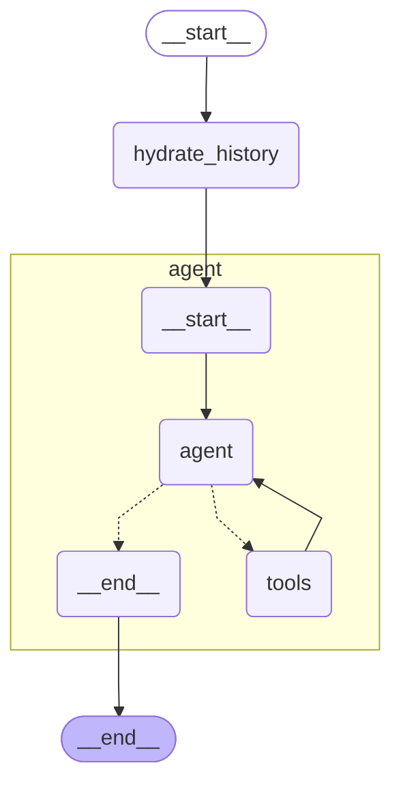

# LangGraph GitHub Helper Agent with Claude and GitHub MCP Server

This project demonstrates how to create a GitHub Helper Agent using LangGraph with Claude 3.5 Sonnet which connects to the GitHub MCP Server.

## Overview

The agent uses:
- Claude 3.5 Sonnet as the language model
- LangGraph for orchestration
- Connects to a GitHub Remote MCP server via SSE

## Architecture



## Prerequisites

- Python 3.10+
- `langchain-anthropic`
- `langchain-mcp-adapters`
- `langgraph`
- Anthropic API key set as an environment variable

## Installation

```bash
uv venv -p 3.11 .venv
.venv\Scripts\activate
uv sync
```

Set your API keys and MCP Remote Server URL as environment variables in .env

```bash
ANTHROPIC_API_KEY=your_anthropic_api_key
UIPATH_MCP_SERVER_URL=https://cloud.uipath.com/account/tenant/mcp_/mcp/folder-key/github-mcp/sse
```

## Debugging

For debugging issues:

1. Check logs for any connection or runtime errors:
   ```bash
   uipath run agent '{"owner": "uipath", "repo": "uipath-mcp-python", "pullNumber": 78, "command": "summarize", "in_reply_to": 2060859623}'
   ```


