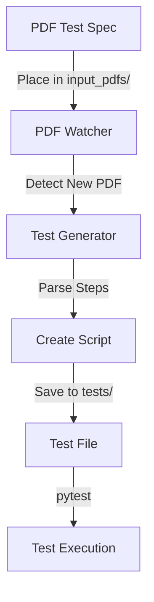
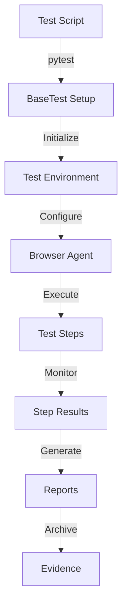
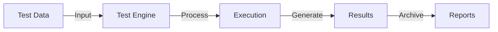
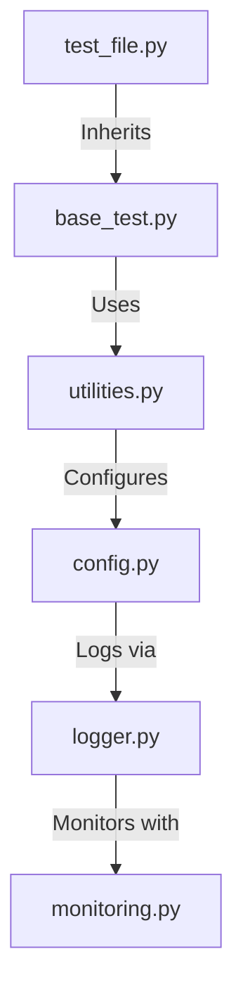

"""
-----------------------
Author: Sukumar Kutagulla
Designation: Test Automation Architect
-----------------------
"""

# VAssureAI Framework User Guide

## Table of Contents
- [Quick Start Guide](#quick-start-guide)
- [Framework Overview](#framework-overview)
- [Detailed Documentation](#detailed-documentation)

## Quick Start Guide

### What is VAssureAI?
VAssureAI is an automated testing tool that helps you test your applications without writing code. You simply write your test steps in a PDF document with plain english, and the framework automatically converts them into working tests.

### How to Use VAssureAI in 5 Simple Steps

#### Step 1: Initial Setup (One-time only)
1. **Download and Install Required Software**
   - Ask your IT team to install:
     - Python 3.11 or newer
     - Google Chrome or Firefox browser
   - Request the following information from your system administrator:
     - Application URL (BASE_URL)
     - Your username (USERNAME)
     - Your password (PASSWORD)
     - LLM (LLM_API_KEY)

2. **Have IT Set Up the Environment**
   - Ask your IT team to:
     - Clone the VAssureAI repository
     - Set up the virtual environment
     - Install required packages
     - Create the `.env` file with your credentials

#### Step 2: Write Your Test Cases
1. **Create a New PDF Document**
   - Use any PDF editor (Microsoft Word/Google Docs + Save as PDF)
   - Follow this simple format:
     ```
     Test Case: [Your Test Name]
     Description: [What the test does]
     
     Steps:
     1. [First action to take]
     2. [Second action to take]
     3. [What to verify]
     ...
     ```

2. **Example Test Case**:
   ```
   Test Case: Login to Application
   Description: Verify user can login successfully
   
   Steps:
   1. Navigate to login page
   2. Enter username in the username field
   3. Click continue button
   4. Enter password in password field
   5. Click login button
   6. Verify dashboard is displayed
   ```

#### Step 3: Run Your Tests
1. **Start the Framework**
   - Double-click the `start_framework.bat` file
   - Or ask IT to create a desktop shortcut for you

2. **Add Your Test Cases**
   - Copy your PDF file into the `input_pdfs` folder
   - The framework will automatically detect and process it

3. **View Your Tests**
   - Look in the `tests` folder
   - You'll see your test case converted to a test script

#### Step 4: Monitor Test Execution
1. **Watch Progress**
   - Tests run automatically
   - You'll see browser windows opening/closing
   - Progress is shown in the terminal window

2. **View Results in Real-time**
   - Screenshots are saved in `screenshots` folder
   - Videos are recorded in `videos` folder
   - Logs are written to `logs` folder

#### Step 5: Review Test Results
1. **Open Test Reports**
   - Go to `reports` folder
   - Open the HTML report in your browser
   - PDF reports are in `reports/pdf` folder

2. **What to Look For**
   - Green ✅ means test passed
   - Red ❌ means test failed
   - Screenshots show what happened
   - Error messages explain any failures

### Common Tasks

#### Creating a New Test
1. Open your favorite document editor
2. Write your test steps as a numbered list
3. Save as PDF in `input_pdfs` folder
4. Framework automatically creates the test

#### Viewing Test Results
1. Look for the newest files in:
   - `reports/report.html` for overall results
   - `screenshots` folder for step-by-step images
   - `videos` folder for full test recordings

#### Troubleshooting Failed Tests
1. Open the HTML report
2. Look for red ❌ marks
3. Check the error message
4. View the screenshot at that step
5. Review the video recording

### Best Practices for Writing Tests
1. **Keep Steps Simple**
   - One action per step
   - Be specific about what to click/type
   - Include verification points

2. **Name Things Clearly**
   - Use descriptive test names
   - Mention the feature being tested
   - Include expected results

3. **Include Verification Steps**
   - Add "Verify" steps to check results
   - Look for specific text or elements
   - Check for success messages

### Getting Help
1. **Common Issues**
   - Check the Troubleshooting section below
   - Review example test cases in `sample_test_cases.pdf`
   - Look at test execution videos

2. **Support Options**
   - Ask your IT team
   - Check framework documentation
   - Contact system administrators

### Troubleshooting Guide

#### Test Not Running?
✓ Check if framework is started (terminal window should be open)  
✓ Verify PDF is in correct folder (input_pdfs)  
✓ Make sure PDF follows correct format  
✓ Ask IT to check environment setup  

#### Test Failed?
✓ Check screenshots in reports  
✓ Review error message in logs  
✓ Verify test steps are correct  
✓ Ensure application is accessible  

#### Can't Find Results?
✓ Look in reports folder  
✓ Check file timestamps  
✓ Ask IT to verify permissions  
✓ Ensure enough disk space  

## Framework Overview

VAssureAI is an innovative test automation framework that combines traditional testing practices with artificial intelligence. It's designed to make test automation accessible to both beginners and experienced testers.

### Why VAssureAI?

- **AI-Powered Testing**: Utilizes LLM for intelligent test execution
- **PDF to Test Conversion**: Automatically converts test specifications from PDF to executable tests
- **Self-Healing**: Automatically handles minor UI changes and retries failed steps
- **Comprehensive Reporting**: Detailed reports with screenshots and videos
- **Easy to Learn**: Simple syntax and common utilities for frequent operations

### System Requirements

1. **Hardware Requirements**:
   - Minimum 8GB RAM (16GB recommended)
   - 50GB free disk space
   - Stable internet connection

2. **Software Requirements**:
   - Python 3.11 or higher
   - Git (for version control)
   - Modern web browser (Chrome/Firefox)

### Installation Steps

1. **Python Setup**:
   ```bash
   # Check Python version
   python --version  # Should be 3.11+
   
   # Create virtual environment
   python -m venv venv
   
   # Activate virtual environment
   .\venv\Scripts\activate  # Windows
   source venv/bin/activate # Linux/Mac
   ```

2. **Install Dependencies**:
   ```bash
   pip install -r requirements.txt
   ```

3. **Environment Configuration**:
   Create a `.env` file in the root directory:
   ```env
   BASE_URL=https://login.veevavault.com/auth/login
   USERNAME=your_username
   PASSWORD=your_password
   LLM_API_KEY=your_llm_api_key
   ```

### First-Time Setup Verification

1. Start the framework:
   ```bash
   python start_framework.py
   ```

2. Run the sample test:
   ```bash
   pytest tests/test_create_deviation.py -v --asyncio-mode=auto
   ```

## Detailed Documentation

### Writing Tests

#### Method 1: Using PDF Specifications

1. **Create Test Specification PDF**:
   - Use clear, structured format
   - Include test case title
   - List steps sequentially
   Example:
   ```
   Test Case: Login to Application
   1. Navigate to login page
   2. Enter username
   3. Click continue
   4. Enter password
   5. Click login
   6. Verify success
   ```

2. **Generate Test Script**:
   - Place PDF in `input_pdfs/` directory
   - Framework automatically generates test script
   - Find generated script in `tests/` directory

#### Method 2: Manual Test Creation

1. **Create Test File**:
   ```python
   import pytest
   from utils.base_test import BaseTest
   from utils.utilities import common_utilities

   @pytest.mark.requires_browser
   class MyTest(BaseTest):
       def get_all_test_steps(self):
           return [
               'Navigate to login page',
               'Enter username "test@example.com"',
               'Click continue button'
           ]

       @pytest.mark.asyncio
       async def test_execution(self):
           test_steps = self.get_all_test_steps()
           await self._execute_test(test_steps, "My Test Results")
   ```

2. **Using Common Utilities**:
   ```python
   def get_all_test_steps(self):
       return (
           common_utilities.get_login_steps() +
           [
               'Click settings button',
               'Verify settings page loaded'
           ]
       )
   ```

### Best Practices

1. **Test Structure**:
   - One test case per file
   - Clear, descriptive test names
   - Proper documentation
   - Modular step definitions

2. **Validation Points**:
   - Add verification steps
   - Include screenshots at key points
   - Verify success conditions

### Running Tests

#### Basic Test Execution

1. **Single Test**:
   ```bash
   pytest tests/my_test.py -v
   ```

2. **All Tests**:
   ```bash
   pytest
   ```

3. **Test Categories**:
   ```bash
   pytest -m "requires_browser"  # Run browser tests
   pytest -m "network_sensitive" # Run network tests
   ```

#### Advanced Execution Options

1. **Parallel Execution**:
   ```bash
   pytest -n auto  # Use all CPU cores
   pytest -n 4     # Use 4 workers
   ```

2. **Report Generation**:
   ```bash
   pytest --html=reports/report.html
   ```

3. **Custom Options**:
   ```bash
   pytest --capture=no  # Show print statements
   pytest -v --tb=short # Short traceback
   ```

### Reports and Analysis

#### Types of Reports

1. **HTML Reports** (reports/report.html):
   - Test summary
   - Step-by-step execution
   - Screenshots
   - Pass/Fail status

2. **PDF Reports** (reports/pdf/):
   - Detailed execution log
   - Performance metrics
   - Visual evidence
   - Error analysis

3. **Test Artifacts**:
   - Screenshots (screenshots/)
   - Videos (videos/)
   - Logs (logs/)

#### Analyzing Results

1. **Real-time Monitoring**:
   - Console output
   - Log files
   - Screenshots

2. **Post-execution Analysis**:
   - HTML report review
   - Performance metrics
   - Error patterns

#### Performance Metrics

1. **Test Execution Time**:
   - Overall duration
   - Step-wise timing
   - Network delays

2. **Resource Usage**:
   - CPU utilization
   - Memory consumption
   - Network bandwidth

### Advanced Features

#### Custom Actions

1. **Browser Actions**:
   ```python
   'Click element "button.submit"'
   'Type text "Hello" in "#input-field"'
   'Select "Option 1" from dropdown'
   ```

2. **Validation Actions**:
   ```python
   'Verify text "Welcome" is visible'
   'Verify element "#dashboard" exists'
   'Verify page title contains "Home"'
   ```

#### Retry Mechanisms

1. **Configuration**:
   ```python
   retry_config = {
       "max_retries": 3,
       "retry_delay": 5,
       "retry_on_network_error": True
   }
   ```

2. **Custom Retry Logic**:
   ```python
   async def test_with_retry(self):
       for attempt in range(self.retry_attempts):
           try:
               result = await self._execute_test(...)
               if result:
                   return result
           except Exception as e:
               logger.warning(f"Attempt {attempt + 1} failed")
   ```

### Troubleshooting Guide

#### Common Issues

1. **Test Generation Issues**:
   - Verify PDF format
   - Check file permissions
   - Review PDF content structure

2. **Execution Errors**:
   - Check environment variables
   - Verify network connectivity
   - Review browser compatibility

3. **Report Generation Issues**:
   - Check disk space
   - Verify write permissions
   - Review file paths

#### Debug Tools

1. **Logging**:
   - Check logs/test_run_*.log
   - Enable debug logging
   - Review console output

2. **Visual Debugging**:
   - Review screenshots
   - Check video recordings
   - Compare with baseline

### Support Contacts

- Technical Support: [Contact Information]
- Documentation: [Link to Documentation]
- Community Forum: [Link to Forum]

## Framework Structure

```
vassureai/
├── actions/                 # Custom test actions
│   ├── __init__.py
│   └── custom_actions.py    # Custom test implementations
├── input_pdfs/             # Test case PDF specifications
│   ├── create_deviation.pdf # Sample test case
│   └── sample_test_cases.pdf # Example test cases
├── logs/                   # Test execution logs
│   └── test_run_*.log      # Timestamped log files
├── metrics/                # Performance metrics data
├── reports/               # Test execution reports
│   ├── assets/           # Report static assets
│   └── pdf/             # PDF format reports
├── screenshots/           # Test execution screenshots
│   └── step_*_*.png      # Step-wise screenshots
├── tests/                # Test implementations
│   ├── __init__.py
│   ├── login_test.py     # Login functionality test
│   └── test_create_deviation.py # Deviation creation test
├── userguide/            # Framework documentation
│   ├── userguide.md     # Detailed user guide
│   ├── userguide.html   # HTML formatted guide
│   ├── userguide.pdf    # PDF version of guide
│   ├── userguide.png    # Guide diagrams/images
│   └── userguide.jpeg   # Guide screenshots
├── utils/                # Framework utilities
│   ├── __init__.py
│   ├── base_test.py      # Base test class
│   ├── config.py         # Configuration management
│   ├── conftest.py       # Pytest configuration
│   ├── controller_setup.py # Browser setup
│   ├── create_sample_pdf.py # Sample PDF generator
│   ├── logger.py         # Logging configuration
│   ├── metrics_reporter.py # Test metrics collection
│   ├── monitoring.py     # Test monitoring
│   ├── pdfgenerator.py   # Report generation
│   ├── test_generator.py # Test script generator
│   ├── templates/        # Template files
│   │   └── test_template.py # Test script template
│   └── utilities.py      # Common utilities
├── videos/               # Test execution recordings
├── .env                 # Environment configuration
├── .gitignore           # Git ignore rules
├── create_pdf.py        # PDF creation utility
├── pytest.ini          # Pytest configuration
├── requirements.txt    # Project dependencies
├── start_framework.bat # Windows startup script
└── start_framework.py  # Framework startup script
```

## Framework Control Flow

### Test Generation Flow



1. **PDF Processing Pipeline**
   ```python
   # PDFTestProcessor (utils/utilities.py)
   def extract_test_cases(pdf_path):
       # Extract text from PDF
       # Split into test blocks
       # Convert to structured format
       # Return test cases
   ```

2. **Test Script Generation**
   ```python
   # TestScriptGenerator (utils/test_generator.py)
   def generate_test_file(test_case):
       # Load template
       # Render with test case data
       # Save as Python test file
   ```

### Test Execution Flow



1. **Setup Phase**
   - Environment Initialization
     ```python
     @pytest.fixture(autouse=True)
     def setup_test(self, setup_base):
         self.test_name = "test_name"
         self.retry_attempts = Config.retry.max_retries
         return self
     ```
   - Browser Configuration
     ```python
     def setup_agent():
         # Configure browser options
         # Initialize test agent
         # Setup monitoring
     ```

2. **Execution Phase**
   - Step Execution Loop
     ```python
     async def execute_test(test_steps):
         for step in test_steps:
             # Execute step
             # Capture screenshot
             # Verify result
             # Handle retry if needed
     ```
   - Real-time Monitoring
     ```python
     def monitor_step(step):
         # Track timing
         # Capture metrics
         # Log progress
     ```

3. **Evidence Collection**
   - Screenshots
     ```python
     def save_screenshot(step):
         # Capture screen
         # Save with timestamp
         # Link to report
     ```
   - Video Recording
     ```python
     def record_video():
         # Start recording
         # Capture test execution
         # Save on completion
     ```

4. **Results Processing**
   - Report Generation
     ```python
     def generate_report():
         # Compile results
         # Create HTML/PDF
         # Include evidence
     ```
   - Metrics Collection
     ```python
     def collect_metrics():
         # Performance data
         # Success rates
         # Resource usage
     ```

### Data Flow Architecture



1. **Input Processing**
   - Test Steps: Structured format for actions
   - Configuration: Environment settings
   - Test Data: Dynamic inputs

2. **Execution Pipeline**
   - Step Processing: Action execution
   - Validation: Result verification
   - Recovery: Error handling & retries

3. **Output Generation**
   - Evidence Collection
   - Report Compilation
   - Metrics Aggregation

### File Dependencies



1. **Core Components**
   - base_test.py: Base test functionality
   - utilities.py: Common test operations
   - config.py: Framework configuration

2. **Support Systems**
   - logger.py: Logging and tracing
   - monitoring.py: Test monitoring
   - pdfgenerator.py: Report generation